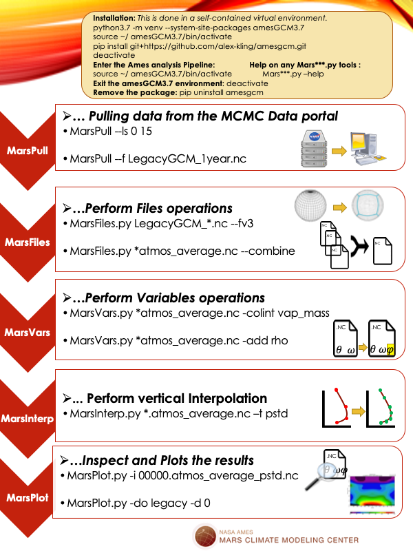
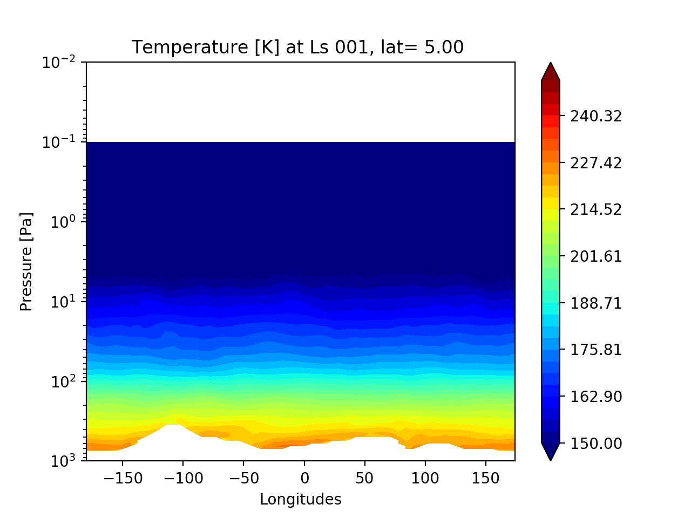

Welcome to the Mars Climate Modeling Center (MCMC) Analysis Pipeline. By the end of this tutorial, you will know how to download Mars Climate data from the MCMC's data portal, reduce these large climate simulations to meaningful data, and make plots for Martian winds, temperature, and aerosols at specific seasons and locations.

The simulation results presented on this page are extensively documented in [Haberle et al. 2019 _Documentation of the NASA/Ames Legacy Mars Global Climate Model: Simulations of the present seasonal water cycle_ ](https://www.sciencedirect.com/science/article/pii/S0019103518305761)

# INSTALLATION:
The analysis pipeline is entirely written in pure Python, which is an intuitive and open source programming language. You may identify yourself in one the following categories:

* A. You are familiar with the Python infrastructure and would like to install the Analysis pipeline on top of your current Python installation: Check the requirements below and skip to '**_Installing the pipeline_**'. Note that you may have to manually add aliases to the _Mars***.py_ executables to your search path.
* B. You have experience with Python but not with managing packages, or are new to Python: To ensure that there is no conflict with other Python versions that may be on your system, we will install a fresh Python distribution **locally** (this does not require admin permission). Additionally, we will install the analysis pipeline in a self-contained _virtual environment_  which is basically a standalone copy of your entire distribution, minus the 'core' code that is shared with the main python distribution.  This will allow you to use your fresh Python installation for other projects (including installing or upgrading packages) without the risk of altering the analysis pipeline. It will also be safe to alter (or even completely delete) that virtual environment without breaking the main distribution.
##  Requirements

**Python 3**: It you are already a Python user, you can install the Ames analysis pipeline on top of you current installation. For new users, we recommend to use the latest version of the Anaconda Python distribution as it already ships with pre-compiled math and plotting packages (e.g. _numpy_, _matplotlib_), and pre-compiled libraries (e.g. hdf5 headers to read netcdf files). You can download either the command-line installer or the graphical interface [here](https://www.anaconda.com/distribution/#download-section). If you are the owner of the system you can choose to install Python at the system level, but you can install it in your home directory if you don't have permission on your system.

* In MacOS and Linux, you can install a fresh Python3  **locally** from a terminal with:

`chmod +x Anaconda3-2020.02-MacOSX-x86_64.sh` (this make the .sh file executable)

`./Anaconda3-2020.02-MacOSX-x86_64.sh`          (this runs the executable)

Read (ENTER) and accept (yes) the terms. Take note of the location for the installation directory. You can use the default location or change it if you would like, for example _/Users/username/anaconda3_ works well.

* In Windows, we recommend installing the pipeline under a Linux-type environment using [Cygwin](https://www.cygwin.com/), so we will be able to use the pipeline as command-line tools. Simply download the _Windows_ version on the [Anaconda website](https://www.anaconda.com/distribution/#download-section) and follow the instructions from the installation GUI. When asked about the installation location, make sure you install Python under your emulated-Linux home _/home/username_ and **not** on the default location _/cygdrive/c/Users/username/anaconda3_. From the installation GUI, the path you want to select is something like: `C:/Program Files/cygwin64/home/username/anaconda3` Also make sure to check YES  for _Add Anaconda to my PATH environment variable_

***

The analysis pipeline requires the following **Python packages** which will be installed automatically in the analysis pipeline virtual environment (more on this later):
* **numpy** (array operations)
* **matplotlib** (plotting library)
* **netCDF4 Python** (handling of netcdf files)
* **requests** (for downloading data from the MCMC Portal)

Optionally, you can install:
* **ghostscript** which will allow the analysis pipeline to generate multiple figures as a single pdf file. Type
`gs -version ` to see if Ghostscript is already available on your system. If it is not, you can installing from this page: [https://www.ghostscript.com/download.html](https://www.ghostscript.com/download.html) or decide to use png images instead.

To make sure the paths are fully actualized, we recommend to close the current terminal. Then, open a fresh terminal, type `python` and hitting the TAB key. If multiple options are be available (e.g. _python_, _python2_, _python 3.7_, _python.exe_), this means that you have other versions of Python sitting on your system (e.g. an old _python2_  executable located in _/usr/local/bin/python_ ...). The same holds true for the `pip command` (e.g. old  _pip_, _pip3_, _pip.exe_). Pick the one you think may be from the Anaconda version you just installed and confirm this with the _which_ command, for example:


`python3 --version`    (`python.exe --version` in Cygwin/Windows)

`which python3`        (`which python.exe` in Cygwin/Windows)

We are looking for a python executable that looks like it was installed with Anaconda, like _/username/anaconda3/bin/python3_ (MacOS/Linux)  or _/username/anaconda3/python.exe_ (Cygwin/Windows)   If `which python3` or `which python.exe` already points to one of those locations, you are good to go. If  `which` points  to some other location (e.g. _/usr/local/bin/python_) proceed with the FULL paths to the Anaconda-Python, e.g.

`/Users/username/anaconda3/bin/python3` instead of `python3` (Linux/MacOS) or `/Users/username/anaconda3/python.exe` instead of `python.exe` (Cygwin/Windows)


## Creation of a virtual environment:
We will create a virtual environment for the Ames analysis pipeline which shares the same Python core but branches out with its own packages. We will call it  _amesGCM3_ to remind ourselves that it shares the same structure that the core python3 it is derived from. From a terminal run:

`python3 -m venv --system-site-packages amesGCM3` (remember to use FULL PATH to `python` if needed)

Here is what just happened :

```
anaconda3                  amesGCM3/
├── bin                    ├── bin
│   ├── pip       (copy)   │    ├── pip
│   └── python3    >>>>    │    ├──python3
└── lib                    │    ├── activate
                           │    ├── activate.csh
                           │    └── deactivate
                           └── lib             

  MAIN ENVIRONMENT           VIRTUAL ENVIRONMENT
(Leave untouched for)       (OK to mess around, will vanish
this particular project)     everytime we run 'deactivate')

```

Now activate the virtual environment with:

`source amesGCM3/bin/activate`      (if you are using **bash** )

`source amesGCM3/bin/activate.csh`  (if you are using **csh/tcsh** )

Note that in Cygwin/Windows, the  _bin_ directory may be named **_Scripts_**


You may notice that your prompt changed from _username>_ to _(amesGCM3)username>_ which indicates that you are INSIDE the virtual environment, even when navigating to different directories on your machine.  

After entering the virtual environment, we can verify that ```which python ``` and ```which pip ``` unambiguously point to _amesGCM3/bin/python3_ and _amesGCM3/bin/pip_ so there is no need use the full paths.

## Installing the pipeline
##### Directly from Github:

From **inside** the virtual environment, run:

`pip install git+https://github.com/alex-kling/amesgcm.git`

##### From a .zip archive:
If you have been provided with an archive, download and untar the '_amesgcm-master.zip_' archive anywhere (e.g. in our _Downloads_ directory). From **inside** the virtual environment, run:

```
cd amesgcm-master
pip install .
```
It is safe to move (or remove) both the '_amesgcm-master_' source code, and the '.zip' archive from your _Downloads_ directory since _pip_ installed the pipeline inside your _~/amesGCM3_ virtual environment.
***
To make sure the paths to the executables are correctly set in your terminal, exit the virtual environment with

`deactivate`

This complete the one-time installation of the Ames analysis pipeline:
```
amesGCM3/
├── bin
│   ├── MarsFiles.py
│   ├── MarsInterp.py
│   ├── MarsPlot.py
│   ├── MarsPull.py
│   ├── MarsVars.py
│   ├── activate
│   ├── activate.csh
│   ├── deactivate
│   ├── pip
│   └── python3
├── lib
│   └── python3.7
│       └── site-packages
│           ├── netCDF4
│           └── amesgcm
│               ├── FV3_utils.py
│               ├── Ncdf_wrapper.py
│               └── Script_utils.py
├── mars_data
│   └── Legacy.fixed.nc
└── mars_templates
    ├──amesgcm_profile
    └── legacy.in
```

***
**Quick Tip:**
If you prefer to use the _conda_ package manager to set-up your virtual environment instead of _pip_ , you may use the following commands instead to install the pipeline:
Verify with ```conda info``` or  ```which conda``` that you are using the intented _conda_ executable (two or more versions of _conda_ might be present if both python 2 and python 3 are installed on your system). Then install the pipeline with:

```
conda create -n amesGCM3
conda activate amesGCM3
conda install pip
pip install git+https://github.com/alex-kling/amesgcm.git
```

The source code will be installed in _your_conda/envs/amesGCM3/_ . The pipeline can then be activated with ```conda activate amesGCM3``` and exited with ```conda deactivate``` (more on this below).

***

## Routine use of the pipeline

Every time you want to use the analysis pipeline from a new terminal session, simply run:

`source amesGCM3/bin/activate`    (`source amesGCM3/bin/activate.csh` in **csh/tcsh**)

You can check that the tools are installed properly by typing `Mars` and hit the **TAB** key. No matter where you are on your system, you should see the following:
```
(amesGCM3) username$ Mars
MarsFiles.py   MarsInterp.py  MarsPlot.py    MarsPull.py    MarsVars.py
```
If no executable show up, the paths have not not been set-up in the virtual environment. You can use the full paths to the executable e.g. instead of using  `MarsPlot.py`, use `~/amesGCM3/bin/MarsPlot.py`. If that solution works for you, also consider setting-up your own aliases, for example:

Add `alias MarsPlot.py='/username/amesGCM3/bin/MarsPlot.py'` to your _~/.bash_profile_  and run
`source ~/.bash_profile` (in **bash**)

Add `alias MarsPlot.py /username/amesGCM3/bin/MarsPlot.py` to your _~/.cshrc_  and run
`source ~/.cshrc` (in **csh**)  

Check the documentation for any of the executables above with the `--help` option:

`MarsPlot.py --help` (`MarsPlot.py -h` for short)


After you are done with your work, you can exit the analysis pipeline with:

 `deactivate`

## Upgrade, or remove the pipeline
To upgrade the pipeline, activate the virtual environment:

`source amesGCM3/bin/activate`    (`source amesGCM3/bin/activate.csh` in **csh/tcsh**)

And run:

`pip install git+https://github.com/alex-kling/amesgcm.git --upgrade`

To permanently remove the amesgcm pipeline, activate the virtual environment and run :

`pip uninstall amesgcm`

It is also safe to delete the entire _amesGCM3_ virtual environment directory as this will not affect your main Python distribution.

# TUTORIAL:
## Overview of the process
The following steps will be used to access the data, reduce it, compute additional diagnostics, interpolate the diagnostics to standard pressures levels, and visualize the results.

## Download raw Legacy GCM outputs
The data from the Legacy GCM is archived every 1.5 hours (i.e. 16 times a day) and packaged in chunks of 10 sols (1 sol = 1 martian day). Files are available for download on the MCMC Data portal at : [https://data.nas.nasa.gov/legacygcm/data_legacygcm.php](https://data.nas.nasa.gov/legacygcm/data_legacygcm.php), and referenced by their solar longitude or "_Ls_", which  is 0° at the vernal equinox (beginning of Northern spring), 90° during the summer solstice, 180° at the autumnal equinox, and 270° during winter solstice. To download a 30-sols chunk starting at the beginning at the martian year (Ls =0 to Ls=15), navigate to a place you would like to store the data and run :
```
MarsPull.py --help
MarsPull.py --ls 0 15
```
This will download three LegacyGCM_Ls000***.nc raw outputs, each ~280MB each.

We can use the **--inspect** command of MarsPlot.py to peak into the content for one of the raw outputs:

`MarsPlot.py -i LegacyGCM_Ls000_Ls004.nc`

Note the characteristic structure for the Legacy GCM raw outputs with 10 days chunks ('_time_') , and 16 time of day ('_ntod_').

## File format conversion
For analysis purposes, it is useful to reduce the data from the raw outputs into different formats:

* **fixed**:   static fields (e.g. surface albedo, topography)
* **average**: 5 days averages
* **daily** : continuous time series
* **diurn** : 5 days average for each time of the day

New files for each of the formats listed above can be created using the _MarsFiles_ utility which handles conversions from the Legacy format to this new (FV3) format. To create _fixed_ and _average_ files for each of the 10 days output from the Legacy GCM, run:

```
MarsFiles.py -h
MarsFiles.py LegacyGCM_Ls* -fv3 fixed average
```
And check the new content for one of the files with:
```
MarsPlot.py -i 00000.fixed.nc
MarsPlot.py -i 00000.atmos_average.nc
```

Moving forward with the postprocessing pipeline, it is the user's choice to proceed with individual sets of files (00000, 00010, and 00020 files in our example), or merge those files together into one.
All the utilities from the analysis pipeline (including the plotting routine) accept a **list** of files as input, and keeping separate files can be strategic when computer memory is limited (the **daily** files remain 280MB each and there are 67 of those in one Mars year).

Since working with 5 days average involves relatively small files, we can use the **--combine** option of _MarsFiles_ to merge them together along the '_time_' dimension:

```
MarsFiles.py *fixed.nc -c
MarsFiles.py *atmos_average.nc -c
```
We can use the **--dump** (or **--stat**) option of MarsPlot to inspect the changes made to the time dimension:

```
MarsPlot.py -i 00000.atmos_average.nc
MarsPlot.py -i 00000.atmos_average.nc -dump time areo
```
## Variable operations
When provided with no arguments, the variable utility _MarsVars.py_ has the same functionality as _MarsPlot.py -i_ and displays the content for the file:

`MarsVars.py 00000.atmos_average.nc`

To see what _MarsVars.py_ can do, check the `--help` option (`MarsVars.py -h`)

For example, to compute the atmospheric density (rho) from the vertical grid data (pk, bk), surface pressure (ps) and air temperature (temp), run:

`MarsVars.py 00000.atmos_average.nc -add rho`

Check that a new variable was added to the file by running again _MarsVars_ with no argument:

`MarsVars.py 00000.atmos_average.nc`

Similarly, we will perform a column integration for the water vapor (vap_mass) with **-col**. At the same time, we will  remove the dust (dst_num) and water ice (ice_num) **particles numbers** variables, which we are not planning to use in this analysis (this will free some memory).

`MarsVars.py 00000.atmos_average.nc -col vap_mass -rm ice_num dst_num`


## Pressure interpolation
The Ames GCM uses a pressure coordinate in the vertical, which means that a single atmospheric layer will be located at different geometric heights (and pressure levels) between the atmospheric columns. Before we do any zonal averaging, it is therefore necessary to interpolate the data in all the columns to a same standard pressure. This operation is done with the _MarsInterp_ utility using the **--type pstd** option:

```
MarsInterp.py -h
MarsInterp.py  00000.atmos_average.nc -t pstd
```

We observe with `MarsPlot.py -i 00000.atmos_average_pstd.nc` that the pressure level axis "pfull" (formerly 24 layers) has disappeared and was replaced by a standard pressure "pstd". Also, the shape for the 3-dimensional variables are different and reflect the new shape of "pstd"

## Plotting the results with MarsPlot:
While you may use the software of your choice to visualize the results (e.g. Matlab, IDL), a utility is provided to create 2D figures and 1D line plots that are easily configured from an input template. To generate a template in the current directory use:

```
MarsPlot.py -h
MarsPlot.py --template
```
and open the file _Custom.in_ with a text editor  (you can rename the file to _something.in_ if you want). As an introduction  to _MarsPlot_, you can skip the commented  instructions at the top and go directly to the section:
```
=======================================================
START
```
***
**Quick Tip:** _MarsPlot_ uses text files with a '_.in_' extension as input files. Select "Python"  as the language (in place of "Plain text") when editing the file from text editor (gedit, atom ...) to enable syntax-highlighting of key words. If you are using the **vim** editor, add the following lines to your **~/.vimrc** to recognize "Custom.in' as using Python's syntax.
```
syntax on
colorscheme default
au BufReadPost *.in  set syntax=python
```
Close the file (`:wq`): next time you open Custom.in with Vim, numbers and keywords like 'True' or 'None' will be highlighted.
***

In order to access data in a specific file,  _MarsPlot_ uses the syntax ` Main Variable  = XXXXX.file@N.var`,  `XXXXX` being the sol number (e.g. "03335", optional), `file` being the file type (e.g. "`atmos_average_pstd`"), `@N`  being the simulation number (e.g. "@2" if comparing two different simulations, optional), and `var` the requested variable (e.g. "`ucomp`" for the zonal winds).

When dimensions are omitted with `None`, _MarsPlot_ makes educated guesses for data selection (e.g, if no layer is requested, use the surface layer etc...) and will tell you exactly how the data is being processed both in the default title for the figures, and in the terminal output.  This behavior is detailed in the commented instructions at the top of _Custom.in_, as well as additional features:  For example, note the use of the brackets "**[ ]**" for variable operations,  "**{ }**" to overwrite the default dimensions, and  the possibility of adding another simulation to the **<<<<< Simulations >>>>>** block for comparison purposes.

After inspecting the file, you can verify once again that pdf-ghostscript is available on your system with `gs -version` (see the _Requirements_ section) and feed the template back to _MarsPlot_ with:

`MarsPlot.py Custom.in`      (`MarsPlot.py Custom.in -o png` if you are not using ghostscript)  

```
[----------]  0 % (2D_lon_lat :fixed.zsurf)
[#####-----] 50 % (2D_lat_press :atmos_average.ucomp, Ls= (MY 1) 13.61, lon=18.0)
[##########]100 % (Done)
```

By default MarsPlot will handle errors by itself (e.g. missing data) and reports them after completion both in  the terminal and overlayed in the figures. To by-pass this behavior (when debugging), use the  **--debug** option.

A file _Diagnostic.pdf_ will be generated in the current directory with the requested plots which can be opened with a pdf viewer (`open Diagnostic.pdf` on MacOS, `evince Diagnostic.pdf` on Linux). If you have used the `--output png` formatting option, the images will be located in _plots/_ in the current directory.

You can try to add a new figure by making a copy/paste of any of the entire `<<<| Plot ... = True |>>>` blocks below the `HOLD ON[...]HOLD OFF` statement, which is used to put multiple figures on a same page.  For example, to compute the  zonally-averaged (`Lon +/-180 = all`) and time-average of the first 10 degree of solar longitude (`Ls 0-360 = 0.,10`) for the dust field (dst_mass) from the interpolated file (atmos_average_pstd), we use:

```
<<<<<<<<<<<<<<| Plot 2D lat X lev = True |>>>>>>>>>>>>>
Title          = This is the dust field converted to [g/kg]
Main Variable  = [atmos_average_pstd.dst_mass]*1000.
Cmin, Cmax     = None
Ls 0-360       = 0.,10
Lon +/-180     = all
2nd Variable   = None
Contours Var 2 = None
Axis Options  : Lat = [None,None] | level[Pa] = [1e3,0.2] | cmap = Wistia | scale = lin
```
Note that we decided to use the "**[ ]**" syntax around the variable to plot the dust field in [g/kg] instead of the default unit of [kg/kg], and changed the default title accordingly. We also decided to change the colormap to _Wistia_ and adjusted the `Axis Options`. You can now feed the modified template back to _MarsPlot_. By default `MarsPlot.py Custom.in` runs the requested analysis on the **last** set of output files present in the directory (identified by **XXXXX.fixed.nc**) To run the analysis over a single specific data file or a range of files, use the **--date**  options:

`MarsPlot.py Custom.in -d 0`

Close and open the pdf again, you should see a new figure with the updated dust field. You can use  _Custom.in_  jointly with the `MarsPlot.py --inspect` option discussed above to add new figures, and also explore the other types of plots presented at the end of _Custom.in_  (these are set to `= False`  by default but you can enabled them with  `= True`).

# Moving forward with your own analysis

You can customize your own plots using the programming language of your choice. Here is a script to get you started in Python. Unless you have installed python-netCDF4 and the analysis pipeline on top of your main distribution, the script has to be be run from **inside** the virtual environment in order to access the _netCDF4_ and _amesgcm_ packages. Copy-paste the following inside a script named _demo.py_ and run:

`python  demo.py`

***

```
#======================= Import python packages ================================
import numpy as np                          # for array operations
import matplotlib.pyplot as plt             # python plotting library
from netCDF4 import Dataset                 # to read .nc files
#===============================================================================

# Open a fixed.nc file, read some variables and close it.
f_fixed=Dataset('/Users/akling/test/00000.fixed.nc','r')
lon=f_fixed.variables['lon'][:]
lat=f_fixed.variables['lat'][:]
zsurf=f_fixed.variables['zsurf'][:]  
f_fixed.close()

# Open a dataset and read the 'variables' attribute from the NETCDF FILE
f_average_pstd=Dataset('/Users/akling/test/00000.atmos_average_pstd.nc','r')
vars_list     =f_average_pstd.variables.keys()
print('The variables in the atmos files are: ',vars_list)

# Read the 'shape' and 'units' attribute from the temperature VARIABLE
Nt,Nz,Ny,Nx = f_average_pstd.variables['temp'].shape
units_txt   = f_average_pstd.variables['temp'].units
print('The data dimensions are Nt,Nz,Ny,Nx=',Nt,Nz,Ny,Nx)
# Read the pressure, time, and the temperature for an equatorial cross section
pstd       = f_average_pstd.variables['pstd'][:]   
areo       = f_average_pstd.variables['areo'][0] #solar longitude for the 1st timestep
temp       = f_average_pstd.variables['temp'][0,:,18,:] #time, press, lat, lon
f_average_pstd.close()

# Get the latitude of the cross section.
lat_cross=lat[18]

# Example of accessing  functions from the Ames Pipeline if we wanted to plot
# the data  in a different coordinate system  (0>360 instead of +/-180 )
#----
from amesgcm.FV3_utils import lon180_to_360,shiftgrid_180_to_360
lon360=lon180_to_360(lon)
temp360=shiftgrid_180_to_360(lon,temp)

# Define some contours for plotting
conts= np.linspace(150,250,32)

#Create a figure with the data
plt.close('all')
ax=plt.subplot(111)
plt.contourf(lon,pstd,temp,conts,cmap='jet',extend='both')
plt.colorbar()
# Axis labeling
ax.invert_yaxis()
ax.set_yscale("log")
plt.xlabel('Longitudes')
plt.ylabel('Pressure [Pa]')
plt.title('Temperature [%s] at Ls %03i, lat= %.2f '%(units_txt,areo,lat_cross))
plt.show()
```

This will produce the following:


