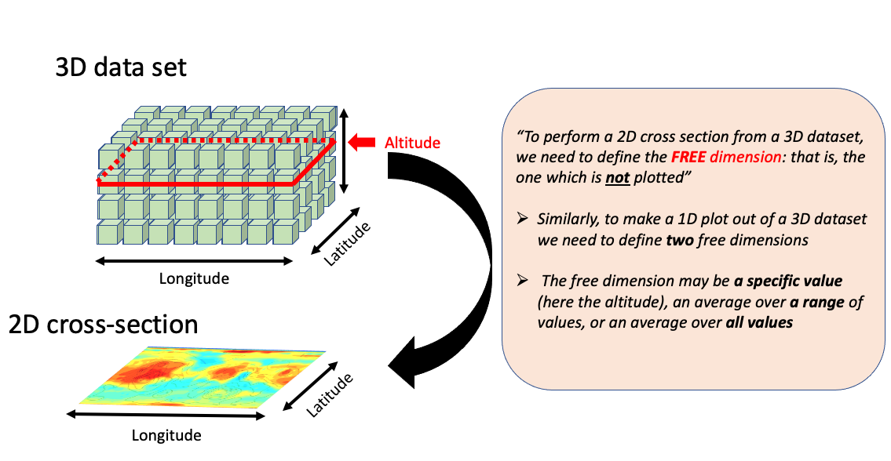

Descriptive Guide to CAP
========================

.. image:: ./images/GCM_Workflow_PRO.png
   :alt: GCM Workflow

Table of Contents
-----------------

* `Descriptive Guide to CAP`_
* `Cheat Sheet`_
* `Getting Help`_
* `1. MarsPull - Downloading Raw MGCM Output`_
* `2. MarsFiles - File Manipulations and Reduction`_
* `3. MarsVars - Performing Variable Operations`_
* `4. MarsInterp - Interpolating the Vertical Grid`_
* `5. MarsPlot - Plotting the Results`_
* `6. MarsPlot - File Analysis`_

  * `Inspecting Variable Content of netCDF Files`_
  * `Disabling or Adding a New Plot`_
  * `Adjusting the Color Range and Colormap`_
  * `Creating 1D Plots`_
  * `Customizing 1D Plots`_
  * `Putting Multiple Plots on the Same Page`_
  * `Putting Multiple 1D Plots on the Same Page`_
  * `Using a Different Start Date`_
  * `Accessing Simulations in Different Directories`_
  * `Overwriting Free Dimensions`_
  * `Performing Element-wise Operations`_
  * `Using Code Comments and Speeding Up Processing`_
  * `Changing Projections`_
  * `Adjusting Figure Format and Size`_
  * `Accessing CAP Libraries for Custom Plots`_
  * `Debugging`_

----

CAP is a toolkit designed to simplify the post-processing of Mars Global Climate Model (MGCM) output. Written in Python, CAP works with existing Python libraries, allowing users to install and use it easily and free of charge. Without CAP, plotting MGCM output requires users to provide their own scripts for post-processing tasks such as interpolating the vertical grid, computing derived variables, converting between file types, and creating diagnostic plots.

.. image:: ./images/Typical_Pipeline.png
   :alt: Figure 1. The Typical Pipeline

Such a process requires users to be familiar with Fortran files and able to write scripts to perform file manipulations and create plots. CAP standardizes the post-processing effort by providing executables that can perform file manipulations and create diagnostic plots from the command line, enabling users of almost any skill level to post-process and plot MGCM data.

.. image:: ./images/CAP.png
   :alt: Figure 2. The New Pipeline (CAP)

Key CAP Features
----------------

* **Python-based**: Built with an open-source programming language with extensive scientific libraries
* **Virtual Environment**: Provides cross-platform support (MacOS, Linux, Windows), robust version control, and non-intrusive installation
* **Modular Design**: Composed of both libraries (functions) and five executables for efficient command-line processing
* **netCDF4 Format**: Uses a self-descriptive data format widely employed in the climate modeling community
* **FV3 Format Convention**: Follows formatting conventions from the GFDL Finite-Volume Cubed-Sphere Dynamical Core
* **Multi-model Support**: Currently supports both NASA Ames Legacy GCM and NASA Ames GCM with the FV3 dynamical core, with planned expansion to other Global Climate Models

CAP Components
--------------

CAP consists of five executables:

1. **MarsPull** - Access MGCM output
2. **MarsFiles** - Reduce the files
3. **MarsVars** - Perform variable operations
4. **MarsInterp** - Interpolate the vertical grid
5. **MarsPlot** - Visualize the MGCM output

Cheat Sheet
-----------

.. image:: ./images/Cheat_Sheet.png
   :alt: Figure 3. Quick Guide to Using CAP

CAP is designed to be modular. Users can post-process and plot MGCM output exclusively with CAP or selectively integrate CAP into their own analysis routines.

----

Getting Help
------------

Use the ``[-h --help]`` option with any executable to display documentation and examples:

.. code-block:: bash

    (amesCAP)$ MarsPlot -h
    > usage: MarsPlot [-h] [-i INSPECT_FILE] [-d DATE [DATE ...]] [--template]
    >                   [-do DO] [-sy] [-o {pdf,eps,png}] [-vert] [-dir DIRECTORY]
    >                   [--debug]
    >                   [custom_file]

----

1. MarsPull - Downloading Raw MGCM Output
-----------------------------------------

``MarsPull`` is a utility for accessing MGCM output files hosted on the `MCMC Data portal <https://data.nas.nasa.gov/legacygcm/data_legacygcm.php>`_. MGCM data is archived in 1.5-hour intervals (16x/day) and packaged in files containing 10 sols. The files are named fort.11_XXXX in the order they were produced, but ``MarsPull`` maps those files to specific solar longitudes (L\ :sub:`s`, in °).

This allows users to request a file at a specific L\ :sub:`s` or for a range of L\ :sub:`s` using the ``[-ls --ls]`` flag. ``MarsPull`` requires the name of the folder to parse files from, and folders can be listed using ``[-list --list_files]``. The ``[-f --filename]`` flag can be used to parse specific files within a particular directory.

.. code-block:: bash

    MarsPull INERTCLDS -ls 255 285
    MarsPull ACTIVECLDS -f fort.11_0720 fort.11_0723

*Return to* `Table of Contents`_

----

2. MarsFiles - File Manipulations and Reduction
-----------------------------------------------

``MarsFiles`` provides several tools for file manipulations, reduction, filtering, and data extraction from MGCM outputs.

Files generated by the NASA Ames MGCM are in netCDF4 data format with different (runscript-customizable) binning options:

+--------------------+----------------------------------------------+---------------------------------------+-------------------+
| File name          | Description                                  | Timesteps for 10 sols x 24 output/sol | Ratio to daily    |
+====================+==============================================+=======================================+===================+
| **atmos_daily.nc** | Continuous time series                       | (24 x 10)=240                         | 1                 |
+--------------------+----------------------------------------------+---------------------------------------+-------------------+
| **atmos_diurn.nc** | Data binned by time of day and 5-day average | (24 x 2)=48                           | x5 smaller        |
+--------------------+----------------------------------------------+---------------------------------------+-------------------+
| **atmos_average.nc** | 5-day averages                             | (1 x 2) = 2                           | x80 smaller       |
+--------------------+----------------------------------------------+---------------------------------------+-------------------+
| **fixed.nc**       | Static variables (surface albedo, topography)| static                                | few kB            |
+--------------------+----------------------------------------------+---------------------------------------+-------------------+

Data Reduction Functions
~~~~~~~~~~~~~~~~~~~~~~~~

* Create **multi-day averages** of continuous time-series: ``[-ba --bin_average]``
* Create **diurnal composites** of continuous time-series: ``[-bd --bin_diurn]``
* Extract **specific seasons** from files: ``[-split --split]``
* Combine **multiple** files into one: ``[-c --concatenate]``
* Create **zonally-averaged** files: ``[-za --zonal_average]``

Data Transformation Functions
~~~~~~~~~~~~~~~~~~~~~~~~~~~~~

* Perform **tidal analysis** on diurnal composite files: ``[-tide --tide_decomp]``
* Apply **temporal filters** to time-varying fields:

  * Low pass: ``[-lpt --low_pass_temporal]``
  * High-pass: ``[-hpt --high_pass_temporal]``
  * Band-pass: ``[-bpt --band_pass_temporal]``

* **Regrid** a file to a different spatio/temporal grid: ``[-regrid --regrid_xy_to_match]``
* **Time-shift** diurnal composite files to uniform local time: ``[-t --time_shift]``

For all operations, you can process selected variables within the file using ``[-incl --include]``.

Time Shifting Example
^^^^^^^^^^^^^^^^^^^^^

Time shifting allows you to interpolate diurnal composite files to the same local times at all longitudes, which is useful for comparing with orbital datasets that often provide data at specific local times (e.g., 3am and 3pm).

.. code-block:: bash

    (AmesCAP)$ MarsFiles *.atmos_diurn.nc -t
    (AmesCAP)$ MarsFiles *.atmos_diurn.nc -t '3. 15.'

.. image:: ./images/time_shift.png
   :alt: Time shifting example

*3pm surface temperature before (left) and after (right) processing a diurn file with MarsFiles to uniform local time (diurn_T.nc)*

*Return to* `Table of Contents`_

----

3. MarsVars - Performing Variable Operations
--------------------------------------------

``MarsVars`` provides tools for variable operations such as adding, removing, and modifying variables, and performing column integrations.

A typical use case is adding atmospheric density (``rho``) to a file. Because density is easily computed from pressure and temperature fields, it's not archived in the GCM output to save space:

.. code-block:: bash

    (amesCAP)$ MarsVars 00000.atmos_average.nc -add rho

You can verify the addition using MarsPlot's ``[-i --inspect]`` function:

.. code-block:: bash

    (amesCAP)$ MarsPlot -i 00000.atmos_average.nc
    >
    > ===================DIMENSIONS==========================
    > ['bnds', 'time', 'lat', 'lon', 'pfull', 'scalar_axis', 'phalf']
    > (etc)
    > ====================CONTENT==========================
    > pfull          : ('pfull',)= (30,), ref full pressure level  [Pa]
    > temp           : ('time', 'pfull', 'lat', 'lon')= (4, 30, 180, 360), temperature  [K]
    > rho            : ('time', 'pfull', 'lat', 'lon')= (4, 30, 180, 360), density (added postprocessing)  [kg/m3]

Available Variable Operations
~~~~~~~~~~~~~~~~~~~~~~~~~~~~~

+------------------------------+--------------------------------------------------------------+
| Command Option               | Action                                                       |
+==============================+==============================================================+
| -add --add_variable          | Add a variable to the file                                   |
+------------------------------+--------------------------------------------------------------+
| -rm --remove_variable        | Remove a variable from a file                                |
+------------------------------+--------------------------------------------------------------+
| -extract --extract_copy      | Extract a list of variables to a new file                    |
+------------------------------+--------------------------------------------------------------+
| -col --column_integrate      | Column integration, applicable to mixing ratios in [kg/kg]   |
+------------------------------+--------------------------------------------------------------+
| -zdiff --differentiate_wrt_z | Vertical differentiation (e.g., compute gradients)           |
+------------------------------+--------------------------------------------------------------+
| -zd --zonal_detrend          | Zonally detrend a variable                                   |
+------------------------------+--------------------------------------------------------------+
| -edit --edit                 | Change a variable's name, attributes, or scale               |
+------------------------------+--------------------------------------------------------------+

Example: Editing a NetCDF Variable
^^^^^^^^^^^^^^^^^^^^^^^^^^^^^^^^^^

.. code-block:: bash

    (AmesCAP)$ MarsVars *.atmos_average.nc -edit temp -rename airtemp
    (AmesCAP)$ MarsVars *.atmos_average.nc -edit ps -multiply 0.01 -longname 'new pressure' -unit 'mbar'

*Return to* `Table of Contents`_

----

4. MarsInterp - Interpolating the Vertical Grid
-----------------------------------------------

Native MGCM output files use a terrain-following pressure coordinate (``pfull``) as the vertical coordinate, meaning the geometric heights and actual mid-layer pressure of atmospheric layers vary based on location. For rigorous spatial averaging, it's necessary to interpolate each vertical column to a standard pressure grid (``_pstd`` grid):

.. image:: ./images/MarsInterp.png
   :alt: MarsInterp

*Pressure interpolation from the reference pressure grid to a standard pressure grid*

``MarsInterp`` performs vertical interpolation from *reference* (``pfull``) layers to *standard* (``pstd``) layers:

.. code-block:: bash

    (amesCAP)$ MarsInterp 00000.atmos_average.nc -t pstd

An inspection of the file shows that the pressure level axis has been replaced:

.. code-block:: bash

    (amesCAP)$ MarsPlot -i 00000.atmos_average_pstd.nc
    >
    > ===================DIMENSIONS==========================
    > ['bnds', 'time', 'lat', 'lon', 'scalar_axis', 'phalf', 'pstd']
    > ====================CONTENT==========================
    > pstd           : ('pstd',)= (36,), pressure  [Pa]
    > temp           : ('time', 'pstd', 'lat', 'lon')= (4, 36, 180, 360), temperature  [K]

Interpolation Types
~~~~~~~~~~~~~~~~~~~

``MarsInterp`` supports 3 types of vertical interpolation, selected with the ``[-t --interp_type]`` flag:

+----------------+------------------------------------------+--------------------+
| Command Option | Description                              | Lowest level value |
+================+==========================================+====================+
| -t pstd        | Standard pressure [Pa] (default)         | 1000 Pa            |
+----------------+------------------------------------------+--------------------+
| -t zstd        | Standard altitude [m]                    | -7000 m            |
+----------------+------------------------------------------+--------------------+
| -t zagl        | Standard altitude above ground level [m] | 0 m                |
+----------------+------------------------------------------+--------------------+

Using Custom Vertical Grids
~~~~~~~~~~~~~~~~~~~~~~~~~~~

``MarsInterp`` uses default grids for each interpolation type, but you can specify custom layers by editing the hidden file ``.amesgcm_profile`` in your home directory.

For first-time use, copy the template:

.. code-block:: bash

    (amesCAP)$ cp ~/amesCAP/mars_templates/amesgcm_profile ~/.amesgcm_profile # Note the dot '.' !!!

Open ``~/.amesgcm_profile`` with any text editor to see customizable grid definitions:

.. code-block:: none

    <<<<<<<<<<<<<<| Pressure definitions for pstd |>>>>>>>>>>>>>

    p44=[1.0e+03, 9.5e+02, 9.0e+02, 8.5e+02, 8.0e+02, 7.5e+02, 7.0e+02,
         6.5e+02, 6.0e+02, 5.5e+02, 5.0e+02, 4.5e+02, 4.0e+02, 3.5e+02,
         3.0e+02, 2.5e+02, 2.0e+02, 1.5e+02, 1.0e+02, 7.0e+01, 5.0e+01,
         3.0e+01, 2.0e+01, 1.0e+01, 7.0e+00, 5.0e+00, 3.0e+00, 2.0e+00,
         1.0e+00, 5.0e-01, 3.0e-01, 2.0e-01, 1.0e-01, 5.0e-02, 3.0e-02,
         1.0e-02, 5.0e-03, 3.0e-03, 5.0e-04, 3.0e-04, 1.0e-04, 5.0e-05,
         3.0e-05, 1.0e-05]

Use your custom grid with the ``[-v --vertical_grid]`` argument:

.. code-block:: bash

    (amesCAP)$ MarsInterp 00000.atmos_average.nc -t pstd -v phalf_mb

*Return to* `Table of Contents`_

----

5. MarsPlot - Plotting the Results
----------------------------------

``MarsPlot`` is CAP's plotting routine. It accepts a modifiable template (``Custom.in``) containing a list of plots to create. Designed specifically for netCDF output files, it enables quick visualization of MGCM output.

The MarsPlot workflow involves three components:

- **MarsPlot** in a terminal to inspect files and process the template
- **Custom.in** template in a text editor
- **Diagnostics.pdf** viewed in a PDF viewer

You can use ``MarsPlot`` to inspect netCDF files:

.. code-block:: bash

    (amesCAP)> MarsPlot -i 07180.atmos_average.nc

    > ===================DIMENSIONS==========================
    > ['lat', 'lon', 'pfull', 'phalf', 'zgrid', 'scalar_axis', 'time']
    > [...]
    > ====================CONTENT==========================
    > pfull          : ('pfull',)= (24,), ref full pressure level  [Pa]
    > temp           : ('time', 'pfull', 'lat', 'lon')= (10, 24, 36, 60), temperature  [K]
    > ucomp          : ('time', 'pfull', 'lat', 'lon')= (10, 24, 36, 60), zonal wind  [m/sec]
    > [...]

Creating and Using a Template
~~~~~~~~~~~~~~~~~~~~~~~~~~~~~

Generate a template with the ``[-template --generate_template]`` argument:

.. code-block:: bash

    (amesCAP)$ MarsPlot -template
    > /path/to/simulation/run_name/history/Custom.in was created
    (amesCAP)$
    (amesCAP)$ MarsPlot Custom.in
    > Reading Custom.in
    > [----------]  0 % (2D_lon_lat :fixed.zsurf)
    > [#####-----] 50 % (2D_lat_lev :atmos_average.ucomp, L\ :sub:`s`= (MY 2) 252.30, zonal avg)
    > [##########]100 % (Done)
    > Merging figures...
    > /path/to/simulation/run_name/history/Diagnostics.pdf was generated

Plot Types and Cross-Sections
~~~~~~~~~~~~~~~~~~~~~~~~~~~~~

MarsPlot is designed to generate 2D cross-sections and 1D plots from multi-dimensional datasets. For this, you need to specify which dimensions to plot and which "free" dimensions to average/select.

*A refresher on cross-sections for multi-dimensional datasets*

The data selection process follows this decision tree:

.. code-block:: none

    1. Which simulation                                                 ┌─
       (e.g. ACTIVECLDS directory)                                      │  DEFAULT   1. ref> is current directory
             │                                                          │  SETTINGS
             └── 2. Which XXXXX start date                              │            2. latest XXXXX.fixed in directory
                  (e.g. 00668, 07180)                                   └─
                      │                                                 ┌─
                      └── 3. Which type of file                         │
                           (e.g. diurn, average_pstd)                   │   USER     3. provided by user
                               │                                        │ PROVIDES
                               └── 4. Which variable                    │            4. provided by user
                                     (e.g. temp, ucomp)                 └─
                                       │                                ┌─
                                       └── 5. Which dimensions          │            5. see rule table below
                                          (e.g lat =0°,L\ :sub:`s` =270°)        │  DEFAULT
                                              │                         │  SETTINGS
                                              └── 6. plot customization │            6. default settings
                                                     (e.g. colormap)    └─

Default Settings for Free Dimensions
^^^^^^^^^^^^^^^^^^^^^^^^^^^^^^^^^^^^

+---------------+-----------------------------+--------------------------------------+
| Free Dimension| Default Setting             | Implementation                       |
+===============+=============================+======================================+
| time          | Last (most recent) timestep | time = last timestep                 |
+---------------+-----------------------------+--------------------------------------+
| level         | Surface                     | level = sfc                          |
+---------------+-----------------------------+--------------------------------------+
| latitude      | Equator                     | lat = 0 (equator)                    |
+---------------+-----------------------------+--------------------------------------+
| longitude     | Zonal average               | lon = all (average 'all' longitudes) |
+---------------+-----------------------------+--------------------------------------+
| time of day   | 3 pm (diurn files only)     | tod = 15                             |
+---------------+-----------------------------+--------------------------------------+

Custom.in Template Example
^^^^^^^^^^^^^^^^^^^^^^^^^^

Here's an example of a code snippet in ``Custom.in`` for a lon/lat cross-section:

.. code-block:: python

    <<<<<<<<<<<<<<| Plot 2D lon X lat = True |>>>>>>>>>>>>>
    Title          = None
    Main Variable  = atmos_average.temp
    Cmin, Cmax     = None
    Ls 0-360       = None
    Level [Pa/m]   = None
    2nd Variable   = None
    Contours Var 2 = None
    Axis Options  : lon = [None,None] | lat = [None,None] | cmap = jet | scale = lin | proj = cart

This plots the air temperature (``temp``) from the *atmos_average.nc* file as a lon/lat map. Since time and altitude are unspecified (set to ``None``), MarsPlot will show the last timestep in the file and the layer adjacent to the surface.

Specifying Free Dimensions
^^^^^^^^^^^^^^^^^^^^^^^^^^

Here are the accepted values for free dimensions:

+------------------+---------------------------------------+-------------------------+
| Accepted Input   | Meaning                               | Example                 |
+==================+=======================================+=========================+
| ``None``         | Default settings                      | ``Ls 0-360 = None``     |
+------------------+---------------------------------------+-------------------------+
| ``value``        | Return index closest to requested     | ``Level [Pa/m] = 50``   |
+------------------+---------------------------------------+-------------------------+
| ``Val Min, Val Max`` | Average between min and max       | ``Lon +/-180 = -30,30`` |
+------------------+---------------------------------------+-------------------------+
| ``all``          | Average over all dimension values     | ``Latitude = all``      |
+------------------+---------------------------------------+-------------------------+

\* Whether the value is interpreted in Pa or m depends on the vertical coordinate of the file

.. note::
   Time of day (``tod``) in diurn files is specified using brackets ``{}`` in the variable name, e.g.: ``Main Variable = atmos_diurn.temp{tod=15,18}`` for the average between 3pm and 6pm.

*Return to* `Table of Contents`_

----

6. MarsPlot - File Analysis
---------------------------

Inspecting Variable Content of netCDF Files
~~~~~~~~~~~~~~~~~~~~~~~~~~~~~~~~~~~~~~~~~~~

The ``[-i --inspect]`` function can be combined with the ``[-values --print_values]`` flag to print variable values:

.. code-block:: bash

    (amesCAP)$ MarsPlot -i 07180.atmos_average.nc -values pfull
    > pfull=
    > [8.7662227e-02 2.5499690e-01 5.4266089e-01 1.0518962e+00 1.9545468e+00
    > 3.5580616e+00 6.2466631e+00 1.0509957e+01 1.7400265e+01 2.8756382e+01
    > 4.7480076e+01 7.8348366e+01 1.2924281e+02 2.0770235e+02 3.0938846e+02
    > 4.1609518e+02 5.1308148e+02 5.9254102e+02 6.4705731e+02 6.7754218e+02
    > 6.9152936e+02 6.9731799e+02 6.9994830e+02 7.0082477e+02]

For large arrays, the ``[-stats --statistics]`` flag is more suitable. You can also request specific array indexes:

.. code-block:: bash

    (amesCAP)$ MarsPlot -i 07180.atmos_average.nc -stats ucomp temp[:,-1,:,:]
    _________________________________________________________________
      VAR            |      MIN      |      MEAN     |      MAX      |
    _________________|_______________|_______________|_______________|
                ucomp|        -102.98|        6.99949|        192.088|
       temp[:,-1,:,:]|        149.016|        202.508|         251.05|
    _________________|_______________|_______________|_______________|

.. note::
   ``-1`` refers to the last element in that axis, following Python's indexing convention.

Disabling or Adding a New Plot
~~~~~~~~~~~~~~~~~~~~~~~~~~~~~~

Code blocks set to ``= True`` instruct ``MarsPlot`` to draw those plots. Templates set to ``= False`` are skipped. MarsPlot supports seven plot types:

.. code-block:: python

    <<<<<| Plot 2D lon X lat  = True |>>>>>
    <<<<<| Plot 2D lon X time = True |>>>>>
    <<<<<| Plot 2D lon X lev  = True |>>>>>
    <<<<<| Plot 2D lat X lev  = True |>>>>>
    <<<<<| Plot 2D time X lat = True |>>>>>
    <<<<<| Plot 2D time X lev = True |>>>>>
    <<<<<| Plot 1D            = True |>>>>> # Any 1D Plot Type (Dimension x Variable)

Adjusting the Color Range and Colormap
~~~~~~~~~~~~~~~~~~~~~~~~~~~~~~~~~~~~~~

``Cmin, Cmax`` sets the contour range for shaded contours, while ``Contours Var 2`` does the same for solid contours. Two values create a range with 24 evenly-spaced contours; more values define specific contour levels:

.. code-block:: python

    Main Variable  = atmos_average.temp     # filename.variable *REQUIRED
    Cmin, Cmax     = 240,290                # Colorbar limits (minimum, maximum)
    2nd Variable   = atmos_average.ucomp    # Overplot U winds
    Contours Var 2 = -200,-100,100,200      # List of contours for 2nd Variable or CMIN, CMAX
    Axis Options  : Ls = [None,None] | lat = [None,None] | cmap = jet |scale = lin

Contour spacing can be linear (``scale = lin``) or logarithmic (``scale = log``) for values spanning multiple orders of magnitude.

You can change the colormap from the default ``cmap = jet`` to any Matplotlib colormap:

.. image:: ./images/all_colormaps.png
   :alt: Available colormaps

Add the ``_r`` suffix to reverse a colormap (e.g., ``cmap = jet_r`` for red-to-blue instead of blue-to-red).

Creating 1D Plots
~~~~~~~~~~~~~~~~~

The 1D plot template differs from other templates:

- Uses ``Legend`` instead of ``Title`` to label plots when overplotting multiple variables
- Includes additional ``linestyle`` axis options
- Has a ``Diurnal`` option that can only be ``None`` or ``AXIS``

.. code-block:: python

    <<<<<<<<<<<<<<| Plot 1D = True |>>>>>>>>>>>>>
    Legend         = None                   # Legend instead of Title
    Main Variable  = atmos_average.temp
    Ls 0-360       = AXIS                   # Any of these can be selected
    Latitude       = None                   # as the X axis dimension, and
    Lon +/-180     = None                   # the free dimensions can accept
    Level [Pa/m]   = None                   # values as before. However,
    Diurnal  [hr]  = None                   # ** Diurnal can ONLY be AXIS or None **

Customizing 1D Plots
~~~~~~~~~~~~~~~~~~~~

``Axis Options`` controls axes limits and linestyle for 1D plots:

+---------------------------------------------+------------------------------------------+-------------------------------------------------------+
| 1D Plot Option                              | Usage                                    | Example                                               |
+=============================================+==========================================+=======================================================+
| ``lat,lon+/-180,[Pa/m],sols = [None,None]`` | X or Y axes range depending on plot type | ``lat,lon+/-180,[Pa/m],sols = [1000,0.1]``            |
+---------------------------------------------+------------------------------------------+-------------------------------------------------------+
| ``var = [None,None]``                       | Plotted variable range                   | ``var = [120,250]``                                   |
+---------------------------------------------+------------------------------------------+-------------------------------------------------------+
| ``linestyle = -``                           | Linestyle (Matplotlib convention)        | ``linestyle = -ob`` (solid line, blue circle markers) |
+---------------------------------------------+------------------------------------------+-------------------------------------------------------+
| ``axlabel = None``                          | Name for the variable axis               | ``axlabel = New Temperature [K]``                     |
+---------------------------------------------+------------------------------------------+-------------------------------------------------------+

Available colors, linestyles, and marker styles for 1D plots:

.. image:: ./images/linestyles.png
   :alt: Line styles

Putting Multiple Plots on the Same Page
~~~~~~~~~~~~~~~~~~~~~~~~~~~~~~~~~~~~~~~

Use ``HOLD ON`` and ``HOLD OFF`` to group figures on the same page:

.. code-block:: python

    HOLD ON

    <<<<<<| Plot 2D lon X lat = True |>>>>>>
    Title    = Surface CO2 Ice (g/m2)
    .. (etc) ..

    <<<<<<| Plot 2D lon X lat = True |>>>>>>
    Title    = Surface Wind Speed (m/s)
    .. (etc) ..

    HOLD OFF

By default, MarsPlot will arrange the plots automatically. Specify a custom layout with ``HOLD ON rows,columns`` (e.g., ``HOLD ON 4,3``).

Putting Multiple 1D Plots on the Same Page
~~~~~~~~~~~~~~~~~~~~~~~~~~~~~~~~~~~~~~~~~~

Use ``ADD LINE`` between templates to place multiple 1D plots on the same figure:

.. code-block:: python

    <<<<<<| Plot 1D = True |>>>>>>
    Main Variable    = var1
    .. (etc) ..

    ADD LINE

    <<<<<<| Plot 1D = True |>>>>>>
    Main Variable    = var2
    .. (etc) ..

.. note::
   When combining ``HOLD ON/HOLD OFF`` with ``ADD LINE`` on a multi-figure page, the 1D plot with sub-plots must be the LAST one on that page.

Using a Different Start Date
~~~~~~~~~~~~~~~~~~~~~~~~~~~~

For simulations with multiple files of the same type:

.. code-block:: none

    00000.fixed.nc          00100.fixed.nc         00200.fixed.nc         00300.fixed.nc
    00000.atmos_average.nc  00100.atmos_average.nc 00200.atmos_average.nc 00300.atmos_average.nc

By default, MarsPlot uses the most recent files (e.g., ``00300.fixed.nc`` and ``00300.atmos_average.nc``). Instead of specifying dates in each ``Main Variable`` entry, use the ``-date`` argument:

.. code-block:: bash

    MarsPlot Custom.in -d 200

You can also specify a range of sols: ``MarsPlot Custom.in -d 100 300``

For 1D plots spanning multiple years, use ``[-sy --stack_years]`` to overplot consecutive years instead of showing them sequentially.

Accessing Simulations in Different Directories
~~~~~~~~~~~~~~~~~~~~~~~~~~~~~~~~~~~~~~~~~~~~~~

The ``<<< Simulations >>>`` block at the beginning of ``Custom.in`` lets you point to different directories:

.. code-block:: python

    <<<<<<<<<<<<<<<<<<<<<< Simulations >>>>>>>>>>>>>>>>>>>>>
    ref> None
    2> /path/to/another/sim # another simulation
    3>
    =======================================================

When ``ref>`` is set to ``None``, it refers to the current directory. Access variables from other directories using the ``@`` symbol:

.. code-block:: python

    Main Variable  = XXXXX.filename@N.variable

Where ``N`` is the simulation number from the ``<<< Simulations >>>`` block.

Overwriting Free Dimensions
~~~~~~~~~~~~~~~~~~~~~~~~~~~

By default, MarsPlot applies the free dimensions specified in the template to both ``Main Variable`` and ``2nd Variable``. Override this using curly braces ``{}`` with a semicolon-separated list of dimensions:

.. code-block:: python

    <<<<<<<<<<<<<<| Plot 2D lon X lat = True |>>>>>>>>>>>>>
    ...
    Main Variable  = atmos_average.var
    ...
    Ls 0-360       = 270
    Level [Pa/m]   = 10
    2nd Variable   = atmos_average.var{ls=90,180;lev=50}

Here, ``Main Variable`` uses L\ :sub:`s`=270° and pressure=10 Pa, while ``2nd Variable`` uses the average of L\ :sub:`s`=90-180° and pressure=50 Pa.

.. note::
   Dimension keywords are ``ls``, ``lev``, ``lon``, ``lat``, and ``tod``. Accepted values are ``Value`` (closest), ``Valmin,Valmax`` (average between two values), and ``all`` (average over all values).

Performing Element-wise Operations
~~~~~~~~~~~~~~~~~~~~~~~~~~~~~~~~~~

Use square brackets ``[]`` for element-wise operations:

.. code-block:: python

    # Convert topography from meters to kilometers
    Main Variable = [fixed.zsurf]/(10.**3)

    # Normalize dust opacity
    Main Variable = [atmos_average.taudust_IR]/[atmos_average.ps]*610

    # Temperature difference between reference simulation and simulation 2
    Main Variable = [atmos_average.temp]-[atmos_average@2.temp]

    # Temperature difference between surface and 10 Pa level
    Main Variable = [atmos_average.temp]-[atmos_average.temp{lev=10}]

Using Code Comments and Speeding Up Processing
~~~~~~~~~~~~~~~~~~~~~~~~~~~~~~~~~~~~~~~~~~~~~~

Use ``#`` for comments (following Python convention). Each block must remain intact, so add comments between templates or comment all lines of a template.

The ``START`` keyword at the beginning of ``Custom.in`` tells MarsPlot where to begin parsing templates:

.. code-block:: none

    =======================================================
    START

To skip processing certain plots, move the ``START`` keyword further down instead of individually setting plots to ``False``. You can also add a ``STOP`` keyword to process only plots between ``START`` and ``STOP``.

Changing Projections
~~~~~~~~~~~~~~~~~~~~

For ``Plot 2D lon X lat`` figures, MarsPlot supports multiple projections:

**Cylindrical projections:**

- ``cart`` (cartesian)
- ``robin`` (robinson)
- ``moll`` (mollweide)

**Azimuthal projections:**

- ``Npole`` (north polar)
- ``Spole`` (south polar)
- ``ortho`` (orthographic)

.. image:: ./images/projections.png
   :alt: Projections

*(Top) cylindrical projections: cart, robin, and moll. (Bottom) azimuthal projections: Npole, Spole, and ortho*

Azimuthal projections accept optional arguments:

.. code-block:: python

    # Zoom in/out on the North pole
    proj = Npole lat_max

    # Zoom in/out on the South pole
    proj = Spole lat_min

    # Rotate the globe
    proj = ortho lon_center, lat_center

Adjusting Figure Format and Size
~~~~~~~~~~~~~~~~~~~~~~~~~~~~~~~~

- Change the output format with ``[-ftype --figure_filetype]``: choose between *pdf* (default), *png*, or *eps*
- Adjust page width with ``[-pw --pixel_width]`` (default: 2000 pixels)
- Switch to portrait orientation with ``[-portrait --portrait_mode]``

Accessing CAP Libraries for Custom Plots
~~~~~~~~~~~~~~~~~~~~~~~~~~~~~~~~~~~~~~~~

CAP libraries are available for custom analysis:

- Core utilities: ``amescap/FV3_utils``
- Spectral utilities: ``amescap/Spectral_utils``
- File parsing classes: ``amescap/Ncdf_wrapper``

Example of using CAP libraries for custom analysis:

.. code-block:: python

    # Import python packages
    import numpy as np # for array operations
    import matplotlib.pyplot as plt # python plotting library
    from netCDF4 import Dataset # to read .nc files

    # Open a dataset and read the 'variables' attribute from the NETCDF FILE
    nc_file = Dataset('/path/to/00000.atmos_average_pstd.nc', 'r')

    vars_list = nc_file.variables.keys()
    print('The variables in the atmos files are: ', vars_list)

    lon = nc_file.variables['lon'][:]
    lat = nc_file.variables['lat'][:]

    # Read the 'shape' and 'units' attribute from the temperature VARIABLE
    file_dims = nc_file.variables['temp'].shape
    units_txt = nc_file.variables['temp'].units
    print(f'The data dimensions are {file_dims}')

    # Read the pressure, time, and the temperature for an equatorial cross section
    pstd = nc_file.variables['pstd'][:]
    areo = nc_file.variables['areo'][0] # solar longitude for the 1st timestep
    temp = nc_file.variables['temp'][0,:,18,:] # time, press, lat, lon
    nc_file.close()

    # Get the latitude of the cross section.
    lat_cross = lat[18]

    # Example of accessing functions from the Ames Pipeline if we wanted to plot
    # the data in a different coordinate system (0>360 instead of +/-180 )

    from amescap.FV3_utils import lon180_to_360, shiftgrid_180_to_360

    lon360 = lon180_to_360(lon)
    temp360 = shiftgrid_180_to_360(lon, temp)

    # Define some contours for plotting
    contours = np.linspace(150, 250, 32)

    # Create a figure with the data
    plt.close('all')
    ax = plt.subplot(111)
    plt.contourf(lon, pstd, temp, contours, cmap='jet', extend='both')
    plt.colorbar()

    # Axis labeling
    ax.invert_yaxis()
    ax.set_yscale("log")
    plt.xlabel('Longitudes')
    plt.ylabel('Pressure [Pa]')
    plt.title(f'Temperature [{units_txt}] at Ls = {areo}, lat = {lat_cross}')
    plt.show()

Debugging
~~~~~~~~~

``MarsPlot`` handles missing data and many errors internally, reporting issues in the terminal and in the generated figures. To get standard Python errors during debugging, use the ``--debug`` option, which will raise errors and stop execution.

.. note::
   Errors raised with the ``--debug`` flag may reference MarsPlot's internal classes, so they may not always be self-explanatory.

*Return to* `Table of Contents`_
