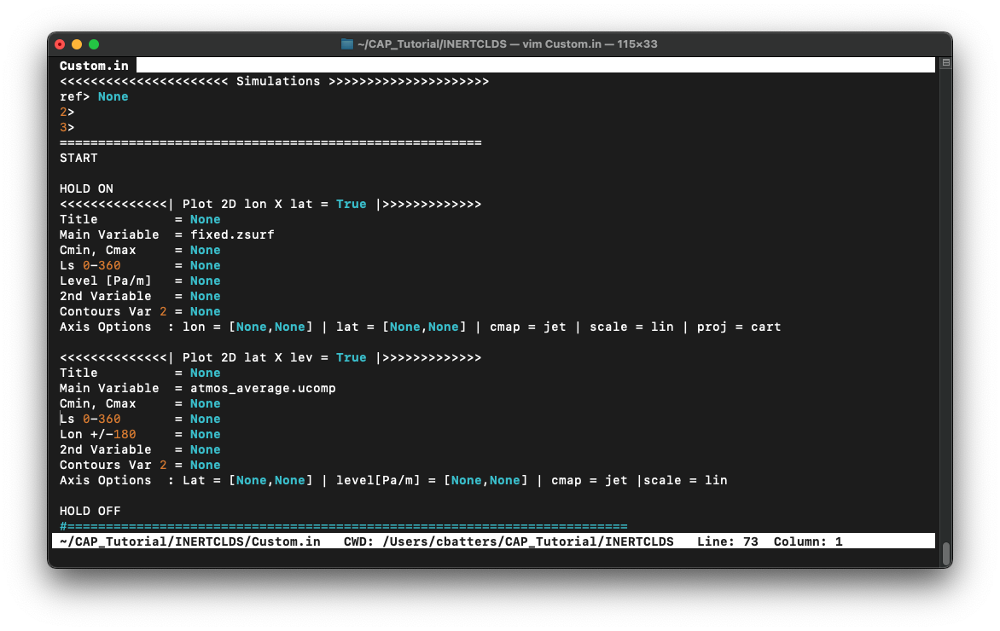
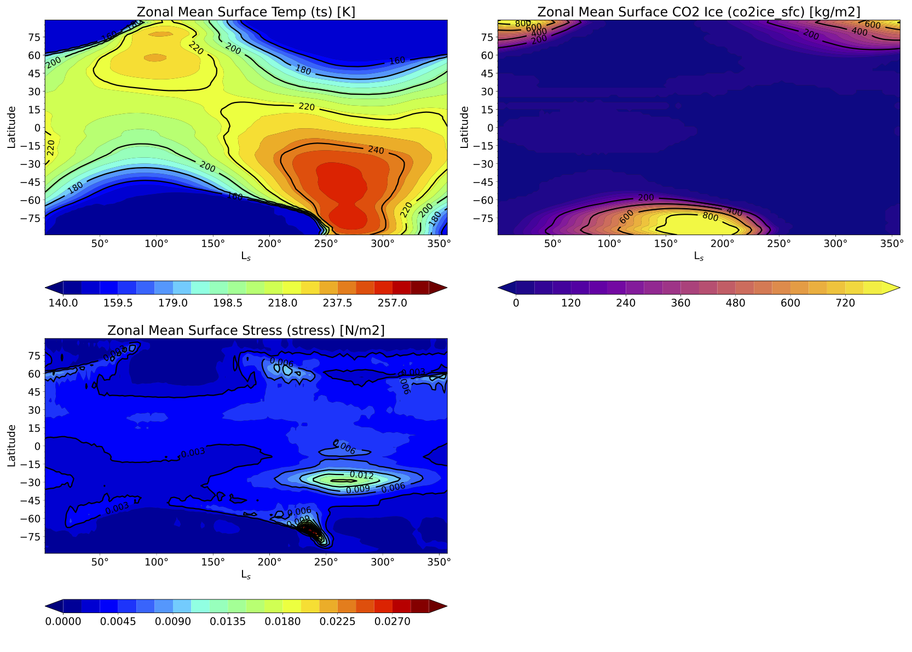
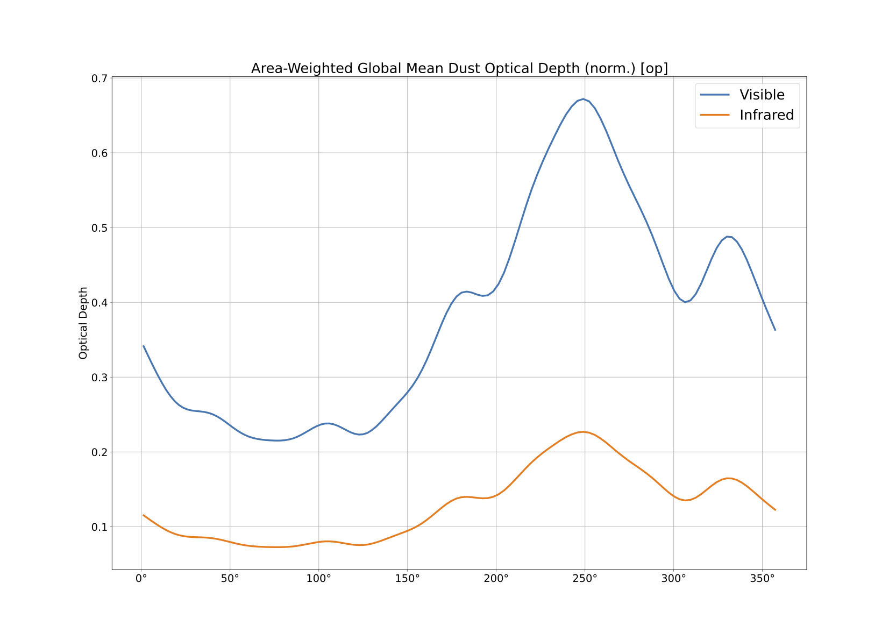
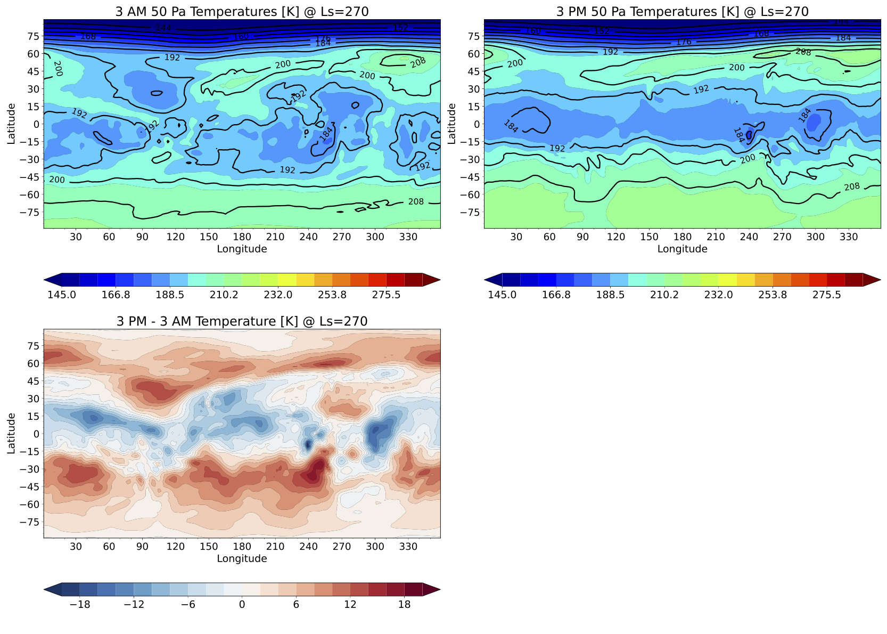
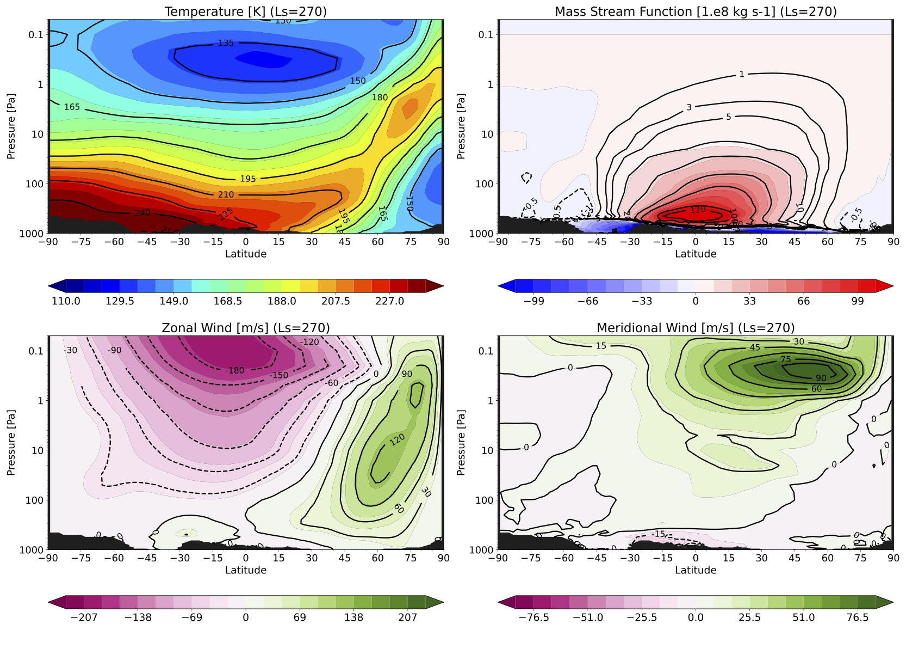

.. _cap_practical:

Examples & Use Cases
====================

CAP is a Python toolkit designed to simplify post-processing and plotting MGCM output. CAP consists of five Python executables:

1. ``MarsPull``  → accessing MGCM output
2. ``MarsFiles``  → reducing the files
3. ``MarsVars``  → performing variable operations
4. ``MarsInterp``  → interpolating the vertical grid
5. ``MarsPlot``  → plotting MGCM output

The following exercises are organized into two parts by function.

`Part I: File Manipulations`_ → ``MarsFiles``, ``MarsVars``, & ``MarsInterp``

`Part II: Plotting with CAP`_ → ``MarsPlot``

.. note::
   This does not cover ``MarsPull``.

----

Table of Contents
-----------------

- `Activating CAP`_
- `Part I: File Manipulations`_
  - `1. MarsPlot's Inspect Function`_
  - `2. Editing Variable Names and Attributes`_
  - `3. Splitting Files in Time`_
  - `4. Deriving Secondary Variables`_
  - `5. Time-Shifting Diurn Files`_
  - `6. Pressure-Interpolating the Vertical Axis`_
- `Part II: Plotting with CAP`_
  - `Step 1: Creating the Template (Custom.in)`_
  - `Step 2: Editing Custom.in`_
  - `Step 3: Generating the Plots`_
- `Custom Set 1 of 4: Zonal Mean Surface Plots Over Time`_
- `Custom Set 2 of 4: Global Mean Column-Integrated Dust Optical Depth Over Time`_
- `Custom Set 3 of 4: 50 Pa Temperatures at 3 AM and 3 PM`_
- `Custom Set 4 of 4: Zonal Mean Circulation Cross-Sections`_

----

Activating CAP
--------------

Activate the ``amescap`` virtual environment to use CAP:

.. code-block:: bash

    (local)~$ source ~/amescap/bin/activate
    (amescap)~$

Confirm that CAP's executables are accessible by typing ``[-h --help]``, which prints documentation for the executable to the terminal:

.. code-block:: bash

    (amescap)~$ MarsVars -h

Now that we know CAP is configured, make a copy of the file ``amescap_profile`` in your home directory, and make it a hidden file:

.. code-block:: bash

    (amescap)~$ cp ~/amescap/mars_templates/amescap_profile ~/.amescap_profile

CAP stores useful settings in ``amescap_profile``. Copying it to our home directory ensures it is not overwritten if CAP is updated or reinstalled.

**Part I covers file manipulations**. Some exercises build off of previous exercises so *it is important to complete them in order*. If you make a mistake or get behind in the process, you can go back and catch up during a break or use the provided answer key before continuing on to Part II.

**Part II demonstrates CAP's plotting routine**. There is more flexibility in this part of the exercise.

*Return to* `Table of Contents`_

Part I: File Manipulations
--------------------------

CAP has dozens of post-processing capabilities. We will go over a few of the most commonly used functions in this tutorial. We will cover:

- **Interpolating** data to different vertical coordinate systems (``MarsInterp``)
- **Adding derived variables** to the files (``MarsVars``)
- **Time-shifting** data to target local times (``MarsFiles``)
- **Trimming** a file to reduce its size (``MarsFiles``).

The required MGCM output files are already loaded in the cloud environment under ``tutorial_files/cap_exercises/``. Change to that directory and look at the contents:

.. code-block:: bash

    (amescap)~$ cd tutorial_files/cap_exercises
    (amescap)~$ ls
    03340.atmos_average.nc  03340.backup.zip
    03340.atmos_diurn.nc    03340.fixed.nc

The three MGCM output files have a 5-digit sol number appended to the front of the file name. The sol number indicates the day that a file's record begins. These contain output from the sixth year of a simulation. The zipped file is an archive of these three output files in case you need it.

.. note::
   The output files we manipulate in Part I will be used to generating plots in Part II so do **not** delete any file you create!

1. MarsPlot's Inspect Function
--------------------------------

The inspect function is part of ``MarsPlot`` and it prints netCDF file contents to the screen. To use it on the ``average`` file, ``03340.atmos_average.nc``, type the following in the terminal:

.. code-block:: bash

    (amescap)~$ MarsPlot -i 03340.atmos_average.nc

.. note::
   This is a good time to remind you that if you are unsure how to use a function, invoke the ``[-h --help]`` argument with any executable to see its documentation (e.g., ``MarsPlot -h``).

*Return to* `Part I: File Manipulations`_

----

2. Editing Variable Names and Attributes
----------------------------------------

In the previous exercise, ``[-i --inspect]`` revealed a variable called ``opac`` in ``03340.atmos_average.nc``. ``opac`` is dust opacity per pascal and it is similar to another variable in the file, ``dustref``, which is opacity per (model) level. Let's rename ``opac`` to ``dustref_per_pa`` to better indicate the relationship between these variables.

We can modify variable names, units, longnames, and even scale variables using the ``[-edit --edit]`` function in ``MarsVars``. The syntax for editing the variable name is:

.. code-block:: bash

    (amescap)~$ MarsVars 03340.atmos_average.nc -edit opac -rename dustref_per_pa
    03340.atmos_average_tmp.nc was created
    03340.atmos_average.nc was updated

We can use ``[-i --inspect]`` again to confirm that ``opac`` was renamed ``dustref_per_pa``:

.. code-block:: bash

    (amescap)~$ MarsPlot -i 03340.atmos_average.nc

The ``[-i --inspect]`` function can also **print a summary of the values** of a variable to the screen using ``[-stats --statistics]``. For example:

.. code-block:: bash

    (amescap)~$ MarsPlot -i 03340.atmos_average.nc -stats dustref_per_pa
    _________________________________________________________
      VAR           |   MIN     |    MEAN     |    MAX      |
    ________________|___________|_____________|_____________|
      dustref_per_pa|          0|  0.000384902|    0.0017573|
    ________________|___________|_____________|_____________|

Finally, ``[-i --inspect]`` can **print the values** of a variable to the screen using ``[-values --print_values]``. For example:

.. code-block:: bash

    (amescap)~$ MarsPlot -i 03340.atmos_average.nc -values lat
    lat=
    [-89. -87. -85. -83. -81. -79. -77. -75. -73. -71. -69. -67. -65. -63.
     -61. -59. -57. -55. -53. -51. -49. -47. -45. -43. -41. -39. -37. -35.
     -33. -31. -29. -27. -25. -23. -21. -19. -17. -15. -13. -11.  -9.  -7.
      -5.  -3.  -1.   1.   3.   5.   7.   9.  11.  13.  15.  17.  19.  21.
      1.   25.  27.  29.  31.  33.  35.  37.  39.  41.  43.  45.  47.  49.
      2.   53.  55.  57.  59.  61.  63.  65.  67.  69.  71.  73.  75.  77.
      3.   81.  83.  85.  87.  89.]

*Return to* `Part I: File Manipulations`_

----

3. Splitting Files in Time
--------------------------

Next we're going to trim the ``diurn`` and ``average`` files by L\ :sub:`s`\. We'll create files that only contain data around southern summer solstice, L\ :sub:`s`\=270. This greatly reduces the file size to make our next post-processing steps more efficient.

Syntax for trimming files by L\ :sub:`s`\ uses ``[-split --split]``:

.. code-block:: bash

    (amescap)~$ MarsFiles 03340.atmos_diurn.nc -split 265 275
    ...
    /home/centos/tutorial_files/cap_exercises/03847.atmos_diurn_Ls265_275.nc was created

.. code-block:: bash

    (amescap)~$ MarsFiles 03340.atmos_average.nc -split 265 275
    ...
    /home/centos/tutorial_files/cap_exercises/03847.atmos_average_Ls265_275.nc was created

The trimmed files have the appendix ``_Ls265_275.nc`` and the simulation day has changed from ``03340`` to ``03847`` to reflect that the first day in the file has changed.

For future steps, we need a ``fixed`` file with the same simulation day number as the files we just created, so make a copy of the ``fixed`` file and rename it:

.. code-block:: bash

    (amescap)~$ cp 03340.fixed.nc 03847.fixed.nc

*Return to* `Part I: File Manipulations`_

----

4. Deriving Secondary Variables
-------------------------------

The ``[-add --add_variable]`` function in ``MarsVars`` derives and adds secondary variables to MGCM output files provided that the variable(s) required for the derivation are already in the file. We will add the meridional mass streamfunction (``msf``) to the trimmed ``average`` file. To figure out what we need in order to do this, use the ``[-h --help]`` function on ``MarsVars``:

.. code-block:: bash

    (amescap)~$ MarsVars -h

The help function shows that streamfunction (``msf``) requires two things: that the meridional wind (``vcomp``) is in the ``average`` file, and that the ``average`` file is ***pressure-interpolated***.

First, confirm that ``vcomp`` is in ``03847.atmos_average_Ls265_275.nc`` using ``[-i --inspect]``:

.. code-block:: bash

    (amescap)~$ MarsPlot -i 03847.atmos_average_Ls265_275.nc
    ...
    vcomp : ('time', 'pfull', 'lat', 'lon')= (3, 56, 90, 180), meridional wind  [m/sec]

Second, pressure-interpolate the average file using ``MarsInterp``. The call to ``MarsInterp`` requires:

- The interpolation type (``[-t --interp_type]``), we will use standard pressure coorindates (``pstd``)
- The grid to interpolate to (``[--v --vertical_grid]``), we will use the default pressure grid (``pstd_default``)

.. note::
   All interpolation types are listed in the ``[-h --help]`` documentation for ``MarsInterp``. Additional grids are listed in ``~/.amescap_profile``, which accepts user-input grids as well.

We will also specify that only temperature (``temp``), winds (``ucomp`` and ``vcomp``), and surface pressure (``ps``) are to be included in this new file using ``[-incl --include]``. This will reduce the interpolated file size.

Finally, add the ``[-print --print_grid]`` flag at the end of prompt to print out the standard pressure grid levels that we are interpolating to:

.. code-block:: bash

    (amescap)~$ MarsInterp 03847.atmos_average_Ls265_275.nc -t pstd -v pstd_default -incl temp ucomp vcomp ps -print
    1100.0 1050.0 1000.0 950.0 900.0 850.0 800.0 750.0 700.0 650.0 600.0 550.0 500.0 450.0 400.0 350.0 300.0 250.0 200.0 150.0 100.0 70.0 50.0 30.0 20.0 10.0 7.0 5.0 3.0 2.0 1.0 0.5 0.3 0.2 0.1 0.05

To perform the interpolation, simply omit the ``[-print --print_grid]`` flag:

.. code-block:: bash

    (amescap)~$ MarsInterp 03847.atmos_average_Ls265_275.nc -t pstd -v pstd_default -incl temp ucomp vcomp ps
    ...
    /home/centos/tutorial_files/cap_exercises/03847.atmos_average_Ls265_275_pstd.nc was created

Now we have a pressure-interpolated ``average`` file with ``vcomp`` in it. We can derive and add ``msf`` to it using ``[-add --add_variable]`` from ``MarsVars``:

.. code-block:: bash

    (amescap)~$ MarsVars 03847.atmos_average_Ls265_275_pstd.nc -add msf
    Processing: msf...
    msf: Done

*Return to* `Part I: File Manipulations`_

----

5. Time-Shifting Diurn Files
----------------------------

The ``diurn`` file is organized by time-of-day assuming ***universal*** time starting at the Martian prime meridian. The time-shift ``[-t --time_shift]`` function interpolates the ``diurn`` file to ***uniform local***  time. This is especially useful when comparing MGCM output to satellite observations in fixed local time orbit.

Time-shifting can only be done on files with a local time dimension (``time_of_day_24``, i.e. ``diurn`` files). By default, ``MarsFiles`` time shifts all of the data in the file to 24 uniform local times and this generates very large files. To reduce file size and processing time, we will time-shift the data only to the local times we are interested in: 3 AM and 3 PM.

Time-shift the temperature (``temp``) and surface pressure (``ps``) in the trimmed ``diurn`` file to 3 AM / 3 PM local time like so:

.. code-block:: bash

    (amescap)~$ MarsFiles 03847.atmos_diurn_Ls265_275.nc -t '3. 15.' -incl temp ps
    ...
    /home/centos/tutorial_files/cap_exercises/03847.atmos_diurn_Ls265_275_T.nc was created

A new ``diurn`` file called ``03847.atmos_diurn_Ls265_275_T.nc`` is created. Use ``[-i --inspect]`` to confirm that only ``ps`` and ``temp`` (and their dimensions) are in the file and that the ``time_of_day`` dimension has a length of 2:

.. code-block:: bash

    (amescap)~$ MarsPlot -i 03847.atmos_diurn_Ls265_275_T.nc
    ...
    ====================CONTENT==========================
    time           : ('time',)= (3,), sol number  [days since 0000-00-00 00:00:00]
    time_of_day_02 : ('time_of_day_02',)= (2,), time of day  [[hours since 0000-00-00 00:00:00]]
    pfull          : ('pfull',)= (56,), ref full pressure level  [mb]
    scalar_axis    : ('scalar_axis',)= (1,), none  [none]
    lon            : ('lon',)= (180,), longitude  [degrees_E]
    lat            : ('lat',)= (90,), latitude  [degrees_N]
    areo           : ('time', 'time_of_day_02', 'scalar_axis')= (3, 2, 1), areo  [degrees]
    ps             : ('time', 'time_of_day_02', 'lat', 'lon')= (3, 2, 90, 180), surface pressure  [Pa]
    temp           : ('time', 'time_of_day_02', 'pfull', 'lat', 'lon')= (3, 2, 56, 90, 180), temperature  [K]
    =====================================================

*Return to* `Part I: File Manipulations`_

----

6. Pressure-Interpolating the Vertical Axis
-------------------------------------------

Now we can efficiently interpolate the ``diurn`` file to the standard pressure grid. Recall that interpolation is part of ``MarsInterp`` and requires:

1. Interpolation type (``[-t --interp_type]``), and
2. Grid (``[-v --vertical_grid]``)

As before, we will interpolate to standard pressure (``pstd``) using the default pressure grid in ``.amesgcm_profile`` (``pstd_default``):

.. code-block:: bash

    (amescap)~$ MarsInterp 03847.atmos_diurn_Ls265_275_T.nc -t pstd -v pstd_default
    ...
    /home/centos/tutorial_files/cap_exercises/03847.atmos_diurn_Ls265_275_T_pstd.nc was created

.. note::
   Interpolation could be done before or after time-shifting, the order does not matter.

We now have four different ``diurn`` files in our directory:

.. code-block:: bash

    03340.atmos_diurn.nc                  # Original MGCM file
    03847.atmos_diurn_Ls265_275.nc        # + Trimmed to L$_s$=240-300
    03847.atmos_diurn_Ls265_275_T.nc      # + Time-shifted; `ps` and `temp` only
    03847.atmos_diurn_Ls265_275_T_pstd.nc # + Pressure-interpolated

CAP always adds an appendix to the name of any new file it creates. This helps users keep track of what was done and in what order. The last file we created was trimmed, time-shifted, then pressure-interpolated. However, the same file could be generated by performing the three functions in any order.

*Return to* `Part I: File Manipulations`_

Part II
-------

This part of the CAP Practical covers how to generate plots with CAP. We will take a learn-by-doing approach, creating five sets of plots that demonstrate some of CAP's most often used plotting capabilities:

1. `Custom Set 1 of 4: Zonal Mean Surface Plots Over Time`_
2. `Custom Set 2 of 4: Global Mean Column-Integrated Dust Optical Depth Over Time`_
3. `Custom Set 3 of 4: 50 Pa Temperatures at 3 AM and 3 PM`_
4. `Custom Set 4 of 4: Zonal Mean Circulation Cross-Sections`_

Plotting with CAP is done in 3 steps:

`Step 1: Creating the Template (Custom.in)`_

`Step 2: Editing Custom.in`_

`Step 3: Generating the Plots`_

As in Part I, we will go through these steps together.

Part II: Plotting with CAP
--------------------------

CAP's plotting routine is ``MarsPlot``. It works by generating a ``Custom.in`` file containing seven different plot templates that users can modify, then reading the ``Custom.in`` file to make the plots.

The plot templates in ``Custom.in`` include:

+----------------+----------------------+-------------------------+
| Plot Type      | X, Y Dimensions      | Name in ``Custom.in``   |
+================+======================+=========================+
| Map            | Longitude, Latitude  | ``Plot 2D lon x lat``   |
+----------------+----------------------+-------------------------+
| Time-varying   | Time, Latitude       | ``Plot 2D time x lat``  |
+----------------+----------------------+-------------------------+
| Time-varying   | Time, level          | ``Plot 2D time x lev``  |
+----------------+----------------------+-------------------------+
| Time-varying   | Longitude, Time      | ``Plot 2D lon x time``  |
+----------------+----------------------+-------------------------+
| Cross-section  | Longitude, Level     | ``Plot 2D lon x lev``   |
+----------------+----------------------+-------------------------+
| Cross-section  | Latitude, Level      | ``Plot 2D lat x lev``   |
+----------------+----------------------+-------------------------+
| Line plot (1D) | Dimension*, Variable | ``Plot 1D``             |
+----------------+----------------------+-------------------------+

.. note::
   Dimension is user-indicated and could be time (``time``), latitude (``lat``), longitude ``lon``, or level (``pfull``, ``pstd``, ``zstd``, ``zagl``).

Additionally, ``MarsPlot`` supports:

- PDF & image format
- Landscape & portrait mode
- Multi-panel plots
- Overplotting
- Customizable axes dimensions and contour intervals
- Adjustable colormaps and map projections

and so much more. You will learn to plot with ``MarsPlot`` by following along with the demonstration. We will generate the ``Custom.in`` template file, customize it, and pass it back into ``MarsPlot`` to create plots.

*Return to* `Part II`_

----

Step 1: Creating the Template (Custom.in)
-----------------------------------------

Generate the template file using ``[-template --generate_template]``, ``Custom.in``:

.. code-block:: bash

    (amescap)~$ MarsPlot -template
    /home/centos/tutorial_files/cap_exercises/Custom.in was created

A new file called ``Custom.in`` is created in your current working directory.

----

Step 2: Editing Custom.in
-------------------------

Open ``Custom.in`` using ``vim``:

.. code-block:: bash

    (amescap)~$ vim Custom.in

Scroll down until you see the first two templates shown in the image below:

Since all of the templates have a similar structure, we can broadly describe how ``Custom.in`` works by going through the templates line-by-line.

Line 1
~~~~~~

.. code-block:: python

    # Line 1                ┌ plot type  ┌ whether to create the plot
    <<<<<<<<<<<<<<| Plot 2D lon X lat = True |>>>>>>>>>>>>>

Line 1 indicates the **plot type** and **whether to create the plot** when passed into ``MarsPlot``.

Line 2
~~~~~~

.. code-block:: python

    # Line 2         ┌ title
    Title          = None

Line 2 is where we set the plot title.

Line 3
~~~~~~

.. code-block:: python

    # Line 3         ┌ file ┌ variable
    Main Variable  = fixed.zsurf          # file.variable
    Main Variable  = [fixed.zsurf]/1000   # [] brackets for mathematical operations
    Main Variable  = diurn_T.temp{tod=3}  # {} brackets for dimension selection

Line 3 indicates the **variable** to plot and the **file** from which to pull the variable.

Additional customizations include:

- Element-wise operations (e.g., scaling by a factor)
- Dimensional selection (e.g., selecting the time of day (``tod``) at which to plot from a time-shifted diurn file)

Line 4
~~~~~~

.. code-block:: python

    # Line 4
    Cmin, Cmax     = None           # automatic, or
    Cmin, Cmax     = -4,5           # contour limits, or
    Cmin, Cmax     = -4,-2,0,1,3,5  # explicit contour levels

Line 4 line defines the **color-filled contours** for ``Main Variable``. Valid inputs are:

- ``None`` (default) enables Python's automatic interpretation of the contours
- ``min,max`` specifies contour range
- ``X,Y,Z,...,N`` gives explicit contour levels

Lines 5 & 6
~~~~~~~~~~~

.. code-block:: python

    # Lines 5 & 6
    Ls 0-360       = None # for 'time' free dimension
    Level Pa/m     = None # for 'pstd' free dimension

Lines 5 & 6 handle the **free dimension(s)** for ``Main Variable`` (the dimensions that are ***not*** plot dimensions).

For example, ``temperature`` has four dimensions: ``(time, pstd, lat, lon)``. For a ``2D lon X lat`` map of temperature, ``lon`` and ``lat`` provide the ``x`` and ``y`` dimensions of the plot. The free dimensions are then ``pstd`` (``Level Pa/m``) and ``time`` (``Ls 0-360``).

Lines 5 & 6 accept four input types:

1. ``integer`` selects the closest value
2. ``min,max`` averages over a range of the dimension
3. ``all`` averages over the entire dimension
4. ``None`` (default) depends on the free dimension:

.. code-block:: python

    # ┌ free dimension  ┌ default setting
    Ls 0-360       = None   # most recent timestep
    Level Pa/m     = None   # surface level
    Lon +/-180     = None   # zonal mean over all longitudes
    Latitude       = None   # equatorial values only

Lines 7 & 8
~~~~~~~~~~~

.. code-block:: python

    # Line 7 & 8
    2nd Variable   = None           # no solid contours
    2nd Variable   = fixed.zsurf    # draw solid contours
    Contours Var 2  = -4,5          # contour range, or
    Contours Var 2  = -4,-2,0,1,3,5 # explicit contour levels

Lines 7 & 8 (optional) define the **solid contours** on the plot. Contours can be drawn for ``Main Variable`` or a different ``2nd Variable``.

- Like ``Main Variable``, ``2nd Variable`` minimally requires ``file.variable``
- Like ``Cmin, Cmax``, ``Contours Var 2`` accepts a range (``min,max``) or list of explicit contour levels (``X,Y,Z,...,N``)

Line 9
~~~~~~

.. code-block:: python

    # Line 9        ┌ X axes limit      ┌ Y axes limit      ┌ colormap   ┌ cmap scale  ┌ projection
     Axis Options : lon = [None,None] | lat = [None,None] | cmap = jet | scale = lin | proj = cart

Finally, Line 9 offers plot customization (e.g., axes limits, colormaps, map projections, linestyles, 1D axes labels).

*Return to* `Part II`_

----

Step 3: Generating the Plots
----------------------------

Generate the plots set to ``True`` in ``Custom.in`` by saving and quitting the editor (``:wq``) and then passing the template file to ``MarsPlot``. The first time we do this, we'll pass the ``[-d --date]`` flag to specify that we want to plot from the ``03340`` ``average`` and ``fixed`` files:

.. code-block:: bash

    (amescap)~$ MarsPlot Custom.in -d 03340

Plots are created and saved in a file called ``Diagnostics.pdf``.

.. image:: ./images/Default.png
   :alt: default plots

----

Summary
~~~~~~~

Plotting with ``MarsPlot`` is done in 3 steps:

.. code-block:: bash

    (amescap)~$ MarsPlot -template # generate Custom.in
    (amescap)~$ vim Custom.in # edit Custom.in
    (amescap)~$ MarsPlot Custom.in # pass Custom.in back to MarsPlot

Now we will go through some examples.

----

Customizing the Plots
---------------------

Open ``Custom.in`` in the editor:

.. code-block:: bash

    (amescap)~$ vim Custom.in

Copy the first two templates that are set to ``True`` and paste them below the line ``Empty Templates (set to False)``. Then, set them to ``False``. This way, we have all available templates saved at the bottom of the script.

We'll preserve the first two plots, but let's define the sol number of the average and fixed files in the template itself so we don't have to pass the ``[-d --date]`` argument every time:

.. code-block:: python

    # for the first plot (lon X lat topography):
    Main Variable  = 03340.fixed.zsurf
    # for the second plot (lat X lev zonal wind):
    Main Variable  = 03340.atmos_average.ucomp

Now we can omit the date (``[-d --date]``) when we pass ``Custom.in`` to ``MarsPlot``.

Custom Set 1 of 4: Zonal Mean Surface Plots Over Time
-----------------------------------------------------

The first set of plots we'll make are zonal mean surface fields over time: surface temperature, CO\ :sub:`2` ice, and wind stress.

For each of the plots, source variables from the *non*-interpolated average file, ``03340.atmos_average.nc``.

For the **surface temperature** plot:

- Copy/paste the ``Plot 2D time X lat`` template above the ``Empty Templates`` line
- Set it to ``True``
- Edit the title to ``Zonal Mean Sfc T [K]``
- Set ``Main Variable = 03340.atmos_average.ts``
- Edit the colorbar range: ``Cmin, Cmax = 140,270``  → *140-270 Kelvin*
- Set ``2nd Variable = 03340.atmos_average.ts``  → *for overplotted solid contours*
- Explicitly define the solid contours: ``Contours Var 2 = 160,180,200,220,240,260``

Let's pause here and pass the ``Custom.in`` file to ``MarsPlot``.

Type ``ESC-:wq`` to save and close the file. Then, pass it to ``MarsPlot``:

.. code-block:: bash

    (amescap)~$ MarsPlot Custom.in

Now, go to your **local terminal** tab and retrieve the PDF:

.. code-block:: bash

    (local)~$ getpwd

Now we can open it and view our plot.

Go back to the **cloud environment** tab to finish generating the other plots on this page. Open ``Custom.in`` in ``vim``:

.. code-block:: bash

    (amescap)~$ vim Custom.in

HOLD ON`` and ``HOLD OFF`` arguments around the surface temperature plot. We will paste the other templates within these arguments to tell ``MarsPlot`` to put these plots on the same page.

Copy/paste the ``Plot 2D time X lat`` template plot twice more. Make sure to set the boolean to ``True``.

For the **surface CO2 ice** plot:

- Set the title to ``Zonal Mean Sfc CO2 Ice [kg/m2]``
- Set ``Main Variable = 03340.atmos_average.co2ice_sfc``
- Edit the colorbar range: ``Cmin, Cmax = 0,800``  → *0-800 kg/m2*
- Set ``2nd Variable = 03340.atmos_average.co2ice_sfc``  → *solid contours*
- Explicitly define the solid contours: ``Contours Var 2 = 200,400,600,800``
- Change the colormap on the ``Axis Options`` line: ``cmap = plasma``

For the **surface wind stress** plot:

- Set the title to ``Zonal Mean Sfc Stress [N/m2]``
- Set ``Main Variable = 03340.atmos_average.stress``
- Edit the colorbar range: ``Cmin, Cmax = 0,0.03``  → *0-0.03 N/m2*

Save and quit the editor (``ESC-:wq``) and pass ``Custom.in`` to ``MarsPlot``:

.. code-block:: bash

   (amescap)~$ MarsPlot Custom.in

*Return to* `Part II: Plotting with CAP`_

----

Custom Set 2 of 4: Global Mean Column-Integrated Dust Optical Depth Over Time
-----------------------------------------------------------------------------

Now we'll generate a 1D plot and practice plotting multiple lines on it.

Let's start by setting up our 1D plot template:

- Write a new set of ``HOLD ON`` and ``HOLD OFF`` arguments.
- Copy/paste the ``Plot 1D`` template between them.
- Set the template to ``True``.

Create the **visible dust optical depth** plot first:

- Set the title: ``Area-Weighted Global Mean Dust OD (norm.) [op]``
- Edit the legend: ``Visible``

The input to ``Main Variable`` is not so straightforward this time. We want to plot the *normalized* dust optical depth, which is dervied as follows:

``normalized_dust_OD = opacity / surface_pressure * reference_pressure``

The MGCM outputs column-integrated visible dust opacity to the variable ``taudust_VIS``, surface pressure is saved as ``ps``, and we'll use a reference pressure of 610 Pa. Recall that element-wise operations are performed when square brackets ``[]`` are placed around the variable in ``Main Variable``. Putting all that together, ``Main Variable`` is:

.. code-block:: python

   # ┌ norm. OD     ┌ opacity                         ┌ surface pressure       ┌ ref. P
   Main Variable  = [03340.atmos_average.taudust_VIS]/[03340.atmos_average.ps]*610

To finish up this plot, tell ``MarsPlot`` what to do to the dimensions of ``taudust_VIS (time, lon, lat)``:

- Leave ``Ls 0-360 = AXIS`` to use 'time' as the X axis dimension.
- Set ``Latitude = all``  → *average over all latitudes*
- Set ``Lon +/-180  = all``  → *average over all longitudes*
- Set the Y axis label under ``Axis Options``: ``axlabel = Optical Depth``

The **infrared dust optical depth** plot is identical to the visible dust OD plot except for the variable being plotted, so duplicate the **visible** plot we just created. Make sure both templates are between ``HOLD ON`` and ``HOLD OFF`` Then, change two things:

- Change ``Main Variable`` from ``taudust_VIS`` to ``taudust_IR``
- Set the legend to reflect the new variable (``Legend = Infrared``)

Save and quit the editor (``ESC-:wq``). pass ``Custom.in`` to ``MarsPlot``:

.. code-block:: bash

   (amescap)~$ MarsPlot Custom.in

Notice we have two separate 1D plots on the same page. This is because of the ``HOLD ON`` and ``HOLD OFF`` arguments. Without those, these two plots would be on separate pages. But how do we overplot the lines on top of one another?

Go back to the cloud environment, open ``Custom.in``, and type ``ADD LINE`` between the two 1D templates.

Save and quit again, pass it through ``MarsPlot``, and retrieve the PDF locally. Now we have the overplotted lines we were looking for.

*Return to* `Part II: Plotting with CAP`_

----

Custom Set 3 of 4: 50 Pa Temperatures at 3 AM and 3 PM
------------------------------------------------------

The first two plots are 3 AM and 3 PM 50 Pa temperatures at L\ :sub:`s`\=270. Below is the 3 PM - 3 AM difference.

We'll generate all three plots before passing ``Custom.in`` to ``MarsPlot``, so copy/paste the ``Plot 2D lon X lat`` template ***three times*** between a set of ``HOLD ON`` and ``HOLD OFF`` arguments and set them to ``True``.

For the first plot,

- Title it for 3 AM temperatures: ``3 AM 50 Pa Temperatures [K] @ Ls=270``
- Set ``Main Variable`` to ``temp`` and select 3 AM for the time of day using curly brackets:

.. code-block:: python

   Main Variable  = 03847.atmos_diurn_Ls265_275_T_pstd.temp{tod=3}

- Set the colorbar range: ``Cmin, Cmax = 145,290``  → *145-290 K*
- Set ``Ls 0-360 = 270``  → *southern summer solstice*
- Set ``Level Pa/m = 50``  → *selects 50 Pa temperatures*
- Set ``2nd Variable`` to be identical to ``Main Variable``

Now, edit the second template for 3 PM temperatures the same way. The only differences are the:

- Title: edit to reflect 3 PM temperatures
- Time of day selection: for 3 PM, ``{tod=15}`` ***change this for ``2nd Variable`` too!***

For the **difference plot**, we will need to use square brackets in the input for ``Main Variable`` in order to subtract 3 AM temperatures from 3 PM temperatures. We'll also use a diverging colorbar to show temperature differences better.

- Set the title to ``3 PM - 3 AM Temperature [K] @ Ls=270``
- Build ``Main Variable`` by subtracting the 3 AM ``Main Variable`` input from the 3 PM ``Main variable`` input:

.. code-block:: python

   Main Variable = [03847.atmos_diurn_Ls265_275_T_pstd.temp{tod=15}]-[03847.atmos_diurn_Ls265_275_T_pstd.temp{tod=3}]

- Center the colorbar at ``0`` by setting ``Cmin, Cmax = -20,20``
- Like the first two plots, set ``Ls 0-360 = 270``  → *southern summer solstice*
- Like the first two plots, set ``Level Pa/m = 50``  → *selects 50 Pa temperatures*
- Select a diverging colormap in ``Axis Options``: ``cmap = RdBu_r``

Save and quit the editor (``ESC-:wq``). pass ``Custom.in`` to ``MarsPlot``, and pull it to your local computer:

.. code-block:: bash

   (amescap)~$ MarsPlot Custom.in

*Return to* `Part II: Plotting with CAP`_

----

Custom Set 4 of 4: Zonal Mean Circulation Cross-Sections
--------------------------------------------------------

For our final set of plots, we will generate four cross-section plots showing temperature, zonal (U) and meridional (V) winds, and mass streamfunction at L\ :sub:`s`\=270.

Begin with the usual 3-step process:

1. Write a set of ``HOLD ON`` and ``HOLD OFF`` arguments
2. Copy-paste the ``Plot 2D lat X lev`` template between them
3. Set the template to ``True``

Since all four plots are going to have the same X and Y axis ranges and ``time`` selection, let's edit this template before copying it three more times:

- Set ``Ls 0-360 = 270``
- In ``Axis Options``, set ``Lat = [-90,90]``
- In ``Axis Options``, set ``level[Pa/m] = [1000,0.05]``

Now copy/paste this template three more times. Let the first plot be temperature, the second be mass streamfunction, the third be zonal wind, and the fourth be meridional wind.

For **temperature**:

.. code-block:: python

   Title          = Temperature [K] (Ls=270)
   Main Variable  = 03847.atmos_average_Ls265_275_pstd.temp
   Cmin, Cmax     = 110,240
   ...
   2nd Variable   = 03847.atmos_average_Ls265_275_pstd.temp

For **streamfunction**, define explicit solid contours under ``Contours Var 2`` and set a diverging colormap.

.. code-block:: python

   Title          = Mass Stream Function [1.e8 kg s-1] (Ls=270)
   Main Variable  = 03847.atmos_average_Ls265_275_pstd.msf
   Cmin, Cmax     = -110,110
   ...
   2nd Variable   = 03847.atmos_average_Ls265_275_pstd.msf
   Contours Var 2 = -5,-3,-1,-0.5,1,3,5,10,20,40,60,100,120
   # set cmap = bwr in Axis Options

For **zonal** and **meridional** wind, use the dual-toned colormap ``PiYG``.

.. code-block:: python

   Title          = Zonal Wind [m/s] (Ls=270)
   Main Variable  = 03847.atmos_average_Ls265_275_pstd.ucomp
   Cmin, Cmax     = -230,230
   ...
   2nd Variable   = 03847.atmos_average_Ls265_275_pstd.ucomp
   # set cmap = PiYG in Axis Options

.. code-block:: python

   Title          = Meridional Wind [m/s] (Ls=270)
   Main Variable  = 03847.atmos_average_Ls265_275_pstd.vcomp
   Cmin, Cmax     = -85,85
   ...
   2nd Variable   = 03847.atmos_average_Ls265_275_pstd.vcomp
   # set cmap = PiYG in Axis Options

Save and quit the editor (``ESC-:wq``). pass ``Custom.in`` to ``MarsPlot``, and pull it to your local computer:

.. code-block:: bash

   (amescap)~$ MarsPlot Custom.in

*Return to* `Part II: Plotting with CAP`_

----

End Credits
-----------

This concludes the practical exercise portion of the CAP tutorial. Please feel free to use these exercises as a reference when using CAP the future!

*Written by Courtney Batterson, Alex Kling, and Victoria Hartwick. This document was created for the NASA Ames MGCM and CAP Tutorial held virtually November 13-15, 2023.*

*Questions, comments, or general feedback? `Contact us <https://forms.gle/2VGnVRrvHDzoL6Y47>`_*.

*Return to* `Table of Contents`_
