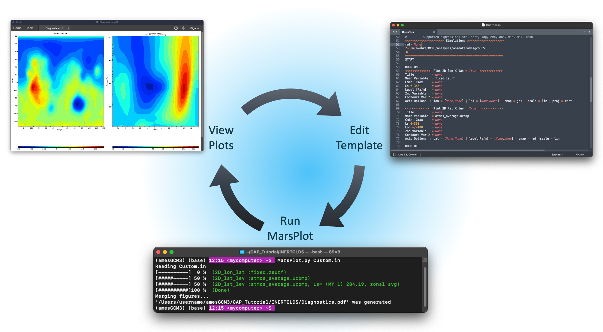

.. AmesCAP documentation master file, initially created by
   sphinx-quickstart on Fri Jul 7 10:35:15 2023.
   You can adapt this file completely to your liking, but it should
   contain the root `toctree` directive.

Welcome to AmesCAP's Documentation!
===================================
**AmesCAP** is the name of the repository hosting the Community Analysis Pipeline (CAP), a Python-based command-line tool that performs analysis and creates plots from netCDF files output by the `Mars Global Climate Model (MGCM) <https://github.com/nasa/AmesGCM>`_. The MGCM and AmesCAP are developed and maintained by the `Mars Climate Modeling Center (MCMC) <https://www.nasa.gov/mars-climate-modeling-center-ames>`_ at NASA's Ames Research Center in Mountain View, CA.

CAP is inspired by the need for increased access to MGCM output. MGCM data products are notoriously complex because the output files are typically tens of GB in size, hold multi-dimensional arrays on model-specific computational grids, and require post-processing in order to make the data usable in scientific, engineering, and educational applications. From simple command-line calls to CAP executables, users can access functions that pressure-interpolate, regrid, perform tidal analyses and time averages (e.g., diurnal, hourly, composite days), and derive secondary variables from the data in MGCM output files.

CAP also has a robust plotting routine that requires no coding to use. CAP's plotting routine references a template that CAP generates and the user modifies to specify the figures CAP will create. Templates are generalizable and can be referenced repeatedly to create plots from multiple data products. A web-based version of CAP's plotting routine is in development and will soon be released through the NAS Data Portal. The Mars Climate Modeling Center Data Portal Web Interface is a point-and-click plotting tool that requires no coding or command-line interaction to use. The Web Interface can create plots from MGCM data hosted on the NAS Data Portal and it can even provide the user a netCDF file of the subset of the data from which the plots were created.

CAP is currently compatible with output from the MCMC’s `Legacy <https://github.com/nasa/legacy-mars-global-climate-model>`_ and `FV3-based <https://github.com/nasa/AmesGCM>`_ MGCMs, which are publicly available on GitHub. Output from simulations performed by both of these models is provided by the MCMC on the NAS Data Portal `here <https://data.nas.nasa.gov/mcmc/>`_. CAP is also compatible with output from the Mars Weather Research and Forecasting Model (MarsWRF), soon to be available on the NAS Data Portal as well, and `OpenMars <https://ordo.open.ac.uk/collections/OpenMARS_database/4278950/1>`_.

.. note::

   CAP is continually in development and we appreciate any feedback you have for us.

.. toctree::
   :maxdepth: 1
   :caption: Contents:

   installation
   autoapi/MarsPull/index
   .. autoapi/MarsFormat/index
   .. autoapi/MarsFiles/index
   .. autoapi/MarsVars/index
   .. autoapi/MarsInterp/index
   .. autoapi/MarsPlot/index
   .. autoapi/MarsCalendar/index
   examples

Indices and tables
------------------

* :ref:`genindex`
* :ref:`search`
