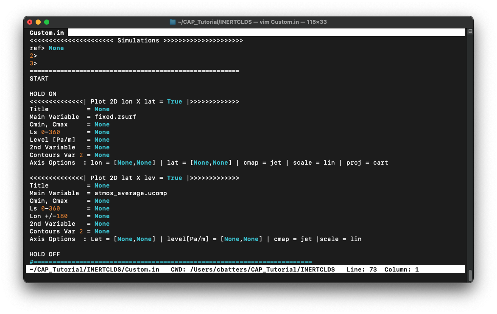

<!-- TOC titleSize:2 tabSpaces:2 depthFrom:1 depthTo:6 withLinks:1 updateOnSave:1 orderedList:0 skip:0 title:1 charForUnorderedList:* -->
## Table of Contents
* [Practical: The Community Analysis Pipeline (CAP)](#the-community-analysis-pipeline-cap)
  * [1. Retrieving Data](#1-retrieving-data)
    * [1.1 Download MGCM output](#11-download-mgcm-output-with-marspullpy)
  * [2. File Manipulations](#2-file-manipulations)
      * [2.1 `fort.11` to `netCDF` Conversion](#21-convert-the-fort11-files-into-netcdf-files)
      * [2.2 Interpolate `atmos_average` to standard pressure](#22-interpolate-atmos_average-to-standard-pressure-coordinates)
      * [2.3 Add `msf` to `atmos_average_pstd`](#23-add-mass-stream-function-msf-to-the-pressure-interpolated-file)
      * [2.4 Add `rho` and `zfull` to `atmos_average`](#24-add-density-rho-and-mid-point-altitude-zfull-to-atmos_average)
      * [2.5 Interpolate `atmos_average` to standard altitude](#25-interpolate-atmos_average-to-standard-altitude)
      * [2.6 Time-Shift & Pressure-Interpolate the Diurn File](#26-time-shift-and-pressure-interpolate-the-diurn-file)
      * [2.7 Apply a Low-Pass Filter (`-lpf`) to the `daily` File](#27-Apply-a-low-pass-filter--lpf-to-the-surface-pressure-ps-and-temperature-ts-in-the-daily-file)
      * [2.8 Vertical Differentiation](#28-estimate-the-magnitude-of-the-wind-shear-using-cap)
      * [2.9 Column Integration](#29-calculate-the-column-integrated-dust-water-ice-and-water-vapor-mixing-ratios-in-the-atmos_daily-file)
      * [2.10 Determine the Minimum, Mean, and Maximum Near-Surface Temperatures](#210-display-the-values-of-pfull-then-display-the-minimum-mean-and-maximum-near-surface-temperatures-temp-over-the-globe)
      * [2.1b ACTIVECLDS: `fort.11` to `netCDF` Conversion](21b-for-activeclds-convert-fort11-files-into-netcdf-files)
      * [2.2b ACTIVECLDS: Interpolate `atmos_average` to standard pressure](22b-for-activeclds-interpolate-atmos_average-to-standard-pressure)
      * [2.5b ACTIVECLDS: Interpolate `atmos_average` to standard altitude](25b-for-activeclds-interpolate-atmos_average-to-standard-altitude)
  * [Break!](#break)
  * [3. Plotting Routines](#3-plotting-routines)
      * [3.1 Global Map: Surface Albedo and Topography](#31-create-a-global-map-of-surface-albedo-alb-with-topography-zsurf-contoured-on-top)
      * [3.2 Zonal Mean Zonal Wind Cross-Section: RIC](#32-plot-the-zonal-mean-zonal-wind-cross-section-at-ls270-using-altitude-as-the-vertical-coordinate)
      * [3.3 Zonal Mean Zonal Wind Cross-Section: RAC](#33-add-the-same-plot-for-the-rac-case-to-the-same-page)
      * [3.4 Overplot Temperatures](#34-overplot-temperature-in-solid-contours)
      * [3.5 Surface Ice & Winds: `lon X lat`](#35-plot-the-surface-co2-ice-content-in-gm2-and-compute-and-plot-surface-wind-speed-from-the-u-and-v-winds)
      * [3.6 Surface Ice & Winds: Improvements](#36-make-the-following-changes-to-the-plots-you-created-in-35)
      * [3.7 Four Global Maps on One Page: `time X lat`](#37-create-the-following-zonal-mean-time-x-lat-plots-on-a-new-page)
      * [3.8 Two Cross-Sections on One Page](#38-plot-the-following-two-cross-sections-lat-x-lev-on-the-same-page)
      * [3.9 Zonal Mean Temperatures: RIC and RAC](#39-plot-zonal-mean-temperature-from-the-ric-and-rac-cases)
      * [3.10 1D Temperature Profiles](#310-generate-two-1d-temperature-profiles-temp-from-the-ric-case)
      * [3.11 Tidal Analysis](#311-plot-the-filtered-and-unfiltered-surface-pressure-over-a-20-sol-period)
<!-- /TOC -->

***

# Practical: The Community Analysis Pipeline (CAP)

**Recap:** CAP is a Python toolkit designed to simplify post-processing and plotting MGCM output. CAP consists of five Python executibles:

1. `MarsPull.py` for accessing MGCM output
2. `MarsFiles.py` for reducing the files
3. `MarsVars.py` for performing variable operations
4. `MarsInterp.py` for interpolating the vertical grid
5. `MarsPlot.py` for visualizing the MGCM output

It is useful to divide these functions into three categories and explore them in order:

1. [Retrieving Data](#1-retrieving-data) -> `MarsPull.py`
2. [File Manipulations](#2-file-manipulations) -> `MarsFiles.py`, `MarsVars.py`, & `MarsInterp.py`
3. [Plotting Routines](#3-plotting-routines) -> `MarsPlot.py`

You already have experience using `MarsPull.py` for retrieving data, which was covered at the end of [CAP_Install.md](https://github.com/alex-kling/amesgcm/blob/master/tutorial/CAP_Install.md). We will build on that knowledge in this tutorial. You may revisit the installation instructions at any time during the tutorial.

## Begin by Activating CAP

As always with CAP, you must activate the `amesGCM3` virtual environment to access the Python executibles:

```bash
(local)>$ source ~/amesGCM3/bin/activate      # bash
(local)>$ source ~/amesGCM3/bin/activate.csh  # csh/tcsh
# ................... OR ...................
(local)>$ source ~/amesGCM3/scripts/activate  # Windows
```
Your prompt should change to confirm you're in the virtual environment. Confirm that CAP's executibles are accessible by typing: 

```bash
(amesGCM3)>$ MarsPull.py -h
```
This is the `--help` argument, which shows the documentation for any of the `Mars*.py` executables.

Let's begin with a review of the data retrieval process you performed when installing CAP ([CAP_Install.md](https://github.com/alex-kling/amesgcm/blob/master/tutorial/CAP_Install.md)).


***

## 1. Retrieving Data

### 1.1 Download MGCM Output with `MarsPull.py`
#### Skip this if you have done it already!

`MarsPull` is used to access and download MGCM output files from the [MCMC Data portal](https://data.nas.nasa.gov/legacygcm/data_legacygcm.php). During the installation, you were asked to:

1. Create a directory called `CAP_Tutorial/`
2. Create two subdirectories: `/INERTCLDS` and `/ACTIVECLDS` 
3. Use `MarsPull` to download several `fort.11` files into each. 

In each subdirectory, `MarsPull` was used to retrieve files from the corresponding simulation on the data portal:

```bash
(amesGCM3)>$ MarsPull.py -id INERTCLDS -ls 255 285    # in the /INERTCLDS directory
# and
(amesGCM3)>$ MarsPull.py -id ACTIVECLDS -ls 255 285   # in the /ACTIVECLDS directory
```

You should have the following 5 `fort.11` files in each directory:

```bash
(amesGCM3)>$ ls CAP_Tutorial/INERTCLDS
> fort.11_0719 fort.11_0720 fort.11_0721 fort.11_0722 fort.11_0723
(amesGCM3)>$ ls CAP_Tutorial/ACTIVECLDS
> fort.11_0719 fort.11_0720 fort.11_0721 fort.11_0722 fort.11_0723
```

#### If you have any `fort.11` files **other than the ones listed above** in **either** directory, **delete** them. 


***

## 2. File Manipulations

We've retrieved the `fort.11` files from the data portal and we can now begin processing the data.

CAP's post-processing capabilities include interpolating and regridding data to different vertical coordinate systems, adding derived variables to the files, and converting between filetypes, just to name a few examples.

The following exercises are designed to demonstrate how CAP can be used for post-processing MGCM output. Please follow along with the demonstration. **We will use the files created here to make plots with `MarsPlot` later, so do *not* delete anything!**

Begin in the `/INERTCLDS` directory and complete exercises 2.1-2.10:

```bash
(amesGCM3)>$ cd ~/CAP_Tutorial/INERTCLDS
```


***

### 2.1 Convert the `fort.11` files into `netCDF` files

In the `/INERTCLDS` directory, type:

```bash
(amesGCM3)>$ MarsFiles.py fort.11_* -fv3 fixed average daily diurn
```

Several `netCDF` files were created from the `fort.11` files:

```bash
(amesGCM3)>$ ls
> 07180.atmos_average.nc  07190.atmos_average.nc  07200.atmos_average.nc  07210.atmos_average.nc  07220.atmos_average.nc
> 07180.atmos_daily.nc    07190.atmos_daily.nc    07200.atmos_daily.nc    07210.atmos_daily.nc    07220.atmos_daily.nc
> 07180.atmos_diurn.nc    07190.atmos_diurn.nc    07200.atmos_diurn.nc    07210.atmos_diurn.nc    07220.atmos_diurn.nc
> 07180.fixed.nc          07190.fixed.nc          07200.fixed.nc          07210.fixed.nc          07220.fixed.nc
```

Remember, the `netCDF` filetypes are:

| Type                  | Description |
| --------------------- | ----------- |
| `*atmos_fixed.nc`     | static variables that **do not change over time**           |
| `*atmos_average.nc`   | **5-day averages** of MGCM output                           |
| `*atmos_diurn.nc`     | files contain **hourly** MGCM output averaged over 5 days   |
| `*atmos_daily.nc`     | **continuous time series** of the MGCM output               |

> **NOTE:** the 5-digit sol number at the begining of each `netCDF` file indicates when the file's records begin. These files are pulled from a simulation that was warm-started from a 10 year run. `10 years x ~668 sols/year = 6680 sols`. The earliest date on these files is 07180 (the middle of the year).


For easier post-processing and plotting, concatenate like-filetypes along the `time` axis:

```bash
(amesGCM3)>$ MarsFiles.py *fixed.nc -c
(amesGCM3)>$ MarsFiles.py *average.nc -c
(amesGCM3)>$ MarsFiles.py *diurn.nc -c
(amesGCM3)>$ MarsFiles.py *daily.nc -c
```

Our directory now contains **four** `netCDF` files in addition to the `fort.11` files:

```bash
(amesGCM3)>$ ls
> 07180.atmos_fixed.nc    fort.11_0719    fort.11_0723
> 07180.atmos_average.nc  fort.11_0720
> 07180.atmos_diurn.nc    fort.11_0721
> 07180.atmos_daily.nc    fort.11_0722
```


***

### 2.2 Interpolate `atmos_average` to standard pressure coordinates

This step uses `MarsInterp`, and the documentation can be viewed using the `--help` argument:

```bash
(amesGCM3)>$ MarsInterp.py -h
```

Use the `--type` (`-t`) argument to interpolate the file to standard pressure coordinates (`pstd`):

```bash
(amesGCM3)>$ MarsInterp.py 07180.atmos_average.nc -t pstd
```

A new pressure-interpolated file called `07180.atmos_average_pstd.nc` was created and the original file was preserved.


***

### 2.3 Add mass stream function (`msf`) to the pressure-interpolated file

This step uses `MarsVars`, and the documentation can be viewed using the `--help` argument:

```bash
(amesGCM3)>$ MarsVars.py -h
```

Adding or removing variables from files is done using the `-add` and `-rem` arguments in the call to `MarsVars`. `msf` is a variable derived from the meridional wind (`vcomp`), so we must first confirm that `vcomp` is indeed a variable in `07180.atmos_average_pstd.nc` by using the `MarsPlot.py --inspect (-i)` command to list the variables in the file:

```python
(amesGCM3)>$ MarsPlot.py -i 07180.atmos_average_pstd.nc

> ===================DIMENSIONS==========================
> ['lat', 'lon', 'phalf', 'time', 'pstd']
> .. (etc) ..
> ====================CONTENT==========================
> .. (etc) ..
> vcomp          : ('time', 'pstd', 'lat', 'lon')= (10, 36, 36, 60), meridional wind  [m/s]
> .. (etc) ..
> Ls ranging from 255.42 to 284.19: 45.00 days
>                (MY 01)   (MY 01)
> =====================================================
```

We can see that `vcomp` is a variable in the file and therefore `msf` can be derived and added:

```bash
(amesGCM3)>$ MarsVars.py 07180.atmos_average_pstd.nc -add msf
```

> **Note:** `msf` should not be added before pressure-interpolating the file because it is derived on pressure coordinates.


**`MarsPlot.py -i` works on any netCDF file, not just the ones created with CAP!**


***

### 2.4 Add density (`rho`) and mid-point altitude (`zfull`) to `atmos_average`

This step also uses the `-add` function from `MarsVars`:

```bash
(amesGCM3)>$ MarsVars.py 07180.atmos_average.nc -add rho zfull
```

Density (`rho`) is derived from pressure (`pfull`) and temperature (`temp`), and mid-point altitude (`zfull`) is obtained via hydrostatic integration.

> **Note:** `rho` and `zfull` must be added to a file before interpolating to another vertical coordinate. Unlike `msf`, these variables are computed on the native model grid and will not be properly calculated on any other vertical grid.


***
### 2.5 Interpolate `atmos_average` to standard altitude

Now that `rho` and `zfull` have been added to `07180.atmos_average.nc`, interpolating the file to standard altitude will include those variables in the new file (`07180.atmos_average_zstd.nc`):

```bash
(amesGCM3)>$ MarsInterp.py 07180.atmos_average.nc -t zstd
```

Your `/INERTCLDS` directory should now contain the fort.11 files and six `netCDF` files:

```bash
> 07180.atmos_fixed.nc    07180.atmos_average_pstd.nc    fort.11_0721
> 07180.atmos_average.nc  07180.atmos_average_zstd.nc    fort.11_0722
> 07180.atmos_diurn.nc    fort.11_0719                   fort.11_0723
> 07180.atmos_daily.nc    fort.11_0720
```

Use the inspect (`MarsPlot.py -i`) function to confirm that:

- The original file (`07180.atmos_average.nc`) contains `rho` and `zfull` but not `msf`.  
- The altitude-interpolated file (`07180.atmos_average_zstd.nc`) contains `rho` and `zfull` but not `msf`.
- The pressure-interpolated file (`07180.atmos_average_pstd.nc`) contains `msf` but not `rho` or `zfull`.

```bash
(amesGCM3)>$ MarsPlot.py -i 07180.atmos_average.nc          # contains rho, zfull, not msf
(amesGCM3)>$ MarsPlot.py -i 07180.atmos_average_zstd.nc     # contains rho, zfull, not msf
(amesGCM3)>$ MarsPlot.py -i 07180.atmos_average_pstd.nc     # contains msf
```


***

### 2.6 Time-shift and pressure-interpolate the `diurn` file

The time-shift function is part of `MarsFiles` and pressure-interpolating is, as we know, part of `MarsInterp`. We'll start by pressure-interpolating the file, **but note that these functions can be used in either order.**


The `diurn` file is organized by time-of-day assuming **universal time** beginning at the Martian prime meridian. Time-shifting the file converts the file to **uniform local time**, which is useful for comparing MGCM output to observations from satellites in fixed local time orbit, for example. Time-shifting can only be done on the `diurn` files because these contain a local time dimension (`ltst`).

For this exercise, include only the surface pressure (`ps`), surface temperature (`ts`), and atmospheric temperature (`temp`) variables. This will minimize file size and processing time.

Time-shift `ps`, `ts`, and `temp` using `MarsFiles`:

```bash
(amesGCM3)>$ MarsFiles.py 07180.atmos_diurn.nc -t --include ts ps temp
```

This created a new file ending in `_T.nc` and containing only `ts`, `ps`, `temp`, and their relevant dimensions. Now, pressure-interpolate the file using `MarsInterp`:

```bash
(amesGCM3)>$ MarsInterp.py 07180.atmos_diurn_T.nc -t pstd
```

This should take just over a minute. 

> **Note:** Interpolating large files (such as `daily` or `diurn` files) with CAP can take a long time because the code is written in Python. That's why we are only including three variables (`ps`, `ts`, and `temp`) in this particular demonstration. 

After time-shifting and pressure-interpolating, `/INERTCLDS` should contain three `diurn` files:

```bash
> 07180.atmos_diurn.nc  07180.atmos_diurn_T.nc  07180.atmos_diurn_T_pstd.nc
```

> **Note:** We will *not* do this here, but you can create custom vertical grids that you want CAP to interpolate to. See the documentation for `MarsInterp` for more information.


***

### 2.7 Apply a low-pass filter (`-lpf`) to the surface pressure (`ps`) and temperature (`ts`) in the `daily` file

Temporal filtering and tidal analyses are functions of `MarsFiles`. The low-pass filter argument requires a cutoff frequency, `sol_max`. Here, we use a 2-sol cut-off frequency to isolate synoptic-scale features. Include only `ps` and `ts` in the new file:

```bash
(amesGCM3)>$ MarsFiles.py 07180.atmos_daily.nc -lpf 2 -include ps ts
```

This created `07180.atmos_daily_lpf.nc` containing only `ps`, `ts`, and their relevant dimensions.


### 2.8 Estimate the magnitude of the wind shear using CAP

This can be done by vertically-differentiating the zonal (U) and meridional (V) winds, i.e. computing dU/dz and dV/dz. The U and V winds are output by the model as `ucomp` and `vcomp`, respectively.

You already know that `MarsVars` is used for adding variables, however, the `-add` argument will not work here. Instead, there is a call specifically for vertical differentiation called `-zdiff`.

Compute and add dU/dz and dV/dz to `07180.atmos_average_zstd.nc` using `-zdiff`:

```bash
(amesGCM3)>$ MarsVars.py 07180.atmos_average_zstd.nc -zdiff ucomp vcomp
```

Using the inspect (`MarsPlot.py -i`) function, we can see the new variables in the file:

```bash
(amesGCM3)>$ MarsPlot.py -i 07180.atmos_average_zstd.nc
> ===================DIMENSIONS==========================
> ['lat', 'lon', 'phalf', 'time', 'zstd']
> .. (etc) ..
> ====================CONTENT==========================
> .. (etc) ..
> d_dz_ucomp     : ('time', 'zstd', 'lat', 'lon')= (10, 45, 36, 60), vertical gradient of zonal wind  [m/s/m]]
> d_dz_vcomp     : ('time', 'zstd', 'lat', 'lon')= (10, 45, 36, 60), vertical gradient of meridional wind  [m/m]]
> .. (etc) ..
>
> Ls ranging from 255.42 to 284.19: 45.00 days
>                (MY 01)   (MY 01)
> =====================================================
```


### 2.9 Calculate the column-integrated dust, water ice, and water vapor mixing ratios in the `daily` file

Similar to the -`zdiff` function, `MarsVars` has a `-col` function that performs a column integration on specified variables.

Column-integrate the dust, water ice, and water vapor mixing ratios like so:

```bash
(amesGCM3)>$ MarsVars.py 07180.atmos_daily.nc -col dst_mass ice_mass vap_mass
```

Using the inspect (`MarsPlot.py -i`) function, we can see the new variables in the file:

```bash
(amesGCM3)>$ MarsPlot.py -i 07180.atmos_daily.nc
> ===================DIMENSIONS==========================
> ['lat', 'lon', 'pfull', 'phalf', 'zgrid', 'scalar_axis', 'time']
> .. (etc) ..
> ====================CONTENT==========================
> .. (etc) ..
> dst_mass_col   : ('time', 'lat', 'lon')= (800, 36, 60), column integration of dust aerosol mass mixing ratio  [kg/m2]
> ice_mass_col   : ('time', 'lat', 'lon')= (800, 36, 60), column integration of water ice aerosol mass mixing ratio  [kg/m2]
> vap_mass_col   : ('time', 'lat', 'lon')= (800, 36, 60), column integration of water vapor mass mixing ratio  [kg/m2]
> dst_mass       : ('time', 'pfull', 'lat', 'lon')= (800, 24, 36, 60), dust aerosol mass mixing ratio  [kg/kg]
> ice_mass       : ('time', 'pfull', 'lat', 'lon')= (800, 24, 36, 60), water ice aerosol mass mixing ratio  [kg/kg]
> vap_mass       : ('time', 'pfull', 'lat', 'lon')= (800, 24, 36, 60), water vapor mass mixing ratio  [kg/kg]
>
> Ls ranging from 254.12 to 286.06: 49.94 days
>                (MY 01)   (MY 01)
> =====================================================
```


### 2.10 Display the values of `pfull`, then display the minimum, mean, and maximum near-surface temperatures `temp` over the globe

Here, we build on our knowledge of the inspect (`MarsPlot.py -i`) function. We already know that `MarsPlot.py -i` displays the variables in a file and information about the file, but `--inspect` can be combined with `--dump` and `--stat` to show more information about specific variables.


Display values of `pfull` in `07180.atmos_average.nc` using `--dump`:

```bash
(amesGCM3)>$ MarsPlot.py -i 07180.atmos_average.nc -dump pfull
> pfull=
> [8.7662227e-02 2.5499690e-01 5.4266089e-01 1.0518962e+00 1.9545468e+00
> 3.5580616e+00 6.2466631e+00 1.0509957e+01 1.7400265e+01 2.8756382e+01
> 4.7480076e+01 7.8348366e+01 1.2924281e+02 2.0770235e+02 3.0938846e+02
> 4.1609518e+02 5.1308148e+02 5.9254102e+02 6.4705731e+02 6.7754218e+02
> 6.9152936e+02 6.9731799e+02 6.9994830e+02 7.0082477e+02]
> ______________________________________________________________________
```

As you can see, `--dump` is a kind of analog for the NCL command `ncdump`.

Indexing specific values of `pfull` is done using quotes and square brackets:

```bash
(amesGCM3)>$ MarsPlot.py -i 07180.atmos_average.nc -dump 'pfull[-1]'
> pfull[-1]=
> 700.8247680664062
> ______________________________________________________________________
```

Indexing the last array element with `-1` (Python syntax), we can see the reference pressure of the first layer above the surface in the MGCM.

> **Note:** quotes `''` are necessary when browsing dimensions.

The minimum, mean, and maximum values of a variable are computed and displayed in the terminal with the `-stat` argument. `-stat` is better suited for visualizing statistics over large arrays like the four-dimensional temperature variable (`temp`). Given the dimensions of the `temp` variable, `[time,pfull,lat,lon]`, use `-stat` to display the minimum, mean, and maximum **near-surface air temperature (over all timesteps and all locations)**:

```bash
(amesGCM3)>$ MarsPlot.py -i 07180.atmos_average.nc -stat 'temp[:,-1,:,:]'
> __________________________________________________________________________
>            VAR            |      MIN      |      MEAN     |      MAX      |
> __________________________|_______________|_______________|_______________|
>             temp[:,-1,:,:]|        149.016|        202.508|         251.05|
> __________________________|_______________|_______________|_______________|
```

***

and... that's it for post-processing the data in the RIC simulation! 

Before moving on to plotting, we need to repeat some of these steps for the RAC simulation. Feel free to repeat all of Steps 2.1-2.10 for the RAC case if you like, but **you are only required to repeat Steps 2.1, 2.2, and 2.5** for this tutorial. For simplicity, we've summarized these steps here:

### 2.1b (for `/ACTIVECLDS`) Convert `fort.11` files into `netCDF` files

In the `/ACTIVECLDS` directory, use `MarsFiles` to convert from `fort.11` to `netCDF`, and then concatenate the files along their `time` axes:

```bash
(amesGCM3)>$ MarsFiles.py fort.11_* -fv3 fixed average daily diurn
(amesGCM3)>$ MarsFiles.py *fixed.nc -c
(amesGCM3)>$ MarsFiles.py *average.nc -c
(amesGCM3)>$ MarsFiles.py *diurn.nc -c
(amesGCM3)>$ MarsFiles.py *daily.nc -c
```

`/ACTIVECLDS` should now contain the original `fort.11` files and just **four** `netCDF` files:

```bash
> 07180.atmos_fixed.nc    fort.11_0719    fort.11_0723
> 07180.atmos_average.nc  fort.11_0720
> 07180.atmos_diurn.nc    fort.11_0721
> 07180.atmos_daily.nc    fort.11_0722
```

### 2.2b (for `/ACTIVECLDS`) Interpolate `atmos_average` to standard pressure

Use `MarsInterp`'s' `--type` (`-t`) command to create `07180.atmos_average_pstd.nc`.:

```bash
(amesGCM3)>$ MarsInterp.py 07180.atmos_average.nc -t pstd
```


### 2.5b (for `/ACTIVECLDS`) Interpolate `atmos_average` to standard altitude

Again, use `MarsInterp`'s' `--type` (`-t`) command to create `07180.atmos_average_zstd.nc`.:

```bash
(amesGCM3)>$ MarsInterp.py 07180.atmos_average.nc -t zstd
```

Your `/ACTIVECLDS` directory should now contain the fort.11 files and six `netCDF` files:

```bash
> 07180.atmos_fixed.nc    07180.atmos_average_pstd.nc    fort.11_0721
> 07180.atmos_average.nc  07180.atmos_average_zstd.nc    fort.11_0722
> 07180.atmos_diurn.nc    fort.11_0719                   fort.11_0723
> 07180.atmos_daily.nc    fort.11_0720
```


***

# Break!
Once you've completed Step 2, you are welcome to take a 15 minute break from the tutorial. 

You can use this time to catch up if you haven't completed Steps 1 and/or 2 already, but we highly encourage you to step away from your machine for these 15 minutes.


***

## 3. Plotting Routines

Time to practice plotting MGCM output with CAP! 

CAP's plotting routine is `MarsPlot`, which can create several plot types:

|Type of plot          |MarsPlot Designation  |
| ---:                 | :---                 |
| Longitude v Latitude |`Plot 2D lon x lat`   |
| Longitude v Time     |`Plot 2D lon x time`  |
| Longitude v Level    |`Plot 2D lon x lev`   |
| Latitude v Level     |`Plot 2D lat x lev`   |
| Time v Latitude      |`Plot 2D time x lat`  |
| Time v level         |`Plot 2D time x lev`  |
| Any 1-D line plot    |`Plot 1D`             |

`MarsPlot` is customizable. Options include: 
- PDF or image format 
- Landscape or portrait mode
- 1+ plots per page
- Overplotting is supported
- Adjustible axes dimensions, colormaps, map projections, contour levels, etc.

**Plotting with CAP requires passing a template to `MarsPlot`.** 

Create the default template by typing:

```bash
(amesGCM3)>$ MarsPlot.py -template
```

The template is called `Custom.in`. We will edit `Custom.in` to create various plots. **We highly recommend using a text editor that opens `Custom.in` in its own window.** Some options include: gvim, sublime text, atom, and pyzo. 

If you use vim, you just have to be familiar with copying and pasting in the terminal. You will also benefit from opening another terminal from which to run command-line calls.


Open `Custom.in` in your preferred text editor, for example:

```bash
(amesGCM3)>$ gvim Custom.in
```

Scroll down until you see the first two templates shown in the image below:



By default, `Custom.in` is set to create the two plots shown above: a global topographical map and a zonal mean wind cross-section. The plot type is indicated at the top of each template:

``` python
> <<<<<<<<<<<<<<| Plot 2D lon X lat = True |>>>>>>>>>>>>>
> <<<<<<<<<<<<<<| Plot 2D lat X lev = True |>>>>>>>>>>>>>
```

When set to `True` (as it is here), `MarsPlot` will draw that plot. If `False`, `MarsPlot` will skip that plot. 

The variable to be plotted is `Main Variable`, which requires the variable name and the file containing it as input:

```python
 Main Variable  = fixed.zsurf   # file.variable
```

**Without making any changes to `Custom.in`**, close the file and pass it back to `MarsPlot`:

```bash
(amesGCM3)>$ MarsPlot.py Custom.in
```

This creates `Diagnostics.pdf`, a single-page PDF displaying the two plots we just discussed: global topography and zonal mean wind. Open the PDF to see the plots.

You can rename `Custom.in` and still pass it to `MarsPlot` successfully. If the template is named anything other than `Custom.in`, `MarsPlot` will produce a PDF named after the template, i.e. `myplots.in` creates `myplots.pdf`. For example:

```bash
(amesGCM3)>$ mv Custom.in myplots.in
(amesGCM3)>$ MarsPlot.py myplots.in
> Reading myplots.in
> [----------]  0 % (2D_lon_lat :fixed.zsurf)
> [#####-----] 50 % (2D_lat_lev :atmos_average.ucomp, Ls= (MY 1) 284.19, zonal avg)
> [##########]100 % (Done)
> Merging figures...
> "/username/CAP_Tutorial/INERTCLDS/myplots.pdf" was generated
```

***

Those are the basics of plotting with CAP. We'll create several plots in exercises 3.1-3.11 below. Begin by deleting `myplots.in` and `myplots.pdf` (if you have them), and then create a new `Custom.in` template:

```bash
(amesGCM3)>$ rm myplots.in myplots.pdf
(amesGCM3)>$ MarsPlot.py -template
```

**Make sure you're in the `/INERTCLDS` directory before continuing.**


***

### 3.1 Create a global map of surface albedo (`alb`) with topography (`zsurf`) contoured on top

Open `Custom.in` in your preferred text editor and make the following changes:

- Set the `Plot 2D lat X lev` to `False` so that `MarsPlot` does not draw it
- On `Plot 2D lon X lat`, set `Main Variable` to albedo (`alb`), which is located in the `fixed` file. Albedo will be color-filled.
- Set `2nd Variable` to topography (`zsurf`), also located in the `fixed` file. Topography will appear as solid contours.
- Set the `Title` to reflect the variable(s) being plotted

Here is what your template should look like:

```python
> <<<<<<<<<<<<<<| Plot 2D lon X lat = True |>>>>>>>>>>>>>
> Title          = 3.1: Albedo w/Topography Overplotted
> Main Variable  = fixed.alb
> Cmin, Cmax     = None
> Ls 0-360       = None
> Level [Pa/m]   = None
> 2nd Variable   = fixed.zsurf
> Contours Var 2 = None
> Axis Options  : lon = [None,None] | lat = [None,None] | cmap = binary | scale = lin | proj = cart
```

Save `Custom.in` (but don't close it!) and go back to the terminal. Pass `Custom.in` back to `MarsPlot`:

```bash
(amesGCM3)>$ MarsPlot.py Custom.in
```

Open `Diagnostics.pdf` and check to make sure it contains a global map of surface albedo with topography contoured overtop.

> Depending on the settings for your specific PDF viewer, you may have to close and reopen the file to view it.


***

### 3.2 Plot the zonal mean zonal wind cross-section at Ls=270° using altitude as the vertical coordinate

`Custom.in` should still be open in your text editor.
- Set the `2D lat X lev` template to `True`
- Change `Main Variable` to point to `ucomp` stored in the `atmos_average_zstd` file
- Set `Ls` to 270°
- Edit the `Title` accordingly

Save `Custom.in`, and pass it to `MarsPlot`. Again, view `Diagnostics.pdf` to see your plots!


***

### 3.3 Add the same plot for the RAC case to the same page

> **Tip:** Copy and paste the `lat x lev` plot you made in 3.2 so that you have two identical templates.

First, point `MarsPlot` to the `/ACTIVECLDS` directory. Do this by editing the `<<<<<<< Simulations <<<<<<<` section so that `2>` points to `/ACTIVECLDS` like so:

```python
> <<<<<<<<<<<<<<<<<<<<<< Simulations >>>>>>>>>>>>>>>>>>>>>
> ref> None
> 2> ../ACTIVECLDS
> 3>
```

Then, edit `Main Variable` in the duplicate template so that the `atmos_average_zstd` file in `/ACTIVECLDS` is sourced:

```python
> Main Variable  = atmos_average_zstd@2.ucomp
```

> **Tip:** Make use of `HOLD ON` and `HOLD OFF` for these.

Save `Custom.in` and pass it to `MarsPlot`. View `Diagnostics.pdf` to see the results.


***

### 3.4 Overplot temperature in solid contours

Add `temp` as the second variable on the plots you created in 3.2 and 3.3:

```python
> <<<<<<<<<<<<<<| Plot 2D lat X lev = True |>>>>>>>>>>>>>
> > 2nd Variable     = atmos_average_zstd.temp
> .. (etc) ..
> 
> <<<<<<<<<<<<<<| Plot 2D lat X lev = True |>>>>>>>>>>>>>
> > 2nd Variable     = atmos_average_zstd@2.temp
> .. (etc) ..
```

Save `Custom.in` and pass it to `MarsPlot`. View `Diagnostics.pdf` to see the results.


***

### 3.5 Plot the surface CO2 ice content in g/m2 and compute and plot surface wind speed from the U and V winds

These will be `lon X lat` plots. Both require variable operations using square brackets `[]`. Plot the results at Ls=270°. Source all of the variables from the `atmos_daily` file in `/INERTCLDS`.

- Surface CO2 Ice (`snow`): Convert kg/m2 -> g/m2. Set the plot area to between 50 °N and 90 °N.

 Using square brackets:
```python
Main Variable  = [atmos_daily.snow]*1000
```

- Surface Wind Speed (`sqrt(u^2 + v^2)`): Call both `ucomp` and `vcomp` under `Main Variable`.

 Using square brackets:
```python
Main Variable  = sqrt([atmos_daily.ucomp]**2+[atmos_daily.vcomp]**2)
```

Use `HOLD ON` and `HOLD OFF` again. You can use this syntax multiple times in the same template. The general format will be:

```python
> HOLD ON
> 
> <<<<<<| Plot 2D lon X lat = True |>>>>>>
> Title    = Surface CO2 Ice (g/m2)
> .. (etc) ..
> 
> <<<<<<| Plot 2D lon X lat = True |>>>>>>
> Title    = Surface Wind Speed (m/s)
> .. (etc) ..
> 
> HOLD OFF
```

Name the plots accordingly. Save `Custom.in` and pass it to `MarsPlot`. You should see two plots on one page in `Diagnostics.pdf`


### 3.6 Make the following changes to the plots you created in 3.5

For the surface CO2 ice plot: 
  - Set the Y axis limits to 60-90 N
  - Set the projection type to `Npole`

For the surface wind speed plot:
  - Constrain the Y axis limits to the northern hemisphere
  - Constrain the X axis limits to the western hemisphere
  - Draw contours at 1, 10, and 20, m/s *(add a second variable!)*


***


### 3.7 Create the following zonal mean `time X lat` plots on a new page

- Surface Temperature (`ts`). Set the colormap to `nipy_spectral`.
- Column dust mass (`dst_mass_col`). Set the colormap to `Spectral_r`.
- Column water ice mass (`ice_mass_col`). Set the colormap to `Spectral_r`.
- Column water vapor mass (`vap_mass_col`). Set the colormap to `Spectral_r`.

> **NOTE:** set the colormap in `Axis Options`:
>```python
>Axis Options  : sols = [None,None] | lat = [None,None] | cmap = nipy_spectral |scale = lin
>```

Source all of the variables from the `atmos_daily` file in `/INERTCLDS`. The general format will be:

```python
> HOLD ON
> 
> <<<<<<| Plot 2D time X lat = True |>>>>>>
> Title    = Zonal Mean Surface Temperature (K)
> .. (etc) ..
> 
> <<<<<<| Plot 2D time X lat = True |>>>>>>
> Title    = Zonal Mean Column Integrated Dust Mass (kg/m2)
> .. (etc) ..
> 
> <<<<<<| Plot 2D time X lat = True |>>>>>>
> Title    = Zonal Mean Column Integrated Water Ice Mass (kg/m2)
> .. (etc) ..
> 
> <<<<<<| Plot 2D time X lat = True |>>>>>>
> Title    = 1Zonal Mean Column Integrated Water Vapor Mass (kg/m2)
> .. (etc) ..
> 
> HOLD OFF
```

Name the plots accordingly. Save `Custom.in` and pass it to `MarsPlot`.


***

### 3.8 Plot the following two cross-sections (`lat X lev`) on the same page

Zonal mean mass streamfunction (`msf`) at Ls=270°
  - Change the colormap from `jet` to `RdBu_r`
  - Force symmetrical contouring by setting the colorbar's minimum and maximum values to -150 and 150
  - Adjust the Y axis limits to 1,000-1 Pa
  - Overplot solid contours at `-100,-50,-10,-5,5,10,50,100` *(Hint: set both `Main Variable` and `2nd Variable` to `msf`)*

Zonal mean temperature (`temp`) at Ls=270° 
  - Source from the same pressure-interpolated file
  - Overplot the zonal mean zonal wind (`ucomp`)
  - Adjust the Y axis limits to 1,000-1 Pa
  - Set the colormap to `jet`

Don't forget to use `HOLD ON` and `HOLD OFF` and to name your plots accordingly. Save `Custom.in` and pass it to `MarsPlot`.


***

### 3.9 Plot zonal mean temperature from the RIC and RAC cases

Create both plots at Ls=270° from the `atmos_average_pstd` file, then create a difference plot.

Make use of `HOLD ON` and `HOLD OFF` again here. Copy and paste a `lat x lev` template three times. For the difference plot, you'll need to use `@N` to point to the `/ACTIVECLDS` directory and use square brackets to subtract one variable from the other:

```python
> Main Variable  = [atmos_average_pstd.temp]-[atmos_average_pstd@2.temp]
```

- Set the minimum and maximum contour-fill intervals to 130 and 250, respectively, on the RIC and RAC plots 
- Set the colormap to `RdBu` for the difference plot
- Set the minimum and maximum contour-fill intervals to -15 and 15, respectively, on the difference plot
- For all three plots, set the vertical range to 1,000-1 Pa
- Set proper titles

Save `Custom.in` and pass it to `MarsPlot`.


***

### 3.10 Generate two 1D temperature profiles (`temp`) from the RIC case 

Call `temp` from the `diurn_T_pstd` file, which is the time-shifted and pressure-interpolated version of the hourly file. Draw the 3 AM and 3 PM thermal profiles at `50°N, 150°E` at Ls=270°. 3 AM is index=`3`, 3 PM is index=`15`, so `Main Variable` will be set as:

```python
> Main Variable    = diurn_T_pstd.temp{ tod=3 }
#                        filename.var{  tod=X }
```

and

```python
> Main Variable    = diurn_T_pstd.temp{tod=15}
```

You will have to specify `Level [Pa/m]` as the Y axis:

```python
> Level [Pa/m]     = AXIS
```

Fnally, change the Y axis limits from `None` to `1000,1` Pa:

```python
> lat,lon+/-180,[Pa/m],sols = [1000,1]
```

To draw two lines on one axes, use `ADD LINE`:

```python
> <<<<<<| Plot 1D = True |>>>>>>
> Main Variable    = var1
> .. (etc) ..
> 
> ADD LINE
> 
> <<<<<<| Plot 1D = True |>>>>>>
> Main Variable    = var2
> .. (etc) ..
```

#### **NOTE:** You do not use `HOLD ON` and `HOLD OFF` to overplot 1D plots. `HOLD` is always for drawing separate plots on the same page

Save `Custom.in` and pass it to `MarsPlot`. View `Diagnostics.pdf`.


***

### 3.11 Plot the 1D filtered and unfiltered surface pressure over a 20-sol period

Here we're asked to compare surface pressure `ps` from the orginal file (`atmos_daily`) to the surface pressure that we time-filtered in exercise 2.6 (`atmos_daily_lpf`).

- Both are 1D plots so use `ADD LINE` to plot on the same axes
- Use `ps` from `atmos_daily.nc` and `atmos_daily_lpf.nc`
- Since we need to choose a location, set `Latitude = 50` and `Lon +/-180 = 150`
- Under `Axis Options`, set the X axis range to (`Ls = [260, 280]`)
- Under `Axis Options`, set the Y axis range to (`var = [860,980]` Pa)

Save `Custom.in` and pass it to `MarsPlot`. View `Diagnostics.pdf`.


***


## That's a Wrap!

This concludes the practical exercise portion of the CAP tutorial. Please keep these exercises as a reference for the future!

*This document was completed in October 2021. Written by Alex Kling, Courtney Batterson, and Victoria Hartwick*

Please submit feedback to Alex Kling: alexandre.m.kling@nasa.gov


***