<!-- TOC titleSize:2 tabSpaces:2 depthFrom:1 depthTo:6 withLinks:1 updateOnSave:1 orderedList:0 skip:0 title:1 charForUnorderedList:* -->
## Table of Contents
* [Introducing the Community Analysis Pipeline (CAP)](#introducing-the-community-analysis-pipeline-cap)
* [Cheat sheet](#cheat-sheet)
* [The big question... How do I do this? >  <span style="color:red">Ask for help!  </span>](#the-big-question-how-do-i-do-this---span-stylecolorredask-for-help--span)
* [1. `MarsPull.py` - Downloading Raw MGCM Output](#1-marspullpy---downloading-raw-mgcm-output)
* [2. `MarsFiles.py` - Reducing the Files](#2-marsfilespy---reducing-the-files)
* [3. `MarsVars.py` - Performing Variable Operations](#3-marsvarspy---performing-variable-operations)
* [4. `MarsInterp.py` - Interpolating the Vertical Grid](#4-marsinterppy---interpolating-the-vertical-grid)
* [5. `MarsPlot.py` - Plotting the Results](#5-marsplotpy---plotting-the-results)
* [MarsPlot.py:  How to?](#marsplotpy--how-to)
  * [Inspect the content of netCDF files](#inspect-the-content-of-netcdf-files)
  * [Disable or add a new plot](#disable-or-add-a-new-plot)
  * [Adjust the color range  and colormap](#adjust-the-color-range--and-colormap)
  * [Make a 1D-plot](#make-a-1d-plot)
  * [Customize 1D plots](#customize-1d-plots)
  * [Put multiple plots on the same page](#put-multiple-plots-on-the-same-page)
  * [Put multiple 1D-plots on the same page](#put-multiple-1d-plots-on-the-same-page)
  * [Use a different epoch](#use-a-different-epoch)
  * [Access simulation in a different directory](#access-simulation-in-a-different-directory)
  * [Overwrite the free dimensions.](#overwrite-the-free-dimensions)
  * [Element-wise operations](#element-wise-operations)
  * [Code comments and speed-up processing](#code-comments-and-speed-up-processing)
  * [Change projections](#change-projections)
  * [Figure format, size](#figure-format-size)
  * [Access CAP libraries and make your own plots](#access-cap-libraries-and-make-your-own-plots)
  * [Debugging](#debugging)
<!-- /TOC -->

***

# Introducing the Community Analysis Pipeline (CAP)

CAP is a toolkit designed to simplify the post-processing of MGCM output. CAP is written in Python and works with existing Python libraries, allowing any Python user to install and use CAP easily and free of charge. Without CAP, plotting MGCM output requires that a user provide their own scripts for post-processing, including code for interpolating the vertical grid, computing and adding derived variables to files, converting between file types, and creating diagnostic plots. In other words, a user would be responsible for the entire post-processing effort as illustrated in Figure 1.

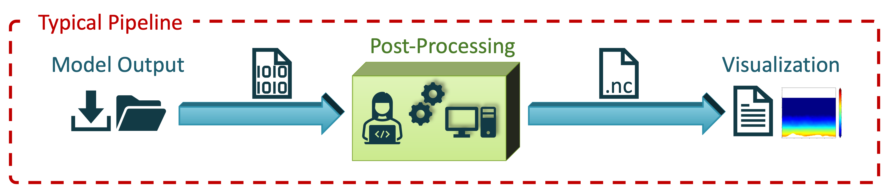

Such a process requires that users be familiar with Fortran files and be able to write (or provide) script(s) to perform file manipulations and create plots. CAP standardizes the post-processing effort by providing executables that can perform file manipulations and create diagnostic plots from the command line. This enables users of almost any skill level to post-process and plot MGCM data (Figure 2).

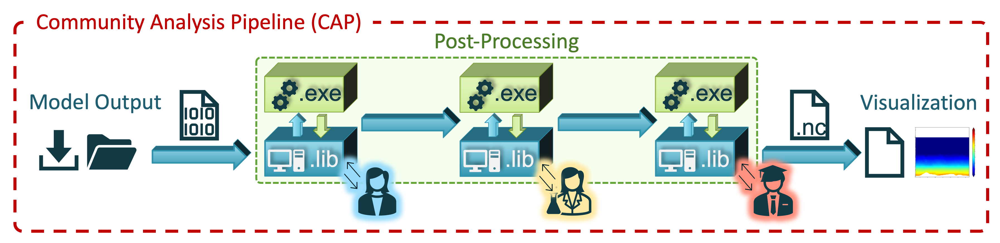


As a foreword, we will list a few design characteristics of CAP:

* CAP is written in **Python**, an open-source programming language with extensive scientific libraries available
* CAP is installed within a Python **virtual environment**, which provides cross-platform support (MacOS, Linux and Windows), robust version control (packages updated within the main Python distribution will not affect CAP), and is not intrusive as it disappears when deactivated
* CAP is composed of a **set of libraries** (functions), callable from a user's own scripts and a collection of **five executables**, which  allows for efficient processing of model outputs from the command-line.
* CAP uses the **netCDF4 data format**, which is widely use in the climate modeling community and self-descriptive (meaning that a file contains  explicit information about its content in term of variables names, units etc...)
* CAP uses a convention for output formatting inherited from the GFDL Finite­-Volume Cubed-Sphere Dynamical Core, referred here as  "**FV3 format**": outputs may be binned and averaged in time in various ways for analysis.  
*  CAP long-term goal is to offer **multi-model support**. At the time of the writing, both the NASA Ames Legacy GCM and the NASA Ames GCM with the FV3 dynamical core are  supported. Efforts are underway to offer compatibility to others Global Climate Models (e.g. eMARS, LMD, MarsWRF).


Specifically, CAP consists of five executables:

1. `MarsPull.py`    Access MGCM output
2. `MarsFiles.py`   Reduce the files
3. `MarsVars.py`    Perform variable operations
4. `MarsInterp.py`  Interpolate the vertical grid
5. `MarsPlot.py`    Visualize the MGCM output


These executables and their commonly-used functions are illustrated in the cheat sheet below in the order in which they are most often used. You should feel free to reference during and after the tutorial.

# Cheat sheet

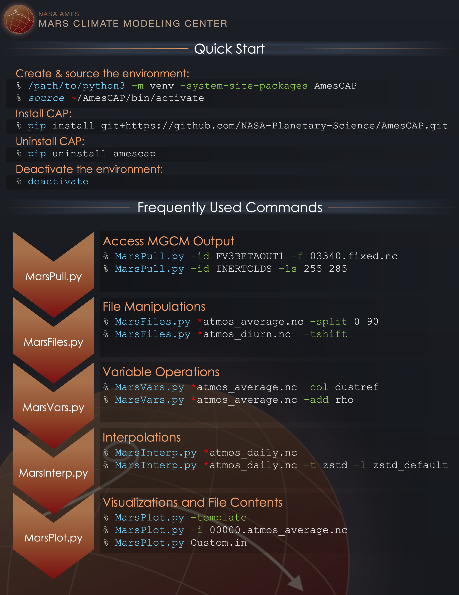

CAP is designed to be modular. For example, a user could post-process and plot MGCM output exclusively with CAP or a user could employ their own post-processing routine and then use CAP to plot the data. Users are free to selectively integrate CAP into their own analysis routine to the extent they see fit.


***
# The big question... How do I do this? >  <span style="color:red">Ask for help!  </span>
Use the `--help` (`-h` for short) option on any executable to display documentation and examples.

```
(AmesCAP)>$ MarsPlot.py -h
> usage: MarsPlot.py [-h] [-i INSPECT_FILE] [-d DATE [DATE ...]] [--template]
>                   [-do DO] [-sy] [-o {pdf,eps,png}] [-vert] [-dir DIRECTORY]
>                   [--debug]
>                   [custom_file]
```


***

# 1. `MarsPull.py` - Downloading Raw MGCM Output

`MarsPull` is a utility for accessing MGCM output files hosted on the [MCMC Data portal](https://data.nas.nasa.gov/legacygcm/data_legacygcm.php). MGCM data is archived in 1.5 hour intervals (16x/day) and packaged in files containing 10 sols. The files are named fort.11_XXXX in the order they were produced, but  `MarsPull` maps those files to specific solar longitudes (L<sub>s</sub>, in °). This allows users to request a file at a specific L<sub>s</sub> or for a range of L<sub>s</sub> using the `-ls` flag. Additionally the `identifier` (`-id`) flag is used to route `MarsPull` through a particular simulation. The `filename` (`-f`) flag can be used to parse specific files within a particular directory.

```bash
MarsPull.py -id INERTCLDS -ls 255 285
MarsPull.py -id ACTIVECLDS -f fort.11_0720 fort.11_0723
```
[Back to Top](#cheat-sheet)
***

# 2. `MarsFiles.py` - Reducing the Files

`MarsFiles` provides several tools for file manipulations, including code designed to create binned, averaged, and time-shifted files from MGCM output. The `-fv3` flag is used to convert fort.11 binaries to the Netcdf data format (you can select one or more of the file format listed below):

```bash
(AmesCAP)>$ MarsFiles.py fort.11* -fv3 fixed average daily diurn
```

These are the file formats that `MarsFiles` can create from the fort.11 MGCM output files.

**Primary files**

| File name | Description                                    |Timesteps for 10 sols x 16 output/sol           |Ratio to daily file (430Mb)|
|-----------|------------------------------------------------|----------------------------------------------- | ---                  |
|**atmos_daily.nc** | continuous time series                | (16 x 10)=160                                  | 1                    |
|**atmos_diurn.nc** | data binned by time of day and 5-day averaged | (16 x 2)=32                                    | x5 smaller           |
|**atmos_average.nc** | 5-day averages                              |  (1 x 2) = 2                                           | x80 smaller          |
|**fixed.nc** | statics variable such as surface albedo and topography  |  static                                        |few kB                |


**Secondary files**


| File name | description|
|-----------|------------|
|daily**_lpf**,**_hpf**,**_bpf** |low, high and band pass filtered|
|diurn**_T** |uniform local time (same time of day at all longitudes)|
|diurn**_tidal** |tidally-decomposed files into  harmonics|
|daily**_to_average**  **_to_diurn** |custom re-binning of daily files|

- `MarsFiles` can concatenate like-files together along the time dimension using the `-combine` (`-c`) flag.

```bash
> 07180.atmos_average.nc  07190.atmos_average.nc  07200.atmos_average.nc # 3 files with 10 days of output each
(AmesCAP)>$ MarsFiles.py *atmos_average.nc -c
> 07180.atmos_average.nc  # 1 file with 30 days of output
```

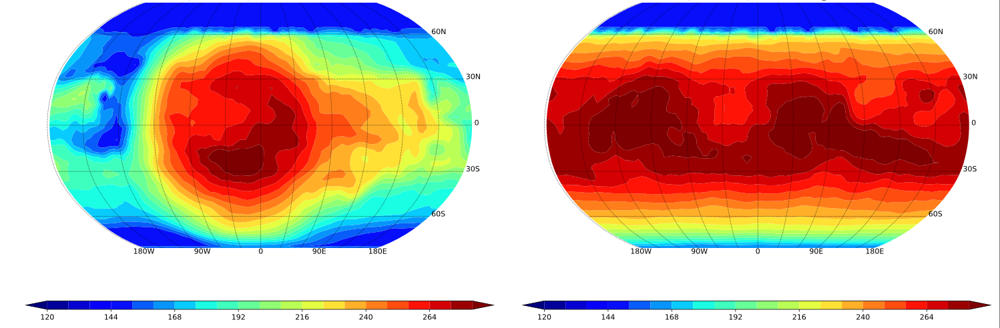
*3pm surface temperature before (left) and after (right) processing a diurn file with MarsFile to uniform local time (`diurn_T.nc`)*


[Back to Top](#cheat-sheet)
***

# 3. `MarsVars.py` - Performing Variable Operations

`MarsVars` provides several tools relating to variable operations such as adding and removing variables, and performing column integrations. With no other arguments, passing a file to `MarsVars` displays file content, much like `ncdump`:

```bash
(AmesCAP)>$ MarsVars.py 00000.atmos_average.nc
>
> ===================DIMENSIONS==========================
> ['bnds', 'time', 'lat', 'lon', 'pfull', 'scalar_axis', 'phalf']
> (etc)
> ====================CONTENT==========================
> pfull          : ('pfull',)= (30,), ref full pressure level  [Pa]
> temp           : ('time', 'pfull', 'lat', 'lon')= (4, 30, 180, 360), temperature  [K]
> (etc)
```

A typical option of `MarsVars` would be to add the atmospheric density `rho` to a file. Because the density is easily computed from the pressure and temperature fields, we do not archive in in the GCM output and instead provides a utility to add it as needed. This conservative approach to logging output allows to  minimize disk space and speed-up post processing.


```bash
(AmesCAP)>$ MarsVars.py 00000.atmos_average.nc -add rho
```

We can see that `rho` was added by calling `MarsVars` with no argument as before:

```bash
(AmesCAP)>$ MarsVars.py 00000.atmos_average.nc
>
> ===================DIMENSIONS==========================
> ['bnds', 'time', 'lat', 'lon', 'pfull', 'scalar_axis', 'phalf']
> (etc)
> ====================CONTENT==========================
> pfull          : ('pfull',)= (30,), ref full pressure level  [Pa]
> temp           : ('time', 'pfull', 'lat', 'lon')= (4, 30, 180, 360), temperature  [K]
> rho            : ('time', 'pfull', 'lat', 'lon')= (4, 30, 180, 360), density (added postprocessing)  [kg/m3]
```

The `help` (`-h`) option provides information on available variables and needed fields for each operation.

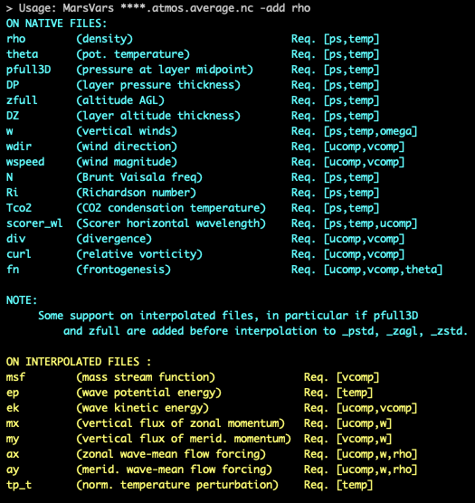

`MarsVars` also offers the following variable operations:


| Command | flag| action|
|-----------|-----|-------|
|add | -add  | add a variable to the file|
|remove |-rm| remove a variable from a file|
|extract |-extract | extract a list of variables to a new file |
|col |-col | column integration, applicable to mixing ratios in [kg/kg] |
|zdiff |-zdiff |vertical differentiation (e.g. compute gradients)|
|zonal_detrend |-zd | zonally detrend a variable|

[Back to Top](#cheat-sheet)
***

# 4. `MarsInterp.py` - Interpolating the Vertical Grid

Native MGCM output files use a terrain-following pressure coordinate as the vertical coordinate (`pfull`), which means the geometric heights and the actual mid-layer pressure of atmospheric layers vary based on the location (i.e. between adjacent grid points). In order to do any rigorous spatial averaging, it is therefore necessary to interpolate each vertical column to a same (standard) pressure grid (`_pstd` grid):

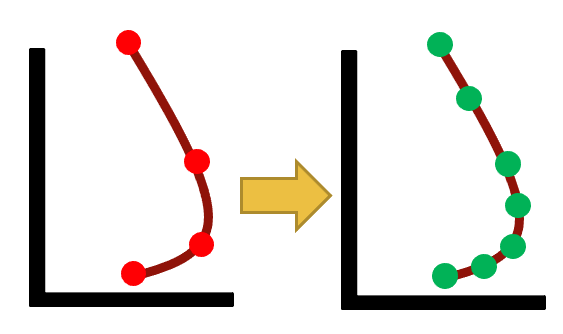

*Pressure interpolation from the reference pressure grid to a standard pressure grid*

`MarsInterp` is used to perform the vertical interpolation from *reference* (`pfull`) layers to *standard* (`pstd`) layers:

```bash
(AmesCAP)>$ MarsInterp.py  00000.atmos_average.nc
```

An inspection of the file shows that the pressure level axis which was `pfull` (30 layers) has been replaced by a standard pressure coordinate `pstd` (36 layers), and all 3- and 4-dimensional variables reflect the new shape:

```bash
(AmesCAP)>$ MarsInterp.py  00000.atmos_average.nc
(AmesCAP)>$ MarsVars.py 00000.atmos_average_pstd.nc
>
> ===================DIMENSIONS==========================
> ['bnds', 'time', 'lat', 'lon', 'scalar_axis', 'phalf', 'pstd']
> ====================CONTENT==========================
> pstd           : ('pstd',)= (36,), pressure  [Pa]
> temp           : ('time', 'pstd', 'lat', 'lon')= (4, 36, 180, 360), temperature  [K]
```

`MarsInterp` support 3 types of vertical interpolation, which may be selected by using the `--type` (`-t` for short) flag:

| file type | description | low-level value in a deep crater
|-----------|-----------|--------|
|_pstd | standard pressure [Pa] (default) |  1000Pa
|_zstd | standard altitude [m]   |  -7000m
|_zagl | standard altitude above ground level [m]   | 0 m

***

**Use of custom vertical grids**

`MarsInterp` uses default grids for each of the interpolation listed above but it is possible for the user to specify the layers for the interpolation. This is done by editing a **hidden** file `.amescap_profile`(note the dot '`.`) in your home directory.  

For the first use, you will need to copy a template of `amescap_profile` to your /home directory:

```bash
(AmesCAP)>$ cp ~/AmesCAP/mars_templates/amescap_profile ~/.amescap_profile # Note the dot '.' !!!
```
You can open `~/.amescap_profile` with any text editor:

```
> <<<<<<<<<<<<<<| Pressure definitions for pstd |>>>>>>>>>>>>>

>p44=[1.0e+03, 9.5e+02, 9.0e+02, 8.5e+02, 8.0e+02, 7.5e+02, 7.0e+02,
>       6.5e+02, 6.0e+02, 5.5e+02, 5.0e+02, 4.5e+02, 4.0e+02, 3.5e+02,
>       3.0e+02, 2.5e+02, 2.0e+02, 1.5e+02, 1.0e+02, 7.0e+01, 5.0e+01,
>       3.0e+01, 2.0e+01, 1.0e+01, 7.0e+00, 5.0e+00, 3.0e+00, 2.0e+00,
>       1.0e+00, 5.0e-01, 3.0e-01, 2.0e-01, 1.0e-01, 5.0e-02, 3.0e-02,
>       1.0e-02, 5.0e-03, 3.0e-03, 5.0e-04, 3.0e-04, 1.0e-04, 5.0e-05,
>       3.0e-05, 1.0e-05]
>
>phalf_mb=[50]
```
In the example above, the user custom-defined two vertical grids, one with 44 levels (named `p44`) and one with a single layer at 50 Pa =0.5mbar(named `phalf_mb`)

You can use these by calling `MarsInterp` with the `-level` (`-l`) argument followed by the name of the new grid defined in `.amescap_profile`.

```bash
(AmesCAP)>$ MarsInterp.py  00000.atmos_average.nc -t pstd -l  p44
```
[Back to Top](#cheat-sheet)
***

# 5. `MarsPlot.py` - Plotting the Results


The last component of CAP is the plotting routine, `MarsPlot`, which accepts a modifiable template (`Custom.in`) containing a list of plots to create. `MarsPlot` is useful for creating plots from MGCM output quickly, and it is designed specifically for use with the `netCDF` output files (`daily`, `diurn`, `average`, `fixed`).

The following figure shows the three components of MarsPlot:
- *MarsPlot.py*, opened in **a terminal** to inspect the netcdf files and ingest the Custom.in template
- *Custom.in* , a template opened in **a text editor**
- *Diagnostics.pdf*, refreshed in a **pdf viewer**

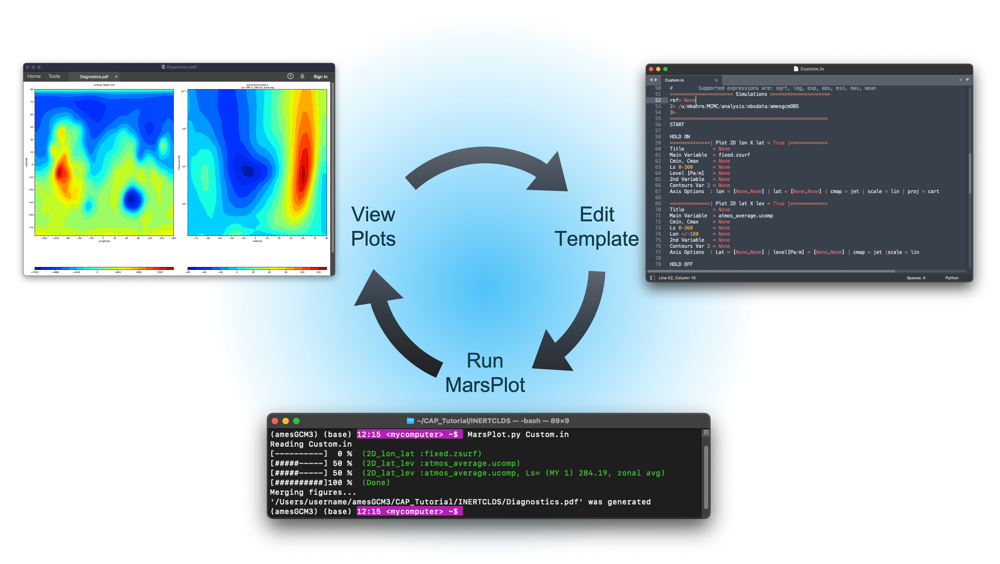

The default template, Custom.in, can be created by passing the `-template` argument to `MarsPlot`. Custom.in is pre-populated to draw two plots on one page: a topographical plot from the fixed file and a cross-section of the zonal wind from the average file. Creating the template and passing it into `MarsPlot` creates a PDF containing the plots:

```
(AmesCAP)>$ MarsPlot.py -template
> /path/to/simulation/run_name/history/Custom.in was created
(AmesCAP)>$
(AmesCAP)>$ MarsPlot.py Custom.in
> Reading Custom.in
> [----------]  0 % (2D_lon_lat :fixed.zsurf)
> [#####-----] 50 % (2D_lat_lev :atmos_average.ucomp, Ls= (MY 2) 252.30, zonal avg)
> [##########]100 % (Done)
> Merging figures...
> /path/to/simulation/run_name/history/Diagnostics.pdf was generated
```

Specifically MarsPlot is designed to generate 2D cross - sections and 1D plots.
Let's remind ourselves that in order to create such plots from a **multi-dimensional** dataset, we first need to specify the **free** dimensions, meaning the ones that are **not** plotted.


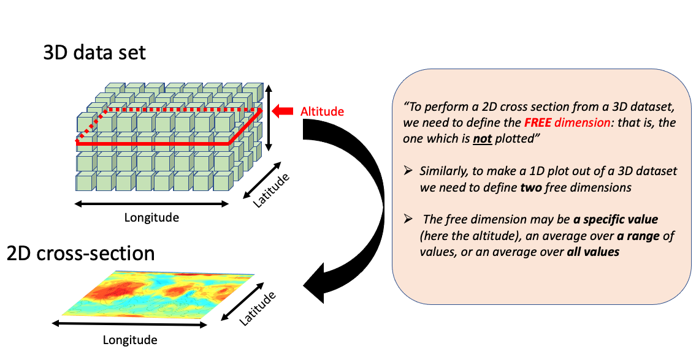

*A refresher on cross-section for multi-dimensional datasets*

The data selection process to make any particular cross section is shown in the decision tree below. If an effort to make the process of generating multiple plots as **streamlined** as possible, MarsPlot selects a number of default settings for the user.

```
1.     Which simulation                                              ┌─
    (e.g. ACTIVECLDS directory)                                      │  DEFAULT    1. ref> is current directory
          │                                                          │  SETTINGS
          └── 2.   Which XXXXX epoch                                 │             2. latest XXXXX.fixed in directory
               (e.g. 00668, 07180)                                   └─
                   │                                                 ┌─
                   └── 3.   Which type of file                       │
                        (e.g. diurn, average_pstd)                   │   USER      3. provided by user
                            │                                        │ PROVIDES
                            └── 4.   Which variable                  │             4. provided by user
                                  (e.g. temp, ucomp)                 └─
                                    │                                ┌─
                                    └── 5. Which dimensions          │             5. see rule table below
                                       (e.g lat =0°,Ls =270°)        │  DEFAULT
                                           │                         │  SETTINGS
                                           └── 6. plot customization │             6. default settings
                                                  (e.g. colormap)    └─              

```

The free dimensions are set by default using day-to-day decisions from a climate modeler's perspective:


|Free dimension|Statement for default setting|Implementation|
|--|------|---------------|
|time |"*I am interested in the most recent events*"                             |time = Nt (last timestep)|
|level|"*I am more interested in the surface than any other vertical layer*"       |level = sfc|
|latitude  |"*If I have to pick a particular latitude, I would rather look at the equator*" |lat=0 (equator)|
|longitude  |"*I am more interested in a zonal average than any particular longitude*"      |lon=all (average over all values)|
|time of day| "*3pm =15hr Ok, this one is arbitrary. However if I use a diurn file, I  have a specific time of day in mind*"   |tod=15 |

*Rule table for the default settings of the free dimensions*

In practice, these cases cover 99% of the work typically done so whenever a setting is left to default (`= None` in MarsPlot's syntax) this is what is being used. This allows to considerably streamline the data selection process.

`Custom.in` can be modified using your preferred text editor (and renamed to your liking). This is an example of the code snippet in `Custom.in` used to generate a lon/lat cross-section. Note that the heading is set to `= True`, so that plot is activated for MarsPlot to process.

```python
<<<<<<<<<<<<<<| Plot 2D lon X lat = True |>>>>>>>>>>>>>
Title          = None
Main Variable  = atmos_average.temp
Cmin, Cmax     = None
Ls 0-360       = None
Level [Pa/m]   = None
2nd Variable   = None
Contours Var 2 = None
Axis Options  : lon = [None,None] | lat = [None,None] | cmap = jet | scale = lin | proj = cart

```
In the example above, we are plotting the air temperature field `temp` from the *atmos_average.nc* file as a lon/lat map. `temp` is a 4D field *(time, level, lat, lon)* but since we left the time (`Ls 0-360`) and altitude (`Level [Pa/m]`) unspecified (i.e. set to `None`) MarsPlot  will show us the *last timestep* in the file and the layer immediately adjacent to the *surface*. Similarly, MarsPlot will generate a *default title* for the figure with the variable's name (`temperature`), unit (`[K]`), selected dimensions (`last timestep, at the surface`), and makes educated choices for the range of the colormap, axis limits etc ... All those options are customizable, if desired.  Finally, note the option of adding a secondary variable as **solid contours**. For example, one may set `2nd Variable = fixed.zsurf` to plot the topography (`zsurf`) from the matching *XXXXX.fixed.nc* file.

To wrap-up (the use of `{}` to overwrite default settings is discussed later on), the following two working expressions are strictly equivalent for `Main Variable = ` (shaded contours) or `2nd Variable = ` (solid contours) fields:

```python
                     variable                                        variable
                        │                     SIMPLIFY TO               │
00668.atmos_average@1.temp{lev=1000;ls=270}     >>>      atmos_average.temp
  │         │       │              │                           │
epoch  file type simulation    free dimensions             file type
                 directory
```
These are the four types of accepted entries for the free dimensions:


|Accepted input |Meaning| Example|
|--         |-       |--|
|`None` |Use default settings from the rule table above| `Ls 0-360 = None`|
|`value`|  Return index closest to requested value in the figure'sunit |`Level [Pa/m]  = 50 ` (50 Pa)|
|`Val Min, Val Max`| Return the average between two values |`Lon +/-180 = -30,30`|
|`all`| `all` is a special keyword that return the average over all values along that dimension |`Latitude       = all`

*Accepted values for the `Ls 0-360`, `Level [Pa/m]` ,`Lon +/-180`, `Latitude` and time of day free dimensions*

> The time of day (`tod`) in diurn files is always specified using brackets`{}`, e.g. : `Main Variable = atmos_diurn.temp{tod=15,18}` for the average between 3pm and 6pm. This has allowed to streamlined all templates by not including the *time of day* free dimension, which is specific to diurn files.


# MarsPlot.py:  How to?

This section discusses MarsPlot capabilities. Note that a compact version of these instructions is present as comment at the very top of a new `Custom.in` and can be used as a quick reference:
```python
===================== |MarsPlot V3.2|===================
# QUICK REFERENCE:
# > Find the matching  template for the desired plot type. Do not edit any labels left of any '=' sign
# > Duplicate/remove any of the <<<< blocks>>>>, skip by setting <<<< block = False >>>>
# > 'True', 'False' and 'None' are capitalized. Do not use quotes '' anywhere in this file
etc...
```
## Inspect the content of netCDF files  

A handy function is MarsPlot's `--inspect` (`-i` for short) command which displays the content of a netCDF file:

```bash
(AmesCAP)> MarsPlot.py -i 07180.atmos_average.nc

> ===================DIMENSIONS==========================
> ['lat', 'lon', 'pfull', 'phalf', 'zgrid', 'scalar_axis', 'time']
> [...]
> ====================CONTENT==========================
> pfull          : ('pfull',)= (24,), ref full pressure level  [Pa]
> temp           : ('time', 'pfull', 'lat', 'lon')= (10, 24, 36, 60), temperature  [K]
> ucomp          : ('time', 'pfull', 'lat', 'lon')= (10, 24, 36, 60), zonal wind  [m/sec]
> [...]
```
> Note that the `-i` method works with any netCDF file, not just the ones generated by CAP

The `--inspect` method can be combined with the `--dump` flag which is most useful to show the content of specific 1D arrays in the terminal.
```bash
(AmesCAP)>$ MarsPlot.py -i 07180.atmos_average.nc -dump pfull
> pfull=
> [8.7662227e-02 2.5499690e-01 5.4266089e-01 1.0518962e+00 1.9545468e+00
> 3.5580616e+00 6.2466631e+00 1.0509957e+01 1.7400265e+01 2.8756382e+01
> 4.7480076e+01 7.8348366e+01 1.2924281e+02 2.0770235e+02 3.0938846e+02
> 4.1609518e+02 5.1308148e+02 5.9254102e+02 6.4705731e+02 6.7754218e+02
> 6.9152936e+02 6.9731799e+02 6.9994830e+02 7.0082477e+02]
> ______________________________________________________________________
```

The `--stat` flag is better suited to inspect large, multi-dimensional arrays. You can also request specific array indexes using quotes and square brackets `'[]'`:

```bash
(AmesCAP)>$  MarsPlot.py -i 07180.atmos_average.nc --stat ucomp 'temp[:,-1,:,:]'
__________________________________________________________________________
           VAR            |      MIN      |      MEAN     |      MAX      |
__________________________|_______________|_______________|_______________|
                     ucomp|        -102.98|        6.99949|        192.088|
            temp[:,-1,:,:]|        149.016|        202.508|         251.05|
__________________________|_______________|_______________|_______________|
```
> `-1` refers to the last element in the that axis, following Python's indexing convention

***
## Disable or add a new plot
Code blocks set to `= True` instruct `MarsPlot` to draw those plots. Other templates in `Custom.in` are set to `= False` by default, which instructs `MarsPlot` to skip those plots. In total, `MarsPlot` is equipped to create seven plot types:

```python
<<<<<| Plot 2D lon X lat  = True |>>>>>
<<<<<| Plot 2D lon X time = True |>>>>>
<<<<<| Plot 2D lon X lev  = True |>>>>>
<<<<<| Plot 2D lat X lev  = True |>>>>>
<<<<<| Plot 2D time X lat = True |>>>>>
<<<<<| Plot 2D time X lev = True |>>>>>
<<<<<| Plot 1D            = True |>>>>> # Any 1D Plot Type (Dimension x Variable)
```

## Adjust the color range  and colormap

`Cmin, Cmax` (and `Contours Var 2`) are how the contours are set for the shaded (and solid) contours. If only two values are included, MarsPlot use 24 contours spaced between the max and min values. If more than two values are provided, MarsPlot will use those individual contours.

```python
Main Variable  = atmos_average.temp     # filename.variable *REQUIRED
Cmin, Cmax     = 240,290                # Colorbar limits (minimum, maximum)
2nd Variable   = atmos_average.ucomp    # Overplot U winds
Contours Var 2 = -200,-100,100,200      # List of contours for 2nd Variable or CMIN, CMAX
Axis Options  : Ls = [None,None] | lat = [None,None] | cmap = jet |scale = lin
```

Note the option of setting the contour spacing linearly `scale = lin` or logarithmically (`scale = log`) if the range of values spans multiple order of magnitudes.

The default colormap `cmap = jet` may be changed using any Matplotlib colormaps. A selections of those are listed below:

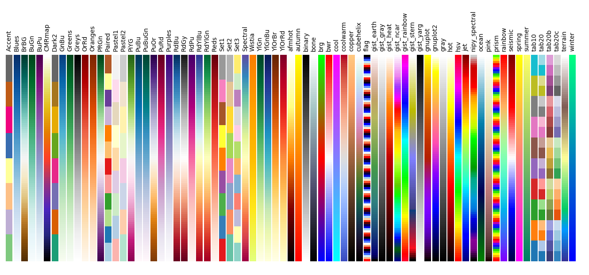

Finally, note the use of the `_r` suffix (reverse) to reverse the order of the colormaps listed in the figure above. From example, using `cmap = jet` would have colors spanning from *blue* > *red*  and `cmap = jet_r` *red* > *blue* instead

*Supported colormaps in Marsplot. The figure was generated using code from [the scipy webpage](https://scipy-lectures.org/intro/matplotlib/auto_examples/options/plot_colormaps.html) .*


***
## Make a 1D-plot
The 1D plot template is different from the others in a few key ways:

- Instead of `Title`, the template requires a `Legend`. When overploting several 1D variables on top of one another, the legend option will label them instead of changing the plot title.
- There is an additional `linestyle` axis option for the 1D plot.
- There is also a `Diurnal` option. The `Diurnal` input can only be `None` or `AXIS`, since there is syntax for selecting a specific time of day using parenthesis (e.g. `atmos_diurn.temp{tod=15}`) The `AXIS` label tells `MarsPlot` which dimension serves as the X axis. `Main Variable` will dictate the Y axis.

> Some plots like vertical profiles and latitude plots use instead Y as the primary axis and plot the variable on the X axis

```python
<<<<<<<<<<<<<<| Plot 1D = True |>>>>>>>>>>>>>
Legend         = None                   # Legend instead of Title
Main Variable  = atmos_average.temp
Ls 0-360       = AXIS                   # Any of these can be selected
Latitude       = None                   # as the X axis dimension, and
Lon +/-180     = None                   # the free dimensions can accept
Level [Pa/m]   = None                   # values as before. However,
Diurnal  [hr]  = None                   # ** Diurnal can ONLY be AXIS or None **
```

## Customize 1D plots
`Axis Options` specify the axes limits, and linestyle  1D-plot:

|1D plot option |Usage| Example|
|----|----|----|
|`lat,lon+/-180,[Pa/m],sols = [None,None]` |range for X or Y axes limit depending on the plot type|`lat,lon+/-180,[Pa/m],sols = [1000,0.1]`|
 |`var = [None,None]`                     | range for the plotted variable on the other axis | `var = [120,250]`|
 |`linestyle = - `                         |Line style following matplotlib's convention| `linestyle = -ob` (solid line & blue circular markers)|
 |`axlabel = None`                          | Change the default name for the axis| `axlabel = New Temperature [K]`

Here is a sample of colors, linestyles and marker styles that can be used in 1D-plots

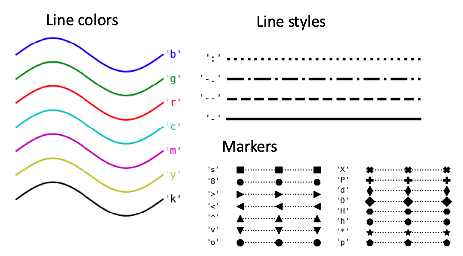

*Supported styles for 1D plots. This figure was also generated using code from [scipy-lectures.org](https://scipy-lectures.org)*

***
## Put multiple plots on the same page

You can sandwich any number of plots between the `HOLD ON` and `HOLD OFF` keywords to group figures on the same page.

```
> HOLD ON
>
> <<<<<<| Plot 2D lon X lat = True |>>>>>>
> Title    = Surface CO2 Ice (g/m2)
> .. (etc) ..
>
> <<<<<<| Plot 2D lon X lat = True |>>>>>>
> Title    = Surface Wind Speed (m/s)
> .. (etc) ..
>
> HOLD OFF
```

By default, MarsPlot will use a default layout for the plots, this can be modified by adding the desired number of lines and number of columns, separated by a comma: `HOLD ON 4,3` will organize the figure with a 4 -lines and 3-column layout.

Note that Custom.in comes with two plots pre-loaded on the same page.
***
## Put multiple 1D-plots on the same page

Similarly adding the `ADD LINE` keywords between two (or more) templates can be used to place multiple 1D plots on the same figure.

```
> <<<<<<| Plot 1D = True |>>>>>>
> Main Variable    = var1
> .. (etc) ..
>
> ADD LINE
>
> <<<<<<| Plot 1D = True |>>>>>>
> Main Variable    = var2
> .. (etc) ..
```

> Note that if you combine `HOLD ON/HOLD OFF` and `ADD LINE` to create a 1D figure with several sub-plots on a **multi-figure page**, the 1D plot has to be the LAST (and only 1D-figure with sub-plots) on that page.
***
## Use a different epoch

If you have run a GCM simulation for a long time, you may have several files of the same type, e.g. :

```
00000.fixed.nc          00100.fixed.nc         00200.fixed.nc         00300.fixed.nc
00000.atmos_average.nc  00100.atmos_average.nc 00200.atmos_average.nc 00300.atmos_average.nc
```
By default MarsPlot counts the `fixed` files in the directory and run the analysis on the last set of files, `00300.fixed.nc` and `00300.atmos_average.nc` in our example. Even though you may specify the epoch for each plot (e.g. `Main Variable  = 00200.atmos_average.temp` for the file starting at 200 sols), it is more convenient to leave the epoch out of the Custom.in and instead pass the `-date` argument to MarsPlot.

```bash
MarsPlot.py Custom.in -d 200
```

> `-date` also accepts a range of sols, e.g. `MarsPlot.py Custom.in -d 100 300` which will run the plotting routine across multiple files.

When creating 1D plots of data spanning multiple years, you can overplot consecutive years on top of the other instead of sequentially by calling `--stack_year` (`-sy`) when submitting the template to `MarsPlot`.


***
## Access simulation in a different directory
At the beginning of `MarsPlot` is the `<<< Simulations >>>` block which, is used to point `MarsPlot` to different directories containing MGCM outputs. When set to `None`, `ref>` (the simulation directory number `@1`, optional in the templates) refers to the **current** directory:

```python
<<<<<<<<<<<<<<<<<<<<<< Simulations >>>>>>>>>>>>>>>>>>>>>
ref> None
2> /path/to/another/sim # another simulation
3>
=======================================================
```
Only 3 simulations have place holders but you can add additional ones if you would like (e.g. `4> ...` )
To access a variable from a file in another directory, just point to the correct simulation when calling `Main Variable` (or `2nd Variable`) using the `@` character:

```python
Main Variable  = XXXXX.filename@N.variable`
```

Where `N` is the number in `<<< Simulations >>>` corresponding the the correct path.

***
## Overwrite the free dimensions.

By default, MarsPlot uses the free dimensions provided in each template (`Ls 0-360` and `Level [Pa/m]` in the example below) to reduce the data for both the `Main Variable` and the `2nd Variable`. You can overwrite this behavior by using parenthesis `{}`, containing a list of specific free dimensions separated by semi-colons `;` The free dimensions within the `{}` parenthesis will ultimately be the last one selected. In the example below,  `Main Variable` (shaded contours) will use a solar longitude of 270° and a pressure of 10 Pa, but the `2nd Variable` (solid contours) will use the average of solar longitudes between 90° and 180° and a pressure of 50 Pa.

```python
<<<<<<<<<<<<<<| Plot 2D lon X lat = True |>>>>>>>>>>>>>
...
Main Variable  = atmos_average.var
...
Ls 0-360       = 270
Level [Pa/m]   = 10
2nd Variable   = atmos_average.var{ls=90,180;lev=50}
```
> Keywords for the dimensions are `ls`, `lev`, `lon`, `lat` and `tod`. Accepted entries are `Value` (closest), `Valmin,Valmax` (average between two values) and `all` (average over all values)
## Element-wise operations

You can encompass variables between square brackets `[]` to perform element-wise operations, which is useful to compare simulations, apply scaling etc... MarsPlot will first load each variables encompassed with the brackets, and then apply the algebraic expression outside the `[]` before plotting.

These are examples of potential applications:


```
 > Main Variable  = [fixed.zsurf]/(10.**3)                            (convert topography from [m] to [km])
 > Main Variable  = [atmos_average.taudust_IR]/[atmos_average.ps]*610 (normalize the dust opacity)     
 > Main Variable  = [atmos_average.temp]-[atmos_average@2.temp]       (temp. difference between ref simu and simu 2)
 > Main Variable  = [atmos_average.temp]-[atmos_average.temp{lev=10}] (temp. difference between the default (near surface) and the 10 Pa level
```
***
## Code comments and speed-up processing

Comments are preceded by `#`, following python's convention. Each `<<<<| block |>>>>` must stay integral so comments may be inserted between templates or comment all lines of the template (which is why it is generally easier to simply set the `<<<<| block = False |>>>>`) but not within a template.

You will notice the `START` key word at the very beginning of the template.
```
=======================================================
START
```
This instructs MarsPlot to start parsing templates at this point. If you are already happy with multiple plots, you can move the `START` keyword further down in the Custom.in to skip those first plots instead of setting those to `<<<<| Plot  = False |>>>>` individually. When you are done with your analysis, simply move `START` back to the top to generate a pdf with all the plots.

Similarly, you can use the keyword `STOP` (which is not initially present in Custom.in) to stop the parsing of templates. In this case, the only plots processed would be the ones between `START` and `STOP`.

***
## Change projections

For `Plot 2D lon X lat` figures, MarsPlot supports 3 types of cylindrical projections : `cart` (cartesian), `robin` (robinson), `moll` (mollweide), and 3 types of azimuthal projections: `Npole` (north polar), `Spole` (south polar) and `ortho` (orthographic).

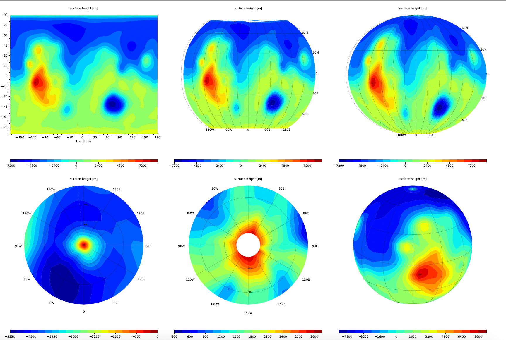
*(Top) cylindrical projection `cart`, `robin` and `moll`. (Bottom) azimuthal projections `Npole`, `Spole` and `ortho`*

The azimuthal projections accept optional arguments as follows:

```
proj = Npole lat_max                   # effectively zoom in/out on the North pole
proj = Spole lat_min                   # effectively zoom in/out on the South pole
proj = ortho lon_center, lat_center    # rotate the globe
```

***
## Figure format, size

* As shown in the `-help` documentation of MarsPlot, the output format for the figure is chosen using the `--output` (`-o`) flag between *pdf* (default, requires the ghostscript software), *png*, or *eps*.
* The `-pw` (pixel width) flag can be use to change the  page width from its default value of 2000 pixels.
* The `--vertical` (`-vert`) can be use to make the pages vertical instead of horizontal

***
## Access CAP libraries and make your own plots

CAP libraries are located (and documented) in `FV3_utils.py`. Spectral utilities are located in `Spectral_utils.py`,  classes to parse fortran binaries and generate netCDf files are located in `Ncdf_wrapper.py`

The following code demonstrate how one can access CAP libraries and make plots for its own analysis:

```python3
#======================= Import python packages ================================
import numpy as np                          # for array operations
import matplotlib.pyplot as plt             # python plotting library
from netCDF4 import Dataset                 # to read .nc files
#===============================================================================

# Open a fixed.nc file, read some variables and close it.
f_fixed=Dataset('/path_to_file/00000.fixed.nc','r')
lon=f_fixed.variables['lon'][:]
lat=f_fixed.variables['lat'][:]
zsurf=f_fixed.variables['zsurf'][:]  
f_fixed.close()

# Open a dataset and read the 'variables' attribute from the NETCDF FILE
f_average_pstd=Dataset('/path_to_file/00000.atmos_average_pstd.nc','r')
vars_list     =f_average_pstd.variables.keys()
print('The variables in the atmos files are: ',vars_list)

# Read the 'shape' and 'units' attribute from the temperature VARIABLE
Nt,Nz,Ny,Nx = f_average_pstd.variables['temp'].shape
units_txt   = f_average_pstd.variables['temp'].units
print('The data dimensions are Nt,Nz,Ny,Nx=',Nt,Nz,Ny,Nx)
# Read the pressure, time, and the temperature for an equatorial cross section
pstd       = f_average_pstd.variables['pstd'][:]   
areo       = f_average_pstd.variables['areo'][0] #solar longitude for the 1st timestep
temp       = f_average_pstd.variables['temp'][0,:,18,:] #time, press, lat, lon
f_average_pstd.close()

# Get the latitude of the cross section.
lat_cross=lat[18]

# Example of accessing  functions from the Ames Pipeline if we wanted to plot
# the data  in a different coordinate system  (0>360 instead of +/-180 )
#----
from amescap.FV3_utils import lon180_to_360,shiftgrid_180_to_360
lon360=lon180_to_360(lon)
temp360=shiftgrid_180_to_360(lon,temp)

# Define some contours for plotting
conts= np.linspace(150,250,32)

#Create a figure with the data
plt.close('all')
ax=plt.subplot(111)
plt.contourf(lon,pstd,temp,conts,cmap='jet',extend='both')
plt.colorbar()
# Axis labeling
ax.invert_yaxis()
ax.set_yscale("log")
plt.xlabel('Longitudes')
plt.ylabel('Pressure [Pa]')
plt.title('Temperature [%s] at Ls %03i, lat= %.2f '%(units_txt,areo,lat_cross))
plt.show()
```
will produce the following image:


***
## Debugging
`MarsPlot` is designed to make plotting MGCM output easier and faster so it handles missing data and many errors by itself. It reports errors both in the terminal and in the generated figures. To by-pass this behavior (when debugging), use the  `--debug` option with `MarsPlot` which will raise standard Python errors and stop the execution. One thing to always look for are typo/syntax errors in the template so you may want to cross-check your current plot against a pristine (empty) template.
> Note that the errors raised with the `--debug` flag may reference to `MarsPlot` internal classes so they may not always be self-explanatory.


[Back to Top](#cheat-sheet)
***
