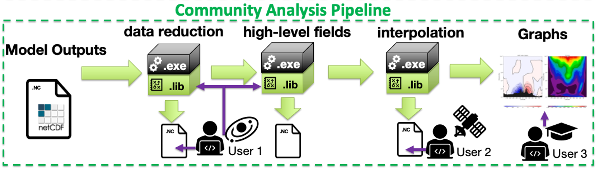

# TUTORIAL:



## Overview of the process
The following steps will be used to access the data, reduce it, compute additional diagnostics, interpolate the diagnostics to standard pressures levels, and visualize the results.


## Variable operations
When provided with no arguments, the variable utility _MarsVars.py_ has the same functionality as _MarsPlot.py -i_ and displays the content for the file:

`MarsVars.py 00000.atmos_average.nc`

To see what _MarsVars.py_ can do, check the `--help` option (`MarsVars.py -h`)

For example, to compute the atmospheric density (rho) from the vertical grid data (pk, bk), surface pressure (ps) and air temperature (temp), run:

`MarsVars.py 00000.atmos_average.nc -add rho`

Check that a new variable was added to the file by running again _MarsVars_ with no argument:

`MarsVars.py 00000.atmos_average.nc`

Similarly, we will perform a column integration for the water vapor (vap_mass) with **-col**. At the same time, we will  remove the dust (dst_num) and water ice (ice_num) **particles numbers** variables, which we are not planning to use in this analysis (this will free some memory).

`MarsVars.py 00000.atmos_average.nc -col vap_mass -rm ice_num dst_num`


## Pressure interpolation
The Ames GCM uses a pressure coordinate in the vertical, which means that a single atmospheric layer will be located at different geometric heights (and pressure levels) between the atmospheric columns. Before we do any zonal averaging, it is therefore necessary to interpolate the data in all the columns to a same standard pressure. This operation is done with the _MarsInterp_ utility using the **--type pstd** option:

```
MarsInterp.py -h
MarsInterp.py  00000.atmos_average.nc -t pstd
```

We observe with `MarsPlot.py -i 00000.atmos_average_pstd.nc` that the pressure level axis "pfull" (formerly 24 layers) has disappeared and was replaced by a standard pressure "pstd". Also, the shape for the 3-dimensional variables are different and reflect the new shape of "pstd"

## Plotting the results with MarsPlot:
While you may use the software of your choice to visualize the results (e.g. Matlab, IDL), a utility is provided to create 2D figures and 1D line plots that are easily configured from an input template. To generate a template in the current directory use:

```
MarsPlot.py -h
MarsPlot.py --template
```
and open the file _Custom.in_ with a text editor  (you can rename the file to _something.in_ if you want). As an introduction  to _MarsPlot_, you can skip the commented  instructions at the top and go directly to the section:
```
=======================================================
START
```
***
**Quick Tip:** _MarsPlot_ uses text files with a '_.in_' extension as input files. Select "Python"  as the language (in place of "Plain text") when editing the file from text editor (gedit, atom ...) to enable syntax-highlighting of key words. If you are using the **vim** editor, add the following lines to your **~/.vimrc** to recognize "Custom.in' as using Python's syntax.
```
syntax on
colorscheme default
au BufReadPost *.in  set syntax=python
```
Close the file (`:wq`): next time you open Custom.in with Vim, numbers and keywords like 'True' or 'None' will be highlighted.
***

In order to access data in a specific file,  _MarsPlot_ uses the syntax ` Main Variable  = XXXXX.file@N.var`,  `XXXXX` being the sol number (e.g. "03335", optional), `file` being the file type (e.g. "`atmos_average_pstd`"), `@N`  being the simulation number (e.g. "@2" if comparing two different simulations, optional), and `var` the requested variable (e.g. "`ucomp`" for the zonal winds).

When dimensions are omitted with `None`, _MarsPlot_ makes educated guesses for data selection (e.g, if no layer is requested, use the surface layer etc...) and will tell you exactly how the data is being processed both in the default title for the figures, and in the terminal output.  This behavior is detailed in the commented instructions at the top of _Custom.in_, as well as additional features:  For example, note the use of the brackets "**[ ]**" for variable operations,  "**{ }**" to overwrite the default dimensions, and  the possibility of adding another simulation to the **<<<<< Simulations >>>>>** block for comparison purposes.

After inspecting the file, you can verify once again that pdf-ghostscript is available on your system with `gs -version` (see the _Requirements_ section) and feed the template back to _MarsPlot_ with:

`MarsPlot.py Custom.in`      (`MarsPlot.py Custom.in -o png` if you are not using ghostscript)  

```
[----------]  0 % (2D_lon_lat :fixed.zsurf)
[#####-----] 50 % (2D_lat_press :atmos_average.ucomp, Ls= (MY 1) 13.61, lon=18.0)
[##########]100 % (Done)
```

By default MarsPlot will handle errors by itself (e.g. missing data) and reports them after completion both in  the terminal and overlayed in the figures. To by-pass this behavior (when debugging), use the  **--debug** option.

A file _Diagnostic.pdf_ will be generated in the current directory with the requested plots which can be opened with a pdf viewer. Run `open -a Preview Diagnostic.pdf` on MacOS: this opens the file with the Preview App that conveniently auto-reload pdfs (the 'Skim' editor, available for download offers a similar feature in _Preferences/Sync_) or use `evince Diagnostic.pdf` on Linux. If you have used the `--output png` formatting option, the images will be located in _plots/_ in the current directory.

You can try to add a new figure by making a copy/paste of any of the entire `<<<| Plot ... = True |>>>` blocks below the `HOLD ON[...]HOLD OFF` statement, which is used to put multiple figures on a same page.  For example, to compute the  zonally-averaged (`Lon +/-180 = all`) and time-average of the first 10 degree of solar longitude (`Ls 0-360 = 0.,10`) for the dust field (dst_mass) from the interpolated file (atmos_average_pstd), we use:

```
<<<<<<<<<<<<<<| Plot 2D lat X lev = True |>>>>>>>>>>>>>
Title          = This is the dust field converted to [g/kg]
Main Variable  = [atmos_average_pstd.dst_mass]*1000.
Cmin, Cmax     = None
Ls 0-360       = 0.,10
Lon +/-180     = all
2nd Variable   = None
Contours Var 2 = None
Axis Options  : Lat = [None,None] | level[Pa] = [1e3,0.2] | cmap = Wistia | scale = lin
```
Note that we decided to use the "**[ ]**" syntax around the variable to plot the dust field in [g/kg] instead of the default unit of [kg/kg], and changed the default title accordingly. We also decided to change the colormap to _Wistia_ and adjusted the `Axis Options`. You can now feed the modified template back to _MarsPlot_. By default `MarsPlot.py Custom.in` runs the requested analysis on the **last** set of output files present in the directory (identified by **XXXXX.fixed.nc**) To run the analysis over a single specific data file or a range of files, use the **--date**  options:

`MarsPlot.py Custom.in -d 0`

Close and open the pdf again, you should see a new figure with the updated dust field. You can use  _Custom.in_  jointly with the `MarsPlot.py --inspect` option discussed above to add new figures, and also explore the other types of plots presented at the end of _Custom.in_  (these are set to `= False`  by default but you can enabled them with  `= True`).

# Moving forward with your own analysis

You can customize your own plots using the programming language of your choice. Here is a script to get you started in Python. Unless you have installed python-netCDF4 and the analysis pipeline on top of your main distribution, the script has to be be run from **inside** the virtual environment in order to access the _netCDF4_ and _amesgcm_ packages. Copy-paste the following inside a script named _demo.py_ and run:

`python  demo.py`

***

```
#======================= Import python packages ================================
import numpy as np                          # for array operations
import matplotlib.pyplot as plt             # python plotting library
from netCDF4 import Dataset                 # to read .nc files
#===============================================================================

# Open a fixed.nc file, read some variables and close it.
f_fixed=Dataset('/Users/akling/test/00000.fixed.nc','r')
lon=f_fixed.variables['lon'][:]
lat=f_fixed.variables['lat'][:]
zsurf=f_fixed.variables['zsurf'][:]  
f_fixed.close()

# Open a dataset and read the 'variables' attribute from the NETCDF FILE
f_average_pstd=Dataset('/Users/akling/test/00000.atmos_average_pstd.nc','r')
vars_list     =f_average_pstd.variables.keys()
print('The variables in the atmos files are: ',vars_list)

# Read the 'shape' and 'units' attribute from the temperature VARIABLE
Nt,Nz,Ny,Nx = f_average_pstd.variables['temp'].shape
units_txt   = f_average_pstd.variables['temp'].units
print('The data dimensions are Nt,Nz,Ny,Nx=',Nt,Nz,Ny,Nx)
# Read the pressure, time, and the temperature for an equatorial cross section
pstd       = f_average_pstd.variables['pstd'][:]   
areo       = f_average_pstd.variables['areo'][0] #solar longitude for the 1st timestep
temp       = f_average_pstd.variables['temp'][0,:,18,:] #time, press, lat, lon
f_average_pstd.close()

# Get the latitude of the cross section.
lat_cross=lat[18]

# Example of accessing  functions from the Ames Pipeline if we wanted to plot
# the data  in a different coordinate system  (0>360 instead of +/-180 )
#----
from amesgcm.FV3_utils import lon180_to_360,shiftgrid_180_to_360
lon360=lon180_to_360(lon)
temp360=shiftgrid_180_to_360(lon,temp)

# Define some contours for plotting
conts= np.linspace(150,250,32)

#Create a figure with the data
plt.close('all')
ax=plt.subplot(111)
plt.contourf(lon,pstd,temp,conts,cmap='jet',extend='both')
plt.colorbar()
# Axis labeling
ax.invert_yaxis()
ax.set_yscale("log")
plt.xlabel('Longitudes')
plt.ylabel('Pressure [Pa]')
plt.title('Temperature [%s] at Ls %03i, lat= %.2f '%(units_txt,areo,lat_cross))
plt.show()
```

This will produce the following:


