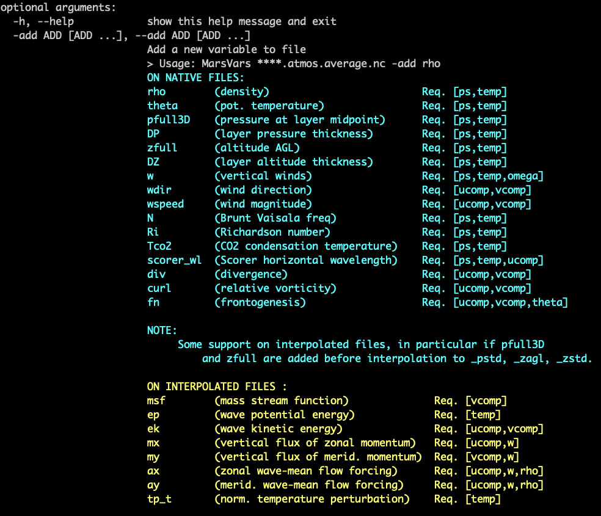

***

# Introducing the Community Analysis Pipeline (CAP)

CAP is a toolkit designed to simplify the post-processing of MGCM output. CAP is written in Python and works with existing Python libraries, allowing any Python user to install and use CAP easily and free of charge. Without CAP, plotting MGCM output requires that a user provide their own scripts for post-processing, including code for interpolating the vertical grid, computing and adding derived variables to files, converting between file types, and creating diagnostic plots. In other words, a user would be responsible for the entire post-processing effort as illustrated in Figure 1.


Such a process requires that users be familiar with Fortran files and be able to write (or provide) script(s) to perform file manipulations and create plots. At best, this effort is cumbersome. At worst, it excludes users who lack access to (or knowledge of how to write) post-processing scripts and/or Fortran code. CAP standardizes the post-processing effort by providing executibles that can perform file manipulations and create diagnostic plots from the command line. This enables users of almost any skill level to post-process and plot MGCM data (Figure 2).


Specifically, CAP consists of five executables:

1. `MarsPull.py`    Access MGCM output
2. `MarsFiles.py`   Reduce the files
3. `MarsVars.py`    Perform variable operations
4. `MarsInterp.py`  Interpolate the vertical grid
5. `MarsPlot.py`    Visualize the MGCM output

and

These executables and their commonly-used functions are illustrated in the cheat sheet below in the order in which they are most often used. You should feel free to reference during and after the tutorial.


CAP is designed to be modular. For example, a user could post-process and plot MGCM output exclusively with CAP or a user could employ their own post-processing routine and then use CAP to plot the data. Users are free to selectively integrate CAP into their own analysis routine to the extent they see fit.

<!-- TOC titleSize:2 tabSpaces:2 depthFrom:1 depthTo:6 withLinks:1 updateOnSave:1 orderedList:0 skip:0 title:1 charForUnorderedList:* -->
## Table of Contents
* [Introducing the Community Analysis Pipeline (CAP)](#introducing-the-community-analysis-pipeline-cap)
* [The big question... How do I do this? >  <span style="color:red">Ask for help!  </span>](#the-big-question-how-do-i-do-this---span-stylecolorredask-for-help--span)
* [1. `MarsPull.py` - Downloading Raw MGCM Output](#1-marspullpy---downloading-raw-mgcm-output)
* [2. `MarsFiles.py` - Reducing the Files](#2-marsfilespy---reducing-the-files)
* [3. `MarsVars.py` - Performing Variable Operations](#3-marsvarspy---performing-variable-operations)
* [4. `MarsInterp.py` - Interpolating the Vertical Grid](#4-marsinterppy---interpolating-the-vertical-grid)
* [5. `MarsPlot.py` - Plotting the Results](#5-marsplotpy---plotting-the-results)
  * [Overview](#overview)
  * [How to](#how-to)
    * [Disable or add a new plot](#disable-or-add-a-new-plot)
    * [Customize Plots](#customize-plots)
    * [Make a 1D-plot](#make-a-1d-plot)
    * [Access simulation in a different directory](#access-simulation-in-a-different-directory)
    * [Element-wise operations](#element-wise-operations)
    * [Debugging](#debugging)
<!-- /TOC -->

***
# The big question... How do I do this? >  <span style="color:red">Ask for help!  </span>
Use the `--help` (`-h` for short) option on any executable to display documentation and examples.
```
(amesGCM3)>$ MarsPlot.py -h
> usage: MarsPlot.py [-h] [-i INSPECT_FILE] [-d DATE [DATE ...]] [--template]
>                   [-do DO] [-sy] [-o {pdf,eps,png}] [-vert] [-dir DIRECTORY]
>                   [--debug]
>                   [custom_file]
```


***

# 1. `MarsPull.py` - Downloading Raw MGCM Output

`MarsPull` is a utility for accessing MGCM output files hosted on the [MCMC Data portal](https://data.nas.nasa.gov/legacygcm/data_legacygcm.php). MGCM data is archived in 1.5 hour intervals (16x/day, '_ntod_') and packaged in files containing 10 sols ('_time_') of data. The file naming convention is:

```bash
LegacyGCM_LsXXX_LsYYY.nc
```

Where XXX and YYY are three-digit Solar Longitude (L<sub>s</sub>) values. The files can be retrieved from the command line using CAP by providing `MarsPull` with either a range of Solar Longitudes from which to pull data or a specific filename.


***

# 2. `MarsFiles.py` - Reducing the Files

`MarsFiles` provides several tools for file manipulations, including code designed to create binned, averaged, and time-shifted files from MGCM output. These are the file formats that `MarsFiles` can create from the fort.11 MGCM output files:

| File name | description|
|-----------|------------|
|* **fixed** | contains such as surface albedo and topography|
|* **average** |contains 5-sol averages of all variables|
|* **daily** |contains a continuous time series of data|
|* **diurn** |contains 5-day averaged data binned by time of day|
|* **_T** |contains time-shifted data (same time of day at all longitudes)|
|* **_lpf**,**_hpf**,**_bpf** |low, high and band pass filtered|
|* **_tidal** |tidally-decomposed files into  harmonics|
|* **_to_average** **_to_diurn** |custom re-binning of daily files|
|* **_regrid**  |4N-dimensional interpolation (lon,lat,time,altitude) to a different grid |


`MarsFiles` can concatenate like-files together on the time dimension. `MarsFiles` can also be used to perform basic tidal analyses (temporal and spatial filtering, diurnal tides and their harmonics).

CAP is capable of applying high-, low-, and band-pass filters to netCDF files using the syntax:

```bash
(amesGCM3)>$ MarsFiles.py file.nc -hpf --high_pass_filter sol_min          
(amesGCM3)>$ MarsFiles.py file.nc -lpf --low_pass_filter  sol_max          
(amesGCM3)>$ MarsFiles.py file.nc -bpf --band_pass_filter sol_min sol max  
```

Where `sol_min` and `sol_max` are the minimum and maximum number of days in a filtering period, respectively.


***

# 3. `MarsVars.py` - Performing Variable Operations

`MarsVars` provides several tools relating to variable operations such as adding and removing variables and performing column integrations. With no other arguments, passing a file to `MarsVars` displays file content much like `ncdump`:

```bash
(amesGCM3)>$ MarsVars.py 00000.atmos_average.nc
>
> ===================DIMENSIONS==========================
> ['bnds', 'time', 'lat', 'lon', 'pfull', 'scalar_axis', 'phalf']
> (etc)
> ====================CONTENT==========================
> pfull          : ('pfull',)= (30,), ref full pressure level  [Pa]
> ps             : ('time', 'lat', 'lon')= (4, 180, 360), surface pressure  [Pa]
> temp           : ('time', 'pfull', 'lat', 'lon')= (4, 30, 180, 360), temperature  [K]
> omega          : ('time', 'pfull', 'lat', 'lon')= (4, 30, 180, 360), omega  [Pa/s]
> (etc)
```

This file contains several variables including `ps`, `temp`, and `omega`. Since this is a native file (i.e. the vertical grid is `pfull` indicating the file has not been interpolated), we can calculate the vertical wind (`w`) using `ps`, `temp`, and `omega` and add it to the file:




```bash
(amesGCM3)>$ MarsVars.py 00000.atmos_average.nc -add w
```

We can see that `w` was added by calling `MarsVars` with no argument as before:

```bash
(amesGCM3)>$ MarsVars.py 00000.atmos_average.nc
>
> ===================DIMENSIONS==========================
> ['bnds', 'time', 'lat', 'lon', 'pfull', 'scalar_axis', 'phalf']
> (etc)
> ====================CONTENT==========================
> pfull          : ('pfull',)= (30,), ref full pressure level  [Pa]
> ps             : ('time', 'lat', 'lon')= (4, 180, 360), surface pressure  [Pa]
> temp           : ('time', 'pfull', 'lat', 'lon')= (4, 30, 180, 360), temperature  [K]
> omega          : ('time', 'pfull', 'lat', 'lon')= (4, 30, 180, 360), omega  [Pa/s]
> w              : ('time', 'pfull', 'lat', 'lon')= (4, 30, 180, 360), vertical wind (added postprocessing)  [m/s]
> (etc)
```

`MarsVars` can also remove variables from files which is particularly useful for reducing file sizes:

```bash
(amesGCM3)>$ MarsVars.py 00000.atmos_average.nc
>
> ===================DIMENSIONS==========================
> ['bnds', 'time', 'lat', 'lon', 'pfull', 'scalar_axis', 'phalf']
> (etc)
> ====================CONTENT==========================
> pfull          : ('pfull',)= (30,), ref full pressure level  [Pa]
> temp           : ('time', 'pfull', 'lat', 'lon')= (4, 30, 180, 360), temperature  [K]
> omega          : ('time', 'pfull', 'lat', 'lon')= (4, 30, 180, 360), omega  [Pa/s]
> w              : ('time', 'pfull', 'lat', 'lon')= (4, 30, 180, 360), vertical wind (added postprocessing)  [m/s]
> (etc)
```

`MarsVars` is useful when performing column integrations because the function preserves the original variable and creates a new variable ending in `_col` that contains the column integrated values:

```bash
(amesGCM3)>$ MarsVars.py 00000.atmos_average.nc -col temp
> Performing colum integration: temp...
> temp: Done
```

You can see the added variable in the file:

```bash
(amesGCM3)>$ MarsVars.py 00000.atmos_average.nc
>
> ===================DIMENSIONS==========================
> ['bnds', 'time', 'lat', 'lon', 'pfull', 'scalar_axis', 'phalf']
> (etc)
> ====================CONTENT==========================
> pfull          : ('pfull',)= (30,), ref full pressure level  [Pa]
> temp           : ('time', 'pfull', 'lat', 'lon')= (4, 30, 180, 360), temperature  [K]
> omega          : ('time', 'pfull', 'lat', 'lon')= (4, 30, 180, 360), omega  [Pa/s]
> w              : ('time', 'pfull', 'lat', 'lon')= (4, 30, 180, 360), vertical wind (added postprocessing)  [m/s]
> temp_col       : ('time', 'lat', 'lon')= (4, 180, 360), column integration of temp  [K]
```


***

# 4. `MarsInterp.py` - Interpolating the Vertical Grid

Native MGCM output files use pressure as the vertical coordinate (`pfull`), which means the geometric height and pressure level of an atmospheric layer varies based on location. Climate data is usually analyzed on a standardized grid, however, and it is often necessary to interpolate the files to standard pressure coordinates. The `-type` (`-t`) argument in `MarsInterp` can interpolate files for you:

```bash
(amesGCM3)>$ MarsInterp.py  00000.atmos_average.nc -t pstd
```

An inspection of the file shows that the pressure level axis which was `pfull` (30 layers) has been replaced by a standard pressure coordinate `pstd` (36 layers), and all 3- and 4-dimensional variables reflect the new shape:

```bash
(amesGCM3)>$ MarsInterp.py  00000.atmos_average.nc -t pstd
(amesGCM3)>$ MarsVars.py 00000.atmos_average_pstd.nc
>
> ===================DIMENSIONS==========================
> ['bnds', 'time', 'lat', 'lon', 'scalar_axis', 'phalf', 'pstd']
> ====================CONTENT==========================
> pstd           : ('pstd',)= (36,), pressure  [Pa]
> temp           : ('time', 'pstd', 'lat', 'lon')= (4, 36, 180, 360), temperature  [K]
> omega          : ('time', 'pstd', 'lat', 'lon')= (4, 36, 180, 360), omega  [Pa/s]
> w              : ('time', 'pstd', 'lat', 'lon')= (4, 36, 180, 360), vertical wind (added postprocessing)  [m/s]
> temp_col       : ('time', 'lat', 'lon')= (4, 180, 360), column integration of temp  [K]
```

You can also interpolate files to a standard height `zstd` or height above ground level `zagl`. The specific pressure and altitude definitions that `pstd`, `zstd`, and `zagl` correspond to can be found in `/amesGCM3/bin/MarsInterp.py`.

Other grids you can interpolate to can be found in `/amesGCM3/mars_templates/amesgcm_profile`. You can use these by calling `MarsInterp` with the `-level` (`-l`) argument followed by the name of the array you want to use in `amesgcm_profile`.

You can even add your own vertical coordinate array to `amesgcm_profile` so that `MarsInterp` can interpolate MGCM files to your preferred vertical coordinate system.


***

# 5. `MarsPlot.py` - Plotting the Results

## Overview

The last component of CAP is the plotting routine, `MarsPlot`, which accepts a modifiable template (`Custom.in`) containing a list of plots to create. `MarsPlot` is useful for creating plots from MGCM output quickly, and it is designed specifically for use with the `netCDF` output files (`daily`, `diurn`, `average`, `fixed`) generated by `MarsFiles`.

The default template, Custom.in, can be created by passing the `-template` argument to `MarsPlot`. Custom.in is pre-populated to draw two plots on one page: a topographical plot from the fixed file and a cross-section of the zonal wind from the average file. Creating the template and passing it into `MarsPlot` creates a PDF containing the plots:

```bash
(amesGCM3)>$ MarsPlot.py -template
> /path/to/simulation/run_name/history/Custom.in was created
(amesGCM3)>$
(amesGCM3)>$ MarsPlot.py Custom.in
> Reading Custom.in
> [----------]  0 % (2D_lon_lat :fixed.zsurf)
> [#####-----] 50 % (2D_lat_lev :atmos_average.ucomp, Ls= (MY 2) 252.30, zonal avg)
> [##########]100 % (Done)
> Merging figures...
> /path/to/simulation/run_name/history/Diagnostics.pdf was generated
```

The following figure shows the three components of MarsPlot:
- *MarsPlot.py*, opened in **a terminal** to inspect the netcdf files and ingest the Custom.in template
- *Custom.in* , a template opened in **a text editor**
- *Diagnostics.pdf*, refreshed in a **pdf viewer**


`Custom.in` can be modified using your preferred text editor and renamed to your liking. The above plots are created from the first two blocks of code in `Custom.in` which are set to `= True`. These code blocks are named after the type of plots they create:

```python
<<<<<<<<<<<<<<| Plot 2D lon X lat = True |>>>>>>>>>>>>>
Title          = None
Main Variable  = fixed.zsurf
Cmin, Cmax     = None
Ls 0-360       = None
Level [Pa/m]   = None
2nd Variable   = None
Contours Var 2 = None
Axis Options  : lon = [None,None] | lat = [None,None] | cmap = jet | scale = lin | proj = cart

```
## How to
### Disable or add a new plot
Code blocks is set to `= True` instruct `MarsPlot` to draw those plots. Other templates in `Custom.in` are set to `= False` by default, which instructs `MarsPlot` to skip those plots. In total, `MarsPlot` is equipped to create seven plot types:

```python
<<<<<| Plot 2D lon X lat  = True |>>>>>
<<<<<| Plot 2D lon X time = True |>>>>>
<<<<<| Plot 2D lon X lev  = True |>>>>>
<<<<<| Plot 2D lat X lev  = True |>>>>>
<<<<<| Plot 2D time X lat = True |>>>>>
<<<<<| Plot 2D time X lev = True |>>>>>
<<<<<| Plot 1D            = True |>>>>> # Any 1D Plot Type (Dimension x Variable)
```

The settings for each plot may vary but every plot requires at least the following inputs:

```python
Title          = Temperature            # Plot title
Main Variable  = atmos_average.temp     # filename.variable *REQUIRED
Cmin, Cmax     = 240,290                # Colorbar limits (minimum, maximum)
2nd Variable   = atmos_average.ucomp    # Overplot U winds
Contours Var 2 = 0,100,200              # List of contours for 2nd Variable
```

Some plots require these inputs:

```python
# dimensions that might be required:
Ls 0-360       = 180      # The time at which to plot the variable
Level [Pa/m]   = 50       # The level at which to plot the variable
Lon +/-180     = -90      # The Longitude at which to plot the variable
Latitude       = 50       # The Latitude at which to plot the variable
```

### Customize Plots
`Axis Options` specify the axes limits, colormap, linestyle and color for 1D-plots, projection for certain plots :

```python
# Axis Options for 2D plots may include:
Lat         = [0,90]        # Latitude range for axes limits
Level[Pa/m] = [600,10]      # Level range for axes limits
sols        = [None,None]   # Sol range for axes limits
Lon +/-180  = [-180,180]    # Longitude range for axes limits
cmap        = jet           # Python colormap to use
scale       = lin           # Color map style ([lin]ear, [log]arithmic)
proj        = cart          # Projection ([cart]esian, [robin]son, [moll]weide, [Npole], [Spole], [ortho]graphic)
# Axis Options for 1D plots may include:

 lat,lon+/-180,[Pa/m],sols = [None,None] # range for X or Y axes limit
 var = [None,None]                       # range for displayed variables
 linestyle = -                           # Line style following matplotlib convention'-r' (solid red), '--g' (dashed green), '-ob' (solid & blue markers)
 axlabel = None                          # Change the default name for the axis
```


***
### Make a 1D-plot
The 1D plot template is different from the others in a few key ways:

- Instead of `Title`, the template requires a `Legend`. When overploting several 1D variables on top of one another, the legend option will label them insetad of changing the plot title.
- There is an additional `linestyle` axis option for the 1D plot.
- There is also a `Diurnal` option. The `Diurnal` input can only be `None` or `AXIS`, since there is syntax for selecting a specific time of day. The `AXIS` label tells `MarsPlot` which dimension serves as the X axis. `Main Variable` will dictate the Y axis.

```python
<<<<<<<<<<<<<<| Plot 1D = True |>>>>>>>>>>>>>
Legend         = None                   # Legend instead of Title
Main Variable  = atmos_average.temp
Ls 0-360       = AXIS                   #       Any of these can be selected
Latitude       = None                   #       as the X axis dimension, and
Lon +/-180     = None                   #       the free dimensions can accept
Level [Pa/m]   = None                   #       values as before. However,
Diurnal  [hr]  = None                   #   ** Diurnal can ONLY be AXIS or None **
```


***

There are several other plot customizations you can use:

* When two or more blocks are sandwiched between a `HOLD ON` and `HOLD OFF`, `MarsPlot` will draw the plots on the same page.
* Plots are created on a standard page (8.5 x 11 inches) in landscape mode, but can be drawn in portrait mode as well.
* Plots can be saved as images instead of PDFs by specifying your preferred filetype (PNG, EPS, etc.) when passing the `--output` (`-o`) argument to `MarsPlot`.
* When creating 1D plots of data spanning multiple years, you can overplot consecutive years by calling `--stack_year` (`-sy`) when submitting the template to `MarsPlot`.
* Specify which MGCM output file to use when plotting by passing the `--date` (`-d`) argument to `MarsPlot` followed by the 5-digit file prefix corresponding to the file you want to use. Alternatively, add the prefix to the filename in the template (e.g. `Main Variable = 00000.fixed.thin`).


***
### Access simulation in a different directory
The final plot-related functionality in `MarsPlot` is the simulation list, which allows you to point `MarsPlot` to different directories containing the MGCM output:

```python
<<<<<<<<<<<<<<<<<<<<<< Simulations >>>>>>>>>>>>>>>>>>>>>
ref> None
2> /path/to/another/sim                            # another simulation
3>
=======================================================
```

To access a variable from a file in another directory, just point to the correct simulation when calling `Main Variable`:

```python
Main Variable  = XXXXX.filename@N.variable`
```

Where `N` is the number in `<<< Simulations >>>` corresponding the the correct path.

### Element-wise operations
The `Main Variable` input also accepts variable operations and time-of-day selections like so:

```python
Main Variable  = [filename.variable]*1000  # multiply all values by 1000
Main Variable  = filename.variable{tod = 20}  # select the 20th hour of the day
```

At minimum, `Main Variable` requires `filename.variable` for input, but the above syntax can be combined in several ways allowing for greater plot customization. For example, to plot dust mixing ratio from the diurnal file in simulation #3 at 3 PM local time, the input is:

```python
Main Variable  = [atmos_diurn_plevs_T@2.dst_mass_micro{tod = 15}]*1.e6 # dust ppm
#                [filename@N.variable{dimension = X}]*Y
```


***
### Debugging
`MarsPlot` is designed to make plotting MGCM output easier and faster so it handles missing data for you. For example, when dimensions are omitted with `None`, `MarsPlot` makes educated guesses for data selection and will tell you exactly how the data is being processed both in the title for the figures (if `Title = None`), and in the terminal output. Specifics about this behavior are detailed in the instructions at the top of `Custom.in`.

> `MarsPlot` handles many errors by itself. It reports errors both in the terminal and in the generated figures. To by-pass this behavior (when debugging), use the  `--debug` option with `MarsPlot` which will raise standard Python errors.


***
