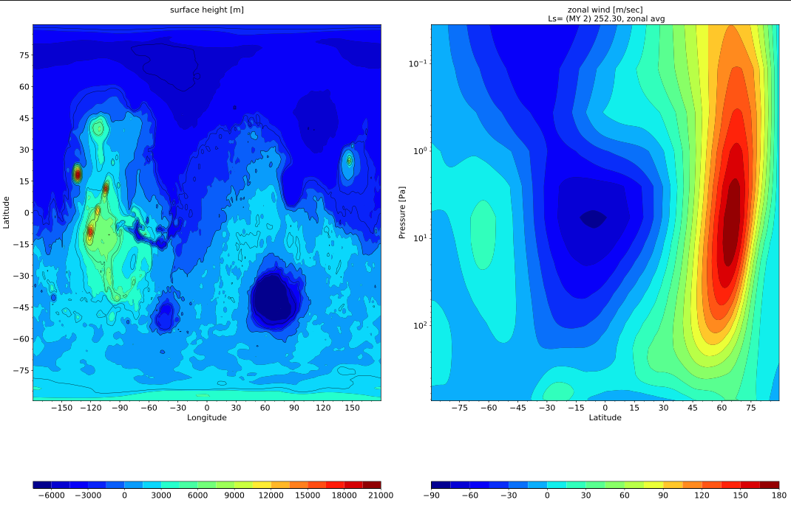

***

# Introducing the Community Analysis Pipeline (CAP)

CAP is toolkit designed to simplify post-processing MGCM output. CAP is written in Python and works with existing Python libraries allowing any Python user to install and use CAP easily and free of charge. Without CAP, plotting MGCM output requires that the user provide their own scripts for post-processing, including code to interpolate the vertical grid, compute derived variables, convert between file types, and create diagnostic plots. The user would be responsible for the entire post-processing effort as illustrated in Figure 1.


Such a process requires that the user be familiar with Fortran files and be able to write (or provide) script(s) to perform file manipulations and create plots from the data. At best, this effort is cumbersome. At worst, it excludes users who lack access to (or knowledge of how to write) post-processing scripts and Fortran code. CAP standardizes the post-processing effort by providing tools that can be called from the command line to perform file manipulations and create diagnostic plots. This enables users of almost any skill level to post-process and plot MGCM data (Figure 2).


Specifically, CAP consists of five subroutines that provide tools to perform the following functions:

1. `MarsPull.py`    Accessing MGCM output
2. `MarsFiles.py`   Reducing the files
3. `MarsVars.py`    Performing variable operations
4. `MarsInterp.py`  Interpolating the vertical grid
5. `MarsPlot.py`    Visualizing the MGCM output

These routines and their commonly-used functions are illustrated in the cheat sheet below, which you should feel free to reference even after the tutorial:


CAP is designed to be modular. A user could use CAP exclusively to post-process and then plot MGCM output, but the tools in CAP can also be employed individually. Thus, users are free to selectively integrate CAP into their own analysis routine to the extent they see fit.


***


# The Five Components of CAP

In this section, we describe the tools provided in CAP by stepping through each of the five subroutines that make up CAP. The routines are presented in the order in which they are most often used, the same order that was listed in the introduction:

1. `MarsPull.py`
2. `MarsFiles.py`
3. `MarsVars.py`
4. `MarsInterp.py`
5. `MarsPlot.py`


***


## 1. `MarsPull.py` - Downloading Raw MGCM Output

`MarsPull` is a utility for accessing MGCM output files hosted on the [MCMC Data portal](https://data.nas.nasa.gov/legacygcm/data_legacygcm.php). MGCM data is archived in 1.5 hour intervals (16x/day, '_ntod_') and packaged in files containing 10 sols ('_time_') of data. The file naming convention is:

```bash
LegacyGCM_LsXXX_LsYYY.nc
```

Where XXX and YYY are three-digit Solar Longitude (L<sub>s</sub>) values. The files can be retrieved from the command line using CAP by providing `MarsPull` with either a range of Solar Longitudes from which to pull data or a specific filename.


***


## 2. `MarsFiles.py` - Reducing the Files

`MarsFiles` provides several tools for file manipulations, including code designed to create binned, averaged, and time-shifted files from MGCM output. These are the file formats that `MarsFiles` can create from the raw MGCM output files:

* **fixed** files containing static fields such as surface albedo and topography
* **average** files containing 5-sol averages of all variables
* **daily** files containing a continuous time series of data
* **diurn** files containing 5-day averaged data binned by time of day
* **_T** files containing time-shifted data (same time of day at all longitudes)

`MarsFiles` can also concatenate files together on the time dimension. This allows users to combine several files into one as long as they are of the same format. 

Finally, `MarsFiles` can be used to perform basic tidal analysis (temporal and spatial filtering, diurnal tides and their harmonics).


***


## 3. `MarsVars.py` - Performing Variable Operations

`MarsVars` provides several tools relating to variable operations such as adding and removing variables and performing column integrations. With no other arguments, passing a file to `MarsVars` displays file content much like `ncdump`:

```python
% MarsVars.py 00000.atmos_average.nc
%
===================DIMENSIONS==========================
['bnds', 'time', 'lat', 'lon', 'pfull', 'scalar_axis', 'phalf']
OrderedDict([('bnds', <class 'netCDF4._netCDF4.Dimension'>: name = 'bnds', size = 2
), ('time', <class 'netCDF4._netCDF4.Dimension'> (unlimited): name = 'time', size = 4
), ('lat', <class 'netCDF4._netCDF4.Dimension'>: name = 'lat', size = 180
), ('lon', <class 'netCDF4._netCDF4.Dimension'>: name = 'lon', size = 360
), ('pfull', <class 'netCDF4._netCDF4.Dimension'>: name = 'pfull', size = 30
), ('scalar_axis', <class 'netCDF4._netCDF4.Dimension'>: name = 'scalar_axis', size = 1
====================CONTENT==========================
pfull          : ('pfull',)= (30,), ref full pressure level  [Pa]
time           : ('time',)= (4,), time  [days since 0000-00-00 00:00:00]
scalar_axis    : ('scalar_axis',)= (1,), none  [none]
lat            : ('lat',)= (180,), latitude  [degrees_N]
bk             : ('phalf',)= (31,), vertical coordinate sigma value  [none]
pk             : ('phalf',)= (31,), pressure part of the hybrid coordinate  [Pa]
lon            : ('lon',)= (360,), longitude  [degrees_E]
areo           : ('time', 'scalar_axis')= (4, 1), areo  [degrees]
ps             : ('time', 'lat', 'lon')= (4, 180, 360), surface pressure  [Pa]
temp           : ('time', 'pfull', 'lat', 'lon')= (4, 30, 180, 360), temperature  [K]
omega          : ('time', 'pfull', 'lat', 'lon')= (4, 30, 180, 360), omega  [Pa/s]
dst_mass_micro : ('time', 'pfull', 'lat', 'lon')= (4, 30, 180, 360), dust_mass  [none]

Ls ranging from 242.52 to 252.30: 15.00 days
               (MY 02)   (MY 02)
=====================================================
 ***Notice***  No operation requested, use '-add var',  '-zdiff var','-zd var', '-col var', '-rm var' 
% 
```

This file contains several variables including `ps`, `temp`, and `omega`. Since this is a native file (i.e. the vertical grid is `pfull` indicating the file has not been interpolated), we can calculate the vertical wind (`w`) using `ps`, `temp`, and `omega` and add it to the file:

```bash
MarsVars.py 00000.atmos_average.nc -add w
```

We can see that `w` was added by calling `MarsVars` with no argument as before:

```python
% MarsVars.py 00000.atmos_average.nc
%
===================DIMENSIONS==========================
['bnds', 'time', 'lat', 'lon', 'pfull', 'scalar_axis', 'phalf']
OrderedDict([('bnds', <class 'netCDF4._netCDF4.Dimension'>: name = 'bnds', size = 2
), ('time', <class 'netCDF4._netCDF4.Dimension'> (unlimited): name = 'time', size = 4
), ('lat', <class 'netCDF4._netCDF4.Dimension'>: name = 'lat', size = 180
), ('lon', <class 'netCDF4._netCDF4.Dimension'>: name = 'lon', size = 360
), ('pfull', <class 'netCDF4._netCDF4.Dimension'>: name = 'pfull', size = 30
), ('scalar_axis', <class 'netCDF4._netCDF4.Dimension'>: name = 'scalar_axis', size = 1
====================CONTENT==========================
pfull          : ('pfull',)= (30,), ref full pressure level  [Pa]
time           : ('time',)= (4,), time  [days since 0000-00-00 00:00:00]
scalar_axis    : ('scalar_axis',)= (1,), none  [none]
lat            : ('lat',)= (180,), latitude  [degrees_N]
bk             : ('phalf',)= (31,), vertical coordinate sigma value  [none]
pk             : ('phalf',)= (31,), pressure part of the hybrid coordinate  [Pa]
lon            : ('lon',)= (360,), longitude  [degrees_E]
areo           : ('time', 'scalar_axis')= (4, 1), areo  [degrees]
ps             : ('time', 'lat', 'lon')= (4, 180, 360), surface pressure  [Pa]
temp           : ('time', 'pfull', 'lat', 'lon')= (4, 30, 180, 360), temperature  [K]
omega          : ('time', 'pfull', 'lat', 'lon')= (4, 30, 180, 360), omega  [Pa/s]
dst_mass_micro : ('time', 'pfull', 'lat', 'lon')= (4, 30, 180, 360), dust_mass  [none]
w              : ('time', 'pfull', 'lat', 'lon')= (4, 30, 180, 360), vertical wind (added postprocessing)  [m/s]

Ls ranging from 242.52 to 252.30: 15.00 days
               (MY 02)   (MY 02)
=====================================================
 ***Notice***  No operation requested, use '-add var',  '-zdiff var','-zd var', '-col var', '-rm var' 
% 
```

MarsVars can also remove variables from files which is particularly useful for reducing file sizes:

```python
% MarsVars.py 00000.atmos_average.nc -rm time
%
% MarsVars.py 00000.atmos_average.nc
%
===================DIMENSIONS==========================
['bnds', 'time', 'lat', 'lon', 'pfull', 'scalar_axis', 'phalf']
OrderedDict([('bnds', <class 'netCDF4._netCDF4.Dimension'>: name = 'bnds', size = 2
), ('time', <class 'netCDF4._netCDF4.Dimension'> (unlimited): name = 'time', size = 4
), ('lat', <class 'netCDF4._netCDF4.Dimension'>: name = 'lat', size = 180
), ('lon', <class 'netCDF4._netCDF4.Dimension'>: name = 'lon', size = 360
), ('pfull', <class 'netCDF4._netCDF4.Dimension'>: name = 'pfull', size = 30
), ('scalar_axis', <class 'netCDF4._netCDF4.Dimension'>: name = 'scalar_axis', size = 1
====================CONTENT==========================
pfull          : ('pfull',)= (30,), ref full pressure level  [Pa]
scalar_axis    : ('scalar_axis',)= (1,), none  [none]
lat            : ('lat',)= (180,), latitude  [degrees_N]
bk             : ('phalf',)= (31,), vertical coordinate sigma value  [none]
pk             : ('phalf',)= (31,), pressure part of the hybrid coordinate  [Pa]
lon            : ('lon',)= (360,), longitude  [degrees_E]
areo           : ('time', 'scalar_axis')= (4, 1), areo  [degrees]
ps             : ('time', 'lat', 'lon')= (4, 180, 360), surface pressure  [Pa]
temp           : ('time', 'pfull', 'lat', 'lon')= (4, 30, 180, 360), temperature  [K]
omega          : ('time', 'pfull', 'lat', 'lon')= (4, 30, 180, 360), omega  [Pa/s]
dst_mass_micro : ('time', 'pfull', 'lat', 'lon')= (4, 30, 180, 360), dust_mass  [none]
w              : ('time', 'pfull', 'lat', 'lon')= (4, 30, 180, 360), vertical wind (added postprocessing)  [m/s]

Ls ranging from 242.52 to 252.30: 15.00 days
               (MY 02)   (MY 02)
=====================================================
 ***Notice***  No operation requested, use '-add var',  '-zdiff var','-zd var', '-col var', '-rm var' 
% 
```

MarsVars is useful when performing column integrations because the function preserves the original variable and creates a new variable ending in `_col` that contains the column integrated values:

```python
% MarsVars.py 00000.atmos_average.nc -col dst_mass_micro
Performing colum integration: dst_mass_micro...
dst_mass_micro_col: Done
%
% MarsVars.py 00000.atmos_average.nc
%
===================DIMENSIONS==========================
['bnds', 'time', 'lat', 'lon', 'pfull', 'scalar_axis', 'phalf']
OrderedDict([('bnds', <class 'netCDF4._netCDF4.Dimension'>: name = 'bnds', size = 2
), ('time', <class 'netCDF4._netCDF4.Dimension'> (unlimited): name = 'time', size = 4
), ('lat', <class 'netCDF4._netCDF4.Dimension'>: name = 'lat', size = 180
), ('lon', <class 'netCDF4._netCDF4.Dimension'>: name = 'lon', size = 360
), ('pfull', <class 'netCDF4._netCDF4.Dimension'>: name = 'pfull', size = 30
), ('scalar_axis', <class 'netCDF4._netCDF4.Dimension'>: name = 'scalar_axis', size = 1
====================CONTENT==========================
pfull          : ('pfull',)= (30,), ref full pressure level  [Pa]
scalar_axis    : ('scalar_axis',)= (1,), none  [none]
lat            : ('lat',)= (180,), latitude  [degrees_N]
bk             : ('phalf',)= (31,), vertical coordinate sigma value  [none]
pk             : ('phalf',)= (31,), pressure part of the hybrid coordinate  [Pa]
lon            : ('lon',)= (360,), longitude  [degrees_E]
areo           : ('time', 'scalar_axis')= (4, 1), areo  [degrees]
ps             : ('time', 'lat', 'lon')= (4, 180, 360), surface pressure  [Pa]
dst_mass_micro_col: ('time', 'lat', 'lon')= (4, 180, 360), column integration of dust_mass  [n/m2]
temp           : ('time', 'pfull', 'lat', 'lon')= (4, 30, 180, 360), temperature  [K]
omega          : ('time', 'pfull', 'lat', 'lon')= (4, 30, 180, 360), omega  [Pa/s]
dst_mass_micro : ('time', 'pfull', 'lat', 'lon')= (4, 30, 180, 360), dust_mass  [none]
w              : ('time', 'pfull', 'lat', 'lon')= (4, 30, 180, 360), vertical wind (added postprocessing)  [m/s]

Ls ranging from 242.52 to 252.30: 15.00 days
               (MY 02)   (MY 02)
=====================================================
 ***Notice***  No operation requested, use '-add var',  '-zdiff var','-zd var', '-col var', '-rm var'
% 
```

***


## 4. `MarsInterp.py` - Interpolating the Vertical Grid

Native MGCM output files use pressure as the vertical coordinate, which means the geometric height and pressure level of an atmospheric layer varies based on location. Climate data is usually analyzed on a standardized grid, however, and it is often necessary to interpolate the files to standard pressure coordinates. The `-type` argument in `MarsInterp` can interpolate files for you:

```bash
MarsInterp.py  00000.atmos_average.nc -t pstd
```

An inspection of the file shows that the pressure level axis which was `pfull` (30 layers) has been replaced by a standard pressure coordinate `pstd` (36 layers), and all 3- and 4-dimensional variables reflect the new shape:

```python
% MarsInterp.py  00000.atmos_average.nc -t pstd
%
% MarsVars.py 00000.atmos_average.nc
%
===================DIMENSIONS==========================
['bnds', 'time', 'lat', 'lon', 'scalar_axis', 'phalf', 'pstd']
OrderedDict([('bnds', <class 'netCDF4._netCDF4.Dimension'>: name = 'bnds', size = 2
), ('time', <class 'netCDF4._netCDF4.Dimension'> (unlimited): name = 'time', size = 4
), ('lat', <class 'netCDF4._netCDF4.Dimension'>: name = 'lat', size = 180
), ('lon', <class 'netCDF4._netCDF4.Dimension'>: name = 'lon', size = 360
), ('pstd', <class 'netCDF4._netCDF4.Dimension'>: name = 'pstd', size = 36
), ('scalar_axis', <class 'netCDF4._netCDF4.Dimension'>: name = 'scalar_axis', size = 1
====================CONTENT==========================
pstd           : ('pstd',)= (36,), pressure  [Pa]
scalar_axis    : ('scalar_axis',)= (1,), none  [none]
lat            : ('lat',)= (180,), latitude  [degrees_N]
lon            : ('lon',)= (360,), longitude  [degrees_E]
areo           : ('time', 'scalar_axis')= (4, 1), areo  [degrees]
ps             : ('time', 'lat', 'lon')= (4, 180, 360), surface pressure  [Pa]
dst_mass_micro_col: ('time', 'lat', 'lon')= (4, 180, 360), column integration of dust_mass  [n/m2]
temp           : ('time', 'pfull', 'lat', 'lon')= (4, 36, 180, 360), temperature  [K]
omega          : ('time', 'pfull', 'lat', 'lon')= (4, 36, 180, 360), omega  [Pa/s]
dst_mass_micro : ('time', 'pfull', 'lat', 'lon')= (4, 36, 180, 360), dust_mass  [none]
w              : ('time', 'pfull', 'lat', 'lon')= (4, 36, 180, 360), vertical wind (added postprocessing)  [m/s]

Ls ranging from 242.52 to 252.30: 15.00 days
               (MY 02)   (MY 02)
=====================================================
 ***Notice***  No operation requested, use '-add var',  '-zdiff var','-zd var', '-col var', '-rm var'
% 
```

You can also interpolate files to a standard height `zstd` or height above ground level `zagl`. The specific pressure and altitude definitions that `pstd`, `zstd`, and `zagl` correspond to can be found in `/amesGCM3/bin/MarsInterp.py`. 

Other grids you can interpolate to can be found in `/amesGCM3/mars_templates/amesgcm_profile`. You can use these by calling MarsInterp with the `-level` argument followed by the name of the array you want to use in `amesgcm_profile`. 

You can even add your own vertical coordinate array to `amesgcm_profile` so that `MarsInterp` can interpolate MGCM files to your preferred vertical coordinate system.

***


## 5. `MarsPlot.py` - Plotting the Results

The last component of CAP is the plotting routine, `MarsPlot`, which accepts a modifiable template containing a list of plots to create. `MarsPlot` is useful for creating plots from MGCM output quickly, and it is designed specifically for use with the netCDF output files (`daily`, `diurn`, `average`, `fixed`) generated by `MarsFiles`. The default template, Custom.in, can be created by passing the `-template` argument to `MarsPlot`. Custom.in is pre-populated to draw two plots on one page: a topographical plot from the fixed file and a cross-section of the zonal wind from the average file. Creating the template and passing it into `MarsPlot` creates a PDF containing the plots as in Figure 4:

```bash
% MarsPlot.py -template
/path/to/simulation/run_name/history/Custom.in was created
%
% MarsPlot.py Custom.in 
Reading Custom.in
[----------]  0 % (2D_lon_lat :fixed.zsurf)
[#####-----] 50 % (2D_lat_lev :atmos_average.ucomp, Ls= (MY 2) 252.30, zonal avg)
[##########]100 % (Done)
Merging figures...
/path/to/simulation/run_name/history/Diagnostics.pdf was generated
%
```



`Custom.in` can be modified using your preferred text editor and renamed to your liking. 

The above plots are created from the first two blocks of code set to `= True` in `Custom.in`. These code blocks are named after the type of plots they create and appear like this:

```python
<<<<<<<<<<<<<<| Plot 2D lon X lat = True |>>>>>>>>>>>>>
 Title          = None
 Main Variable  = fixed.zsurf
 Cmin, Cmax     = None
 Ls 0-360       = None
 Level [Pa/m]   = None
 2nd Variable   = None
 Contours Var 2 = None
 Axis Options  : lon = [None,None] | lat = [None,None] | cmap = jet | scale = lin | proj = cart
 
 <<<<<<<<<<<<<<| Plot 2D lat X lev = True |>>>>>>>>>>>>>
 Title          = None
 Main Variable  = atmos_average.ucomp
 Cmin, Cmax     = None
 Ls 0-360       = None
 Lon +/-180     = None
 2nd Variable   = None
 Contours Var 2 = None
 Axis Options  : Lat = [None,None] | level[Pa/m] = [None,None] | cmap = jet |scale = lin
```

Note that each code block is set to `= True`, instructing `MarsPlot` to draw those plots. Below these is the section containing templates set to `= False` which instructs `MarsPlot` to skip those plots. In total, `MarsPlot` is equipped to create seven plot types, which are shown below along with their default setting:

```python
<<<<<| Plot 2D lon X lat  = True  |>>>>>
<<<<<| Plot 2D lon X time = False |>>>>>
<<<<<| Plot 2D lon X lev  = False |>>>>>
<<<<<| Plot 2D lat X lev  = True  |>>>>>
<<<<<| Plot 2D time X lat = False |>>>>>
<<<<<| Plot 2D time X lev = False |>>>>>
<<<<<| Plot 1D            = False |>>>>> # Any 1D Plot Type (Dimension x Variable)
```

The settings for each plot vary a bit, but every plot contains the following inputs:

```python
Title          = Temperature            # Plot title
Main Variable  = atmos_average.temp     # filename.variable *REQUIRED
Cmin, Cmax     = 240,290                # Colorbar limits (minimum, maximum)
2nd Variable   = atmos_average.ucomp    # Overplot U winds
Contours Var 2 = 0,100,200              # List of contours for 2nd Variable
```

Whether these settings appear depends on the type of plot you are creating:

```python
Dimensions:
Ls 0-360       = 180      # The time at which to plot the variable
Level [Pa/m]   = 50       # The level at which to plot the variable
Lon +/-180     = -90      # The Longitude at which to plot the variable
Latitude       = 50       # The Latitude at which to plot the variable
```

Finally, `Axis Options` specify the axes limits, colormap, and projection of the plots:

```python
Axis Options:
Lat         = [0,90]        # Latitude range for axes limits
Level[Pa/m] = [600,10]      # Level range for axes limits
sols        = [None,None]   # Sol range for axes limits
Lon +/-180  = [-180,180]    # Longitude range for axes limits
cmap        = jet           # Python colormap to use
scale       = lin           # Color map style ([lin]ear, [log]arithmic)
proj        = cart          # Projection ([cart]esian, [robin]son, [moll]weide, [Npole], [Spole], [ortho]graphic)
```

The 1D plot template is different. Instead of `Title`, the template has a `Legend`, which allows you to overplot several 1D variables on one another and label them. There is an additional `linestyle` axis option for the 1D plot as well. The `Ls`, `Latitude`, `Lon`, and `Level` options are still there, however, there is also a `Diurnal` option. The `Diurnal` input can only be `None` or `AXIS`, since there is syntax for selecting a specific time of day. The `AXIS` label tells `MarsPlot` which dimension serves as the X axis, and `Main Variable` will dictate the Y axis.


```python
<<<<<<<<<<<<<<| Plot 1D = False |>>>>>>>>>>>>>
Legend         = None                   # Legend instead of Title
Main Variable  = atmos_average.temp 
Ls 0-360       = AXIS                   #       Any of these can be selected
Latitude       = None                   #       as the X axis dimension, and
Lon +/-180     = None                   #       the free dimensions can accept
Level [Pa/m]   = None                   #       values as before. However,
Diurnal  [hr]  = None                   #   ** Diurnal can ONLY be AXIS or None **
```

There are several other options you can use to customize your plots:

* When two or more of these blocks are sandwiched between a `HOLD ON` and a `HOLD OFF` command, MarsPlot will draw the plots on the same page. 
* Plots are created on a standard page (8.5 x 11 inches) in landscape mode, but can be drawn in portrait. 
* Plots can be saved as images instead of PDFs by specifying your preferred filetype (PNG, EPS, etc.) after passing in the `--output` argument to MarsPlot. 
* When creating 1D plots of data spanning multiple years, you can overplot consecutive years by calling `--stack_year` when submitting the template to MarsPlot.
* Specify which MGCM output file to use when plotting by passing the `--date` argument to MarsPlot followed by the 5-digit file prefix corresponding to the file you want to use. Alternatively, add the prefix to the filename specified under `Main Variable` in the template.

The final plot-related functionality in `MarsPlot` is the simulation list, which allows you to point `MarsPlot` to directories containing the MGCM output files *or* the observation files specifically formatted to work with CAP:

```python
 <<<<<<<<<<<<<<<<<<<<<< Simulations >>>>>>>>>>>>>>>>>>>>>
 ref> None
 2> /u/mkahre/MCMC/analysis/obsdata/amesgcmOBS      # observed data
 3> /path/to/another/sim                            # another simulation
 4> 
 =======================================================
```

To access a variable from a file in another directory, just point to the correct simulation when calling `Main Variable`:

```python
Main Variable  = XXXXX.filename@N.variable`
```

Where `N` is the number under `<<< Simulations >>>` corresponding the the correct path. The `Main Variable` input also accepts variable operations and time-of-day selections like so:

```python
Main Variable  = [filename.variable]*1000  # multiply all values by 1000
Main Variable  = filename.variable{tod = 20}  # select the 20th hour of the day
```

At minimum, `Main Variable` requires `filename.variable` for input, but the above syntax can be combined in several ways allowing for greater plot customization. For example, to plot dust mixing ratio from the diurnal file in simulation #3 at 3 PM local time, the input is:

```python
Main Variable  = [atmos_diurn_plevs_T@3.dst_mass_micro{tod = 15}]*1.e6 # dust ppm
#                [filename@N.variable{dimension = X}]*Y
```

***

`MarsPlot` is designed to make plotting MGCM output easier and faster so it handles missing data for you. For example, when dimensions are omitted with `None`, `MarsPlot` makes educated guesses for data selection and will tell you exactly how the data is being processed both in the title for the figures (if `Title = None`), and in the terminal output. Specifics about this behavior are detailed in the instructions at the top of `Custom.in`.

> `MarsPlot` handles many errors by itself. It reports errors both in the terminal and in the generated figures. To by-pass this behavior (when debugging), use the  `--debug` option with `MarsPlot`.
